# 다이어그램 v1.0

> 최종 수정일: 2026.10.07(수)
> 

---

## 0. 전체 구성·공통 흐름

> 작성: 담당 A (통합)
> 

### 0.1 서비스와 연결 방식

- 목적: 어떤 서비스가 무엇을 동기 호출(REST)로, 무엇을 비동기 이벤트로 주고받는지 한눈에 보여준다.
- 경합·실패 포인트: 동기 호출은 검증용 조회만이며 실패하면 거절(fail-closed). 상태 전파는 모두 이벤트.

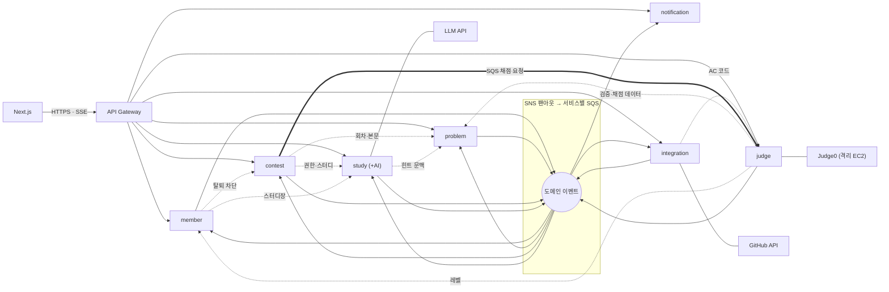
```mermaid
flowchart LR
    FE["Next.js"] -->|"HTTPS · SSE"| GW["API Gateway"]
    GW --> MEM[member]
    GW --> PRB[problem]
    GW --> JDG[judge]
    GW --> CON[contest]
    GW --> STU["study (+AI)"]
    GW --> NOT[notification]
    GW --> INT[integration]
    JDG -.->|"검증·채점 데이터"| PRB
    JDG -.->|"레벨"| MEM
    CON -.->|"권한·스터디"| STU
    CON -.->|"회차·본문"| PRB
    STU -.->|"힌트 문맥"| PRB
    MEM -.->|"탈퇴 차단"| CON
    MEM -.->|"스터디장"| STU
    INT -.->|"AC 코드"| JDG
    CON ==>|"SQS 채점 요청"| JDG
    JDG --- J0["Judge0 (격리 EC2)"]
    STU --- LLM["LLM API"]
    INT --- GH["GitHub API"]
    subgraph BUS["SNS 팬아웃 → 서비스별 SQS"]
        E(("도메인 이벤트"))
    end
    MEM & PRB & JDG & CON & STU & INT --> E
    E --> MEM & PRB & CON & STU & NOT & INT
```

- 점선 = 동기 내부 API(`/internal/v1`, 서비스 토큰, 2초 타임아웃), 굵은 선 = SQS 명령, 실선 버스 = SNS 이벤트. 상세 지도는 API 부록 A, 구독은 이벤트 계약서 §5.

### 0.2 인증 전달

- 목적: 외부 요청이 Gateway에서 검증되고 내부에는 신뢰 헤더만 전달됨을 보여준다.
- 경합·실패 포인트: 위조 헤더 제거, 차단 목록(로그아웃 토큰), 내부 API 외부 노출 차단.

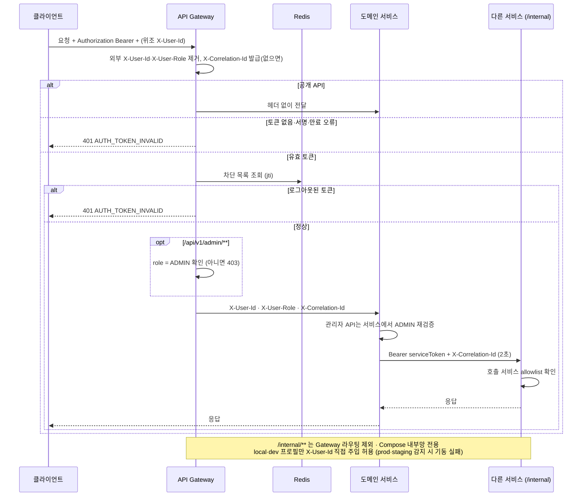
```mermaid
sequenceDiagram
    participant C as 클라이언트
    participant G as API Gateway
    participant R as Redis
    participant S as 도메인 서비스
    participant T as 다른 서비스 (/internal)
    C->>G: 요청 + Authorization Bearer + (위조 X-User-Id)
    G->>G: 외부 X-User-Id·X-User-Role 제거, X-Correlation-Id 발급(없으면)
    alt 공개 API
        G->>S: 헤더 없이 전달
    else 토큰 없음·서명·만료 오류
        G-->>C: 401 AUTH_TOKEN_INVALID
    else 유효 토큰
        G->>R: 차단 목록 조회 (jti)
        alt 로그아웃된 토큰
            G-->>C: 401 AUTH_TOKEN_INVALID
        else 정상
            opt /api/v1/admin/**
                G->>G: role = ADMIN 확인 (아니면 403)
            end
            G->>S: X-User-Id · X-User-Role · X-Correlation-Id
            S->>S: 관리자 API는 서비스에서 ADMIN 재검증
            S->>T: Bearer serviceToken + X-Correlation-Id (2초)
            T->>T: 호출 서비스 allowlist 확인
            T-->>S: 응답
            S-->>C: 응답
        end
    end
    Note over G,T: /internal/** 는 Gateway 라우팅 제외 · Compose 내부망 전용<br/>local·dev 프로필만 X-User-Id 직접 주입 허용 (prod·staging 감지 시 기동 실패)
```

### 0.3 공통 이벤트 전달 (Outbox → SNS → SQS)

- 목적: 모든 도메인 이벤트가 같은 경로·멱등 규칙으로 전달됨을 보여준다.
- 경합·실패 포인트: 발행 후 기록 전 장애(중복 발행), 소비 예외(재수신·DLQ), 삭제 실패(재수신), 순서 역전.

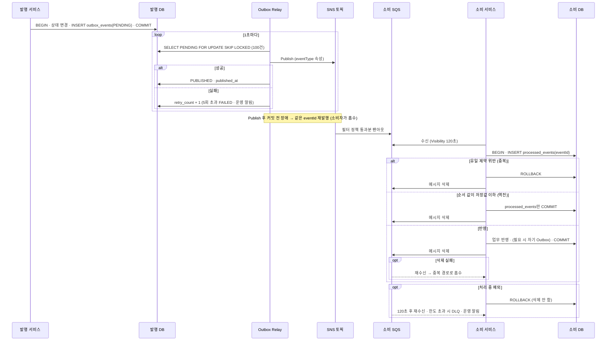
```mermaid
sequenceDiagram
    participant SVC as 발행 서비스
    participant DB as 발행 DB
    participant R as Outbox Relay
    participant SNS as SNS 토픽
    participant Q as 소비 SQS
    participant CON as 소비 서비스
    participant CDB as 소비 DB
    SVC->>DB: BEGIN · 상태 변경 · INSERT outbox_events(PENDING) · COMMIT
    loop 1초마다
        R->>DB: SELECT PENDING FOR UPDATE SKIP LOCKED (100건)
        R->>SNS: Publish (eventType 속성)
        alt 성공
            R->>DB: PUBLISHED · published_at
        else 실패
            R->>DB: retry_count + 1 (5회 초과 FAILED · 운영 알림)
        end
    end
    Note over R,SNS: Publish 후 커밋 전 장애 → 같은 eventId 재발행 (소비자가 흡수)
    SNS->>Q: 필터 정책 통과분 팬아웃
    CON->>Q: 수신 (Visibility 120초)
    CON->>CDB: BEGIN · INSERT processed_events(eventId)
    alt 유일 제약 위반 (중복)
        CON->>CDB: ROLLBACK
        CON->>Q: 메시지 삭제
    else 순서 값이 저장값 이하 (역전)
        CON->>CDB: processed_events만 COMMIT
        CON->>Q: 메시지 삭제
    else 반영
        CON->>CDB: 업무 반영 · (필요 시 자기 Outbox) · COMMIT
        CON->>Q: 메시지 삭제
        opt 삭제 실패
            Q-->>CON: 재수신 → 중복 경로로 흡수
        end
    end
    opt 처리 중 예외
        CON->>CDB: ROLLBACK (삭제 안 함)
        Q-->>CON: 120초 후 재수신 · 한도 초과 시 DLQ · 운영 알림
    end
```

### 0.4 Outbox 상태

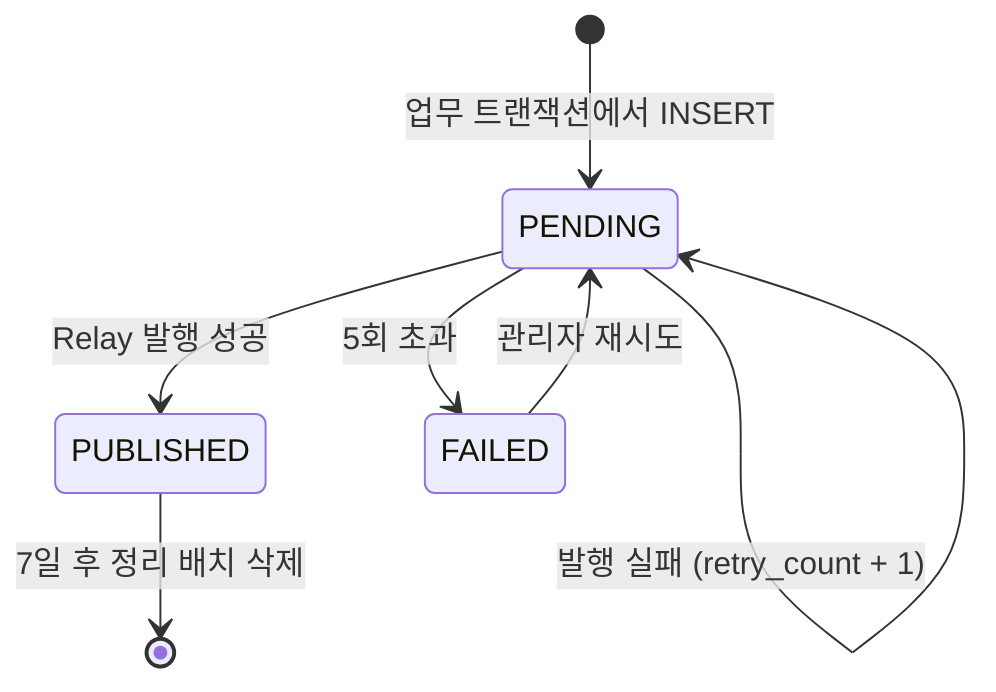
```mermaid
stateDiagram-v2
    [*] --> PENDING : 업무 트랜잭션에서 INSERT
    PENDING --> PUBLISHED : Relay 발행 성공
    PENDING --> PENDING : 발행 실패 (retry_count + 1)
    PENDING --> FAILED : 5회 초과
    FAILED --> PENDING : 관리자 재시도
    PUBLISHED --> [*] : 7일 후 정리 배치 삭제
```

### 0.5 서비스 간 동기 호출 (fail-closed)

- 목적: 검증 목적 조회의 타임아웃·재시도·서킷 판정 순서를 보여준다.
- 경합·실패 포인트: 조회 결과가 불명확하면 허용하지 않는다. 원격 호출 중 DB 잠금 금지.

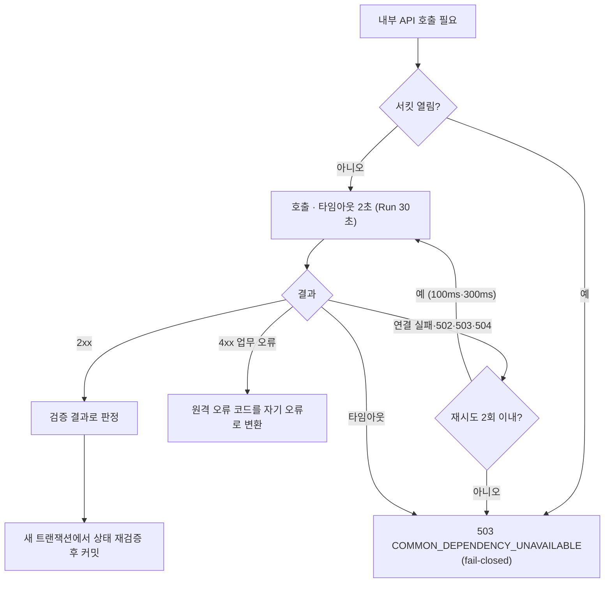
```mermaid
flowchart TD
    A["내부 API 호출 필요"] --> CB{"서킷 열림?"}
    CB -->|"예"| F["503 COMMON_DEPENDENCY_UNAVAILABLE<br/>(fail-closed)"]
    CB -->|"아니오"| CALL["호출 · 타임아웃 2초 (Run 30초)"]
    CALL --> R{"결과"}
    R -->|"2xx"| OK["검증 결과로 판정"]
    R -->|"4xx 업무 오류"| BIZ["원격 오류 코드를 자기 오류로 변환"]
    R -->|"연결 실패·502·503·504"| RT{"재시도 2회 이내?"}
    RT -->|"예 (100ms·300ms)"| CALL
    RT -->|"아니오"| F
    R -->|"타임아웃"| F
    OK --> TX["새 트랜잭션에서 상태 재검증 후 커밋"]
```

---

## 1. 인증·회원 (member)

> 작성: 담당 E · 서비스: `member-service`
> 
- [x]  GitHub OAuth 로그인·JWT 발급 (1.1)
- [x]  토큰 재발급·회전, 재사용 감지 시 전체 폐기 (1.2)
- [x]  로그아웃 (1.2)
- [x]  회원 상태 전이 (1.3)
- [x]  학습 프로필·진단 테스트 흐름 (1.4·1.5)
- [x]  채점 이벤트 → 실력 갱신 (1.6)
- [x]  회원 탈퇴 (1.7)

### 1.1 GitHub OAuth 로그인·JWT 발급

- 목적: 토큰을 URL에 싣지 않고 1회용 교환 코드로 발급하는 흐름을 보여준다.
- 경합·실패 포인트: `state` 위조·만료, 신규 가입 동시 콜백, 교환 코드 동시 사용.

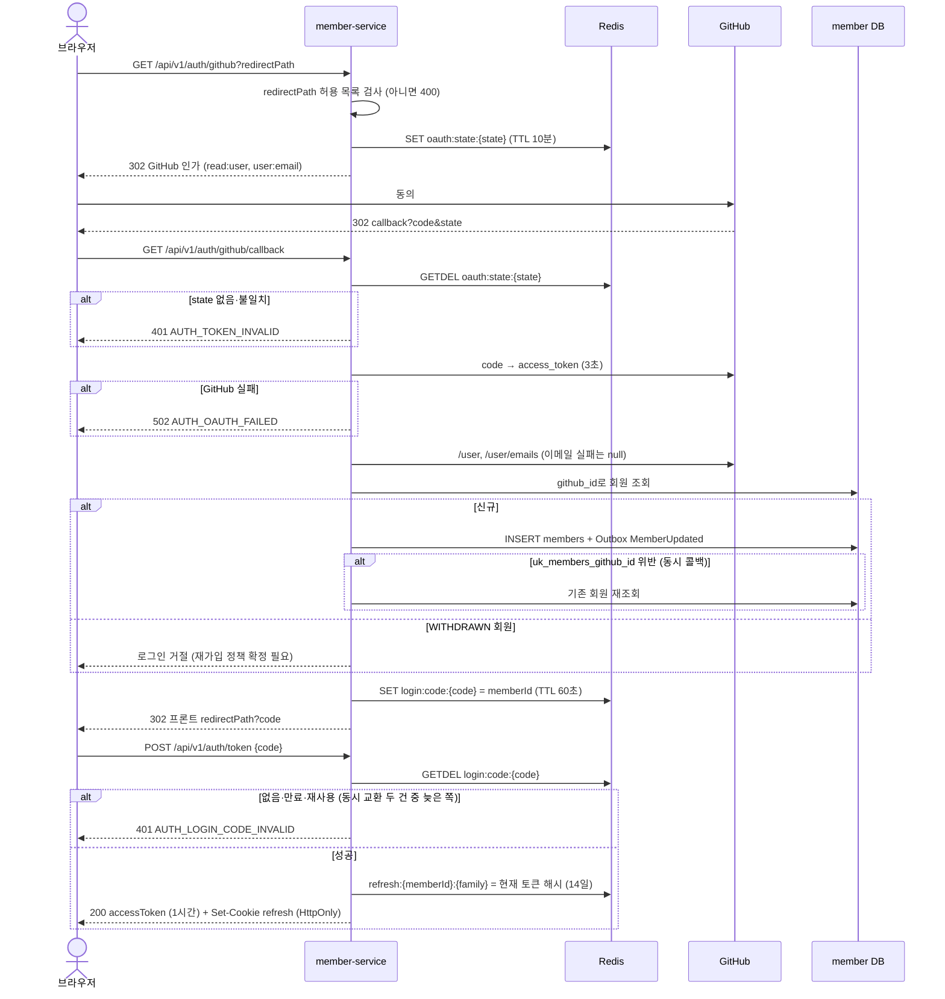
```mermaid
sequenceDiagram
    actor U as 브라우저
    participant M as member-service
    participant R as Redis
    participant GH as GitHub
    participant DB as member DB
    U->>M: GET /api/v1/auth/github?redirectPath
    M->>M: redirectPath 허용 목록 검사 (아니면 400)
    M->>R: SET oauth:state:{state} (TTL 10분)
    M-->>U: 302 GitHub 인가 (read:user, user:email)
    U->>GH: 동의
    GH-->>U: 302 callback?code&state
    U->>M: GET /api/v1/auth/github/callback
    M->>R: GETDEL oauth:state:{state}
    alt state 없음·불일치
        M-->>U: 401 AUTH_TOKEN_INVALID
    end
    M->>GH: code → access_token (3초)
    alt GitHub 실패
        M-->>U: 502 AUTH_OAUTH_FAILED
    end
    M->>GH: /user, /user/emails (이메일 실패는 null)
    M->>DB: github_id로 회원 조회
    alt 신규
        M->>DB: INSERT members + Outbox MemberUpdated
        alt uk_members_github_id 위반 (동시 콜백)
            M->>DB: 기존 회원 재조회
        end
    else WITHDRAWN 회원
        M-->>U: 로그인 거절 (재가입 정책 확정 필요)
    end
    M->>R: SET login:code:{code} = memberId (TTL 60초)
    M-->>U: 302 프론트 redirectPath?code
    U->>M: POST /api/v1/auth/token {code}
    M->>R: GETDEL login:code:{code}
    alt 없음·만료·재사용 (동시 교환 두 건 중 늦은 쪽)
        M-->>U: 401 AUTH_LOGIN_CODE_INVALID
    else 성공
        M->>R: refresh:{memberId}:{family} = 현재 토큰 해시 (14일)
        M-->>U: 200 accessToken (1시간) + Set-Cookie refresh (HttpOnly)
    end
```

### 1.2 토큰 재발급·회전, 로그아웃

- 목적: Refresh Token 회전과 재사용 감지를 원자적으로 처리함을 보여준다.
- 경합·실패 포인트: 동시 재발급 두 건, 탈취 토큰 재사용, 로그아웃 후 Access 사용.

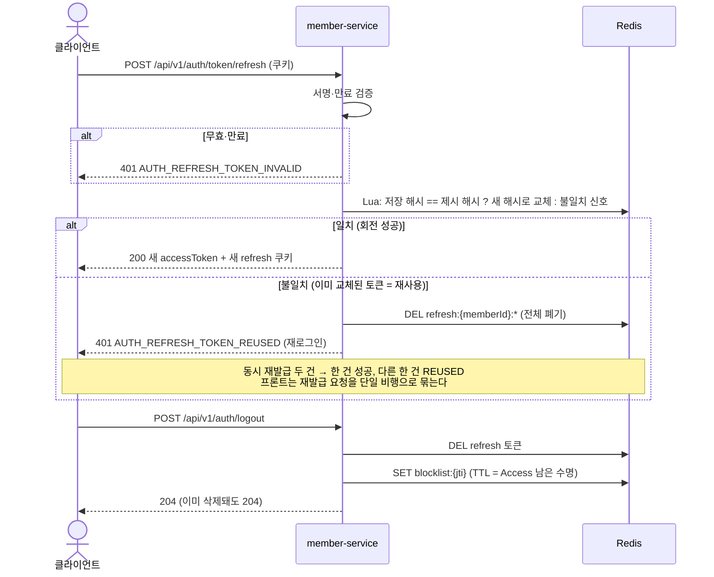
```mermaid
sequenceDiagram
    actor U as 클라이언트
    participant M as member-service
    participant R as Redis
    U->>M: POST /api/v1/auth/token/refresh (쿠키)
    M->>M: 서명·만료 검증
    alt 무효·만료
        M-->>U: 401 AUTH_REFRESH_TOKEN_INVALID
    end
    M->>R: Lua: 저장 해시 == 제시 해시 ? 새 해시로 교체 : 불일치 신호
    alt 일치 (회전 성공)
        M-->>U: 200 새 accessToken + 새 refresh 쿠키
    else 불일치 (이미 교체된 토큰 = 재사용)
        M->>R: DEL refresh:{memberId}:* (전체 폐기)
        M-->>U: 401 AUTH_REFRESH_TOKEN_REUSED (재로그인)
        Note over U,R: 동시 재발급 두 건 → 한 건 성공, 다른 한 건 REUSED<br/>프론트는 재발급 요청을 단일 비행으로 묶는다
    end
    U->>M: POST /api/v1/auth/logout
    M->>R: DEL refresh 토큰
    M->>R: SET blocklist:{jti} (TTL = Access 남은 수명)
    M-->>U: 204 (이미 삭제돼도 204)
```

### 1.3 회원 상태 전이

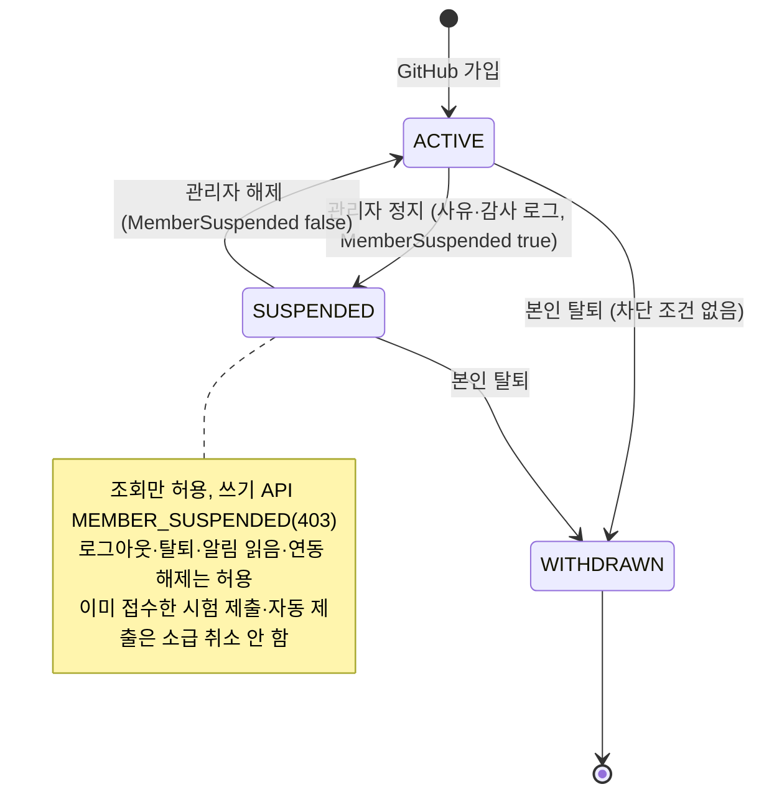
```mermaid
stateDiagram-v2
    [*] --> ACTIVE : GitHub 가입
    ACTIVE --> SUSPENDED : 관리자 정지 (사유·감사 로그, MemberSuspended true)
    SUSPENDED --> ACTIVE : 관리자 해제 (MemberSuspended false)
    ACTIVE --> WITHDRAWN : 본인 탈퇴 (차단 조건 없음)
    SUSPENDED --> WITHDRAWN : 본인 탈퇴
    WITHDRAWN --> [*]
    note right of SUSPENDED
        조회만 허용, 쓰기 API MEMBER_SUSPENDED(403)
        로그아웃·탈퇴·알림 읽음·연동 해제는 허용
        이미 접수한 시험 제출·자동 제출은 소급 취소 안 함
    end note
```

### 1.4 진단 테스트 흐름

- 목적: 진단 시작부터 종료·채점·레벨 확정까지와 이탈 복구를 보여준다.
- 경합·실패 포인트: 동시 시작, 수동 종료와 만료 경합, 종료 후 저장, 채점 `FAILED`(쿨타임 면제). 진단 채점 요청 경로·결과 이벤트명은 확정 필요(이벤트 계약서 M6·J5).

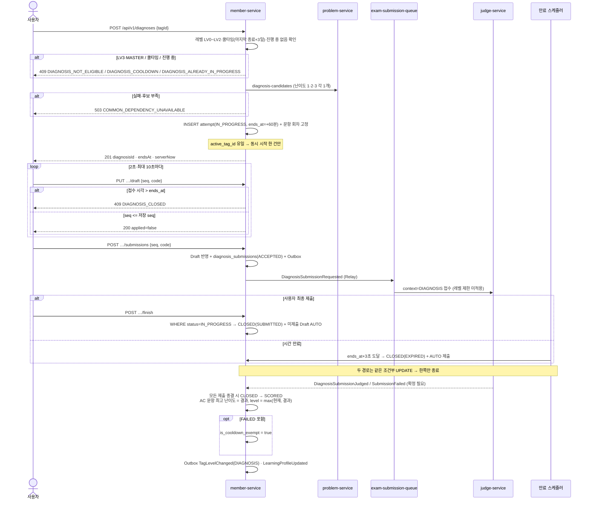
```mermaid
sequenceDiagram
    actor U as 사용자
    participant M as member-service
    participant P as problem-service
    participant Q as exam-submission-queue
    participant J as judge-service
    participant S as 만료 스케줄러
    U->>M: POST /api/v1/diagnoses {tagId}
    M->>M: 레벨 LV0~LV2·쿨타임(마지막 종료+3일)·진행 중 없음 확인
    alt LV3·MASTER / 쿨타임 / 진행 중
        M-->>U: 409 DIAGNOSIS_NOT_ELIGIBLE / DIAGNOSIS_COOLDOWN / DIAGNOSIS_ALREADY_IN_PROGRESS
    end
    M->>P: diagnosis-candidates (난이도 1·2·3 각 1개)
    alt 실패·후보 부족
        M-->>U: 503 COMMON_DEPENDENCY_UNAVAILABLE
    end
    M->>M: INSERT attempt(IN_PROGRESS, ends_at=+60분) + 문항 회차 고정
    Note over M: active_tag_id 유일 → 동시 시작 한 건만
    M-->>U: 201 diagnosisId · endsAt · serverNow
    loop 2초·최대 10초마다
        U->>M: PUT …/draft {seq, code}
        alt 접수 시각 > ends_at
            M-->>U: 409 DIAGNOSIS_CLOSED
        else seq <= 저장 seq
            M-->>U: 200 applied=false
        end
    end
    U->>M: POST …/submissions {seq, code}
    M->>M: Draft 반영 + diagnosis_submissions(ACCEPTED) + Outbox
    M->>Q: DiagnosisSubmissionRequested (Relay)
    Q->>J: context=DIAGNOSIS 접수 (레벨 제한 미적용)
    alt 사용자 최종 제출
        U->>M: POST …/finish
        M->>M: WHERE status=IN_PROGRESS → CLOSED(SUBMITTED) + 미제출 Draft AUTO
    else 시간 만료
        S->>M: ends_at+3초 도달 → CLOSED(EXPIRED) + AUTO 제출
    end
    Note over M,S: 두 경로는 같은 조건부 UPDATE → 한쪽만 종료
    J-->>M: DiagnosisSubmissionJudged / SubmissionFailed (확정 필요)
    M->>M: 모든 제출 종결 시 CLOSED → SCORED<br/>AC 문항 최고 난이도 = 결과, level = max(현재, 결과)
    opt FAILED 포함
        M->>M: is_cooldown_exempt = true
    end
    M->>M: Outbox TagLevelChanged(DIAGNOSIS) · LearningProfileUpdated
```

### 1.5 진단 응시 상태

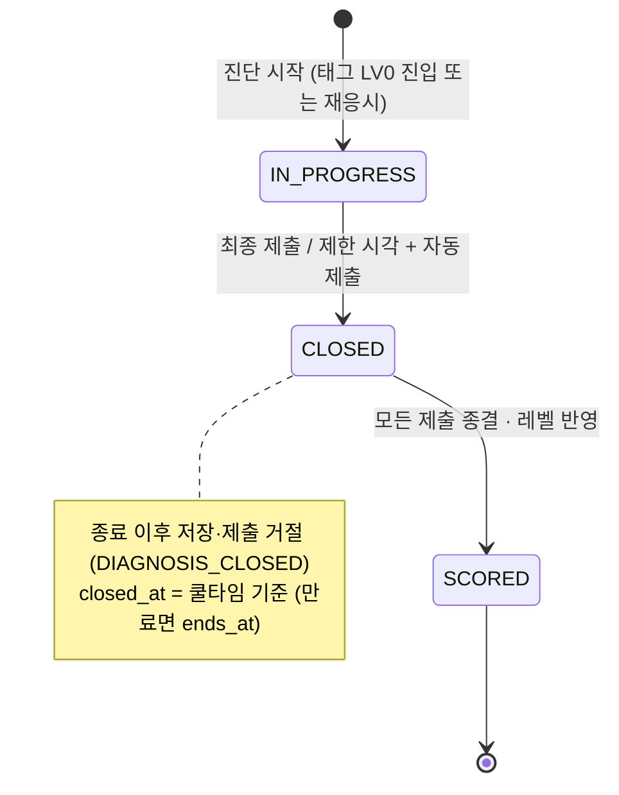
```mermaid
stateDiagram-v2
    [*] --> IN_PROGRESS : 진단 시작 (태그 LV0 진입 또는 재응시)
    IN_PROGRESS --> CLOSED : 최종 제출 / 제한 시각 + 자동 제출
    CLOSED --> SCORED : 모든 제출 종결 · 레벨 반영
    SCORED --> [*]
    note right of CLOSED
        종료 이후 저장·제출 거절 (DIAGNOSIS_CLOSED)
        closed_at = 쿨타임 기준 (만료면 ends_at)
    end note
```

### 1.6 채점 이벤트 → 실력 갱신 (재채점 되돌림 포함)

- 목적: 레벨이 저장값 증감이 아니라 현재 데이터 재계산으로 결정됨을 보여준다.
- 경합·실패 포인트: 이벤트 중복, 재채점 결과 역전 도착, AC → WA 재채점으로 레벨 하향.

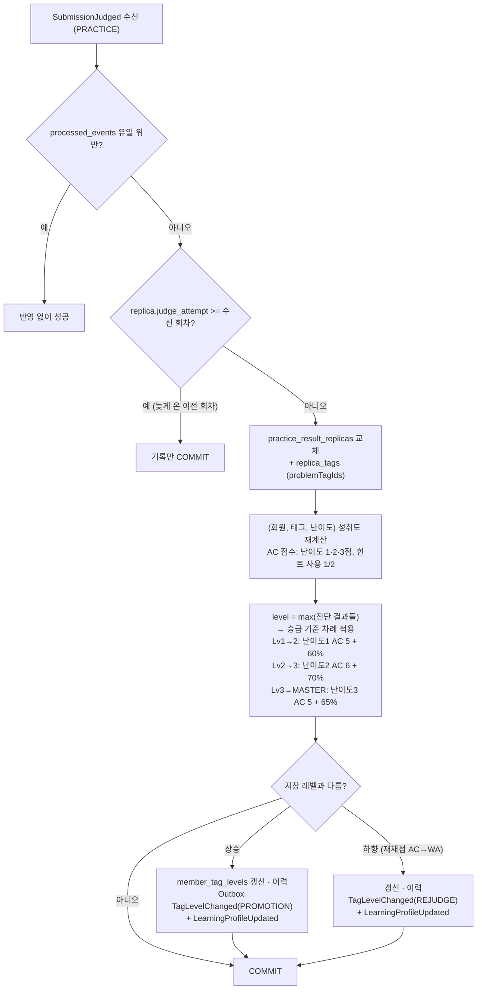
```mermaid
flowchart TD
    A["SubmissionJudged 수신 (PRACTICE)"] --> B{"processed_events 유일 위반?"}
    B -->|"예"| Z["반영 없이 성공"]
    B -->|"아니오"| C{"replica.judge_attempt >= 수신 회차?"}
    C -->|"예 (늦게 온 이전 회차)"| Z2["기록만 COMMIT"]
    C -->|"아니오"| D["practice_result_replicas 교체<br/>+ replica_tags (problemTagIds)"]
    D --> E["(회원, 태그, 난이도) 성취도 재계산<br/>AC 점수: 난이도 1·2·3점, 힌트 사용 1/2"]
    E --> F["level = max(진단 결과들)<br/>→ 승급 기준 차례 적용<br/>Lv1→2: 난이도1 AC 5 + 60%<br/>Lv2→3: 난이도2 AC 6 + 70%<br/>Lv3→MASTER: 난이도3 AC 5 + 65%"]
    F --> G{"저장 레벨과 다름?"}
    G -->|"아니오"| H["COMMIT"]
    G -->|"상승"| I["member_tag_levels 갱신 · 이력<br/>Outbox TagLevelChanged(PROMOTION)<br/>+ LearningProfileUpdated"]
    G -->|"하향 (재채점 AC→WA)"| J["갱신 · 이력<br/>TagLevelChanged(REJUDGE)<br/>+ LearningProfileUpdated"]
    I --> H
    J --> H
```

- 진단 재응시로는 하향하지 않지만 재채점 재계산으로는 하향될 수 있다(정책 §8.3). 힌트 사용 여부는 `hint_usage_replicas`(HintReady 구독, 확정 필요)로 판단한다.

### 1.7 회원 탈퇴

- 목적: 차단 조건 확인 후 탈퇴하고 이벤트로 전 서비스에 전파함을 보여준다.
- 경합·실패 포인트: 확인 API 이후 시험 입장·스터디장 위임 경합(자원 가드 도입 전 허용 리스크), 조회 실패 fail-closed, 중복 탈퇴 요청.

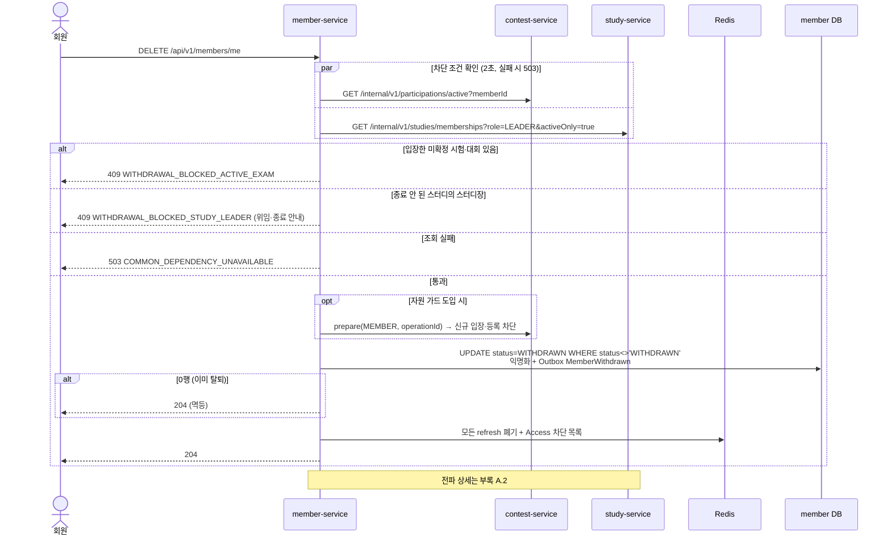
```mermaid
sequenceDiagram
    actor U as 회원
    participant M as member-service
    participant C as contest-service
    participant S as study-service
    participant R as Redis
    participant DB as member DB
    U->>M: DELETE /api/v1/members/me
    par 차단 조건 확인 (2초, 실패 시 503)
        M->>C: GET /internal/v1/participations/active?memberId
    and
        M->>S: GET /internal/v1/studies/memberships?role=LEADER&activeOnly=true
    end
    alt 입장한 미확정 시험·대회 있음
        M-->>U: 409 WITHDRAWAL_BLOCKED_ACTIVE_EXAM
    else 종료 안 된 스터디의 스터디장
        M-->>U: 409 WITHDRAWAL_BLOCKED_STUDY_LEADER (위임·종료 안내)
    else 조회 실패
        M-->>U: 503 COMMON_DEPENDENCY_UNAVAILABLE
    else 통과
        opt 자원 가드 도입 시
            M->>C: prepare(MEMBER, operationId) → 신규 입장·등록 차단
        end
        M->>DB: UPDATE status=WITHDRAWN WHERE status<>'WITHDRAWN'<br/>익명화 + Outbox MemberWithdrawn
        alt 0행 (이미 탈퇴)
            M-->>U: 204 (멱등)
        end
        M->>R: 모든 refresh 폐기 + Access 차단 목록
        M-->>U: 204
    end
    Note over M,S: 전파 상세는 부록 A.2
```

---

## 2. 문제 (problem)

> 작성: 담당 B · 서비스: `problem-service`
> 
- [x]  공개 상태·수정 회차 전이 (2.1·2.2, 검수 워크플로는 P2 보류 → 참고)
- [x]  문제·테스트케이스 등록 (2.3, 크기 무관 S3 저장)
- [x]  비공개 전환·보관 (2.4)
- [x]  풀이 공유·Diff·댓글 권한 확인 (2.5)

### 2.1 문제 공개 상태

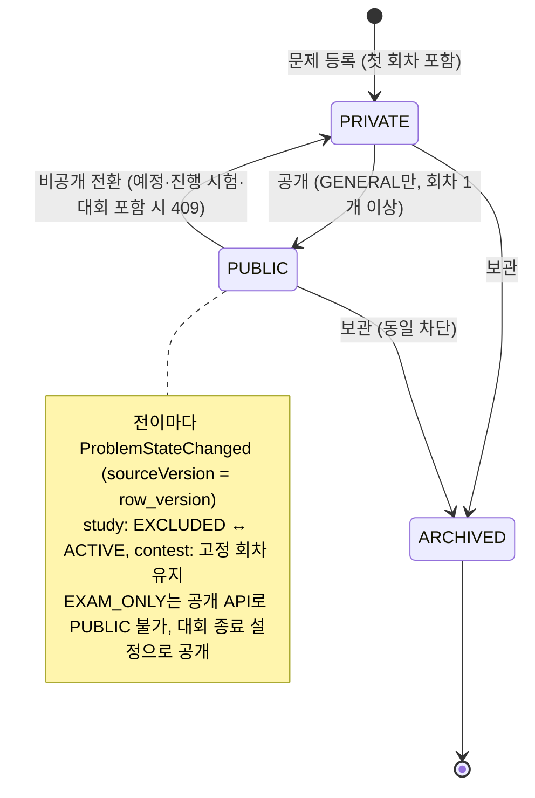
```mermaid
stateDiagram-v2
    [*] --> PRIVATE : 문제 등록 (첫 회차 포함)
    PRIVATE --> PUBLIC : 공개 (GENERAL만, 회차 1개 이상)
    PUBLIC --> PRIVATE : 비공개 전환 (예정·진행 시험·대회 포함 시 409)
    PRIVATE --> ARCHIVED : 보관
    PUBLIC --> ARCHIVED : 보관 (동일 차단)
    ARCHIVED --> [*]
    note right of PUBLIC
        전이마다 ProblemStateChanged (sourceVersion = row_version)
        study: EXCLUDED ↔ ACTIVE, contest: 고정 회차 유지
        EXAM_ONLY는 공개 API로 PUBLIC 불가, 대회 종료 설정으로 공개
    end note
```

### 2.2 수정 회차

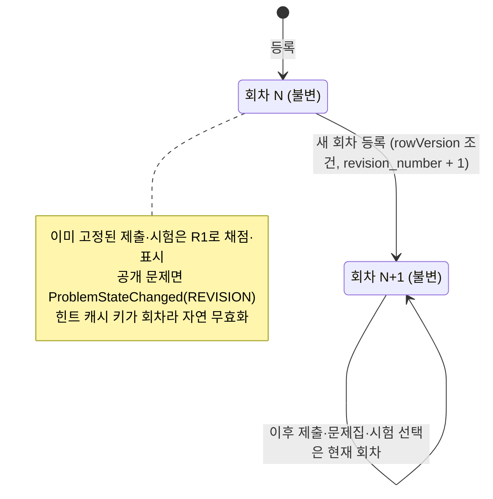
```mermaid
stateDiagram-v2
    state "회차 N (불변)" as R1
    state "회차 N+1 (불변)" as R2
    [*] --> R1 : 등록
    R1 --> R2 : 새 회차 등록 (rowVersion 조건, revision_number + 1)
    R2 --> R2 : 이후 제출·문제집·시험 선택은 현재 회차
    note right of R1
        이미 고정된 제출·시험은 R1로 채점·표시
        공개 문제면 ProblemStateChanged(REVISION)
        힌트 캐시 키가 회차라 자연 무효화
    end note
```

- 검수 워크플로(P2, 보류): 도입 시 `DRAFT → IN_REVIEW → 승인 / REJECTED`, `REJECTED → DRAFT`. 심사 중 회차는 수정 불가, 승인자는 작성자가 아닌 관리자.

### 2.3 문제·테스트케이스 등록

- 목적: S3 업로드와 DB 저장의 실패 조합에서도 고아 데이터가 정리됨을 보여준다.
- 경합·실패 포인트: S3 실패, DB 실패 후 남은 업로드, 같은 멱등키 재요청, 동시 회차 등록.

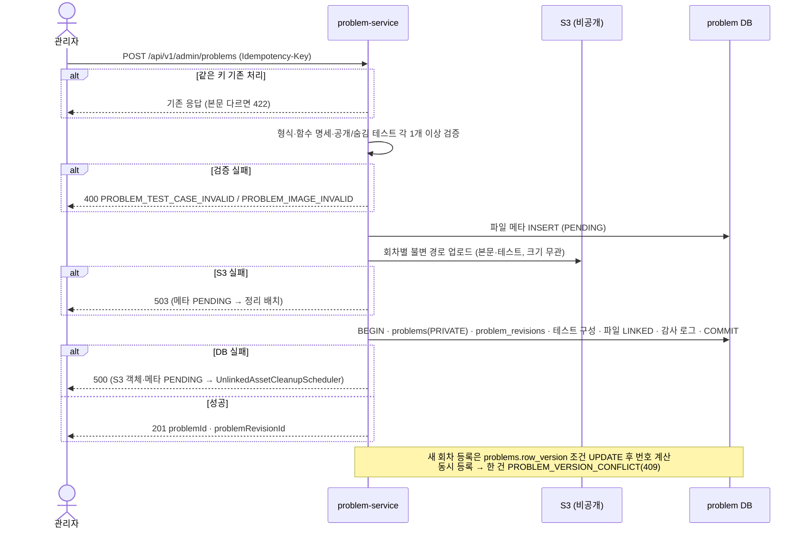
```mermaid
sequenceDiagram
    actor A as 관리자
    participant P as problem-service
    participant S3 as S3 (비공개)
    participant DB as problem DB
    A->>P: POST /api/v1/admin/problems (Idempotency-Key)
    alt 같은 키 기존 처리
        P-->>A: 기존 응답 (본문 다르면 422)
    end
    P->>P: 형식·함수 명세·공개/숨김 테스트 각 1개 이상 검증
    alt 검증 실패
        P-->>A: 400 PROBLEM_TEST_CASE_INVALID / PROBLEM_IMAGE_INVALID
    end
    P->>DB: 파일 메타 INSERT (PENDING)
    P->>S3: 회차별 불변 경로 업로드 (본문·테스트, 크기 무관)
    alt S3 실패
        P-->>A: 503 (메타 PENDING → 정리 배치)
    end
    P->>DB: BEGIN · problems(PRIVATE) · problem_revisions · 테스트 구성 · 파일 LINKED · 감사 로그 · COMMIT
    alt DB 실패
        P-->>A: 500 (S3 객체·메타 PENDING → UnlinkedAssetCleanupScheduler)
    else 성공
        P-->>A: 201 problemId · problemRevisionId
    end
    Note over P,DB: 새 회차 등록은 problems.row_version 조건 UPDATE 후 번호 계산<br/>동시 등록 → 한 건 PROBLEM_VERSION_CONFLICT(409)
```

### 2.4 비공개 전환·보관

- 경합·실패 포인트: 사용 확인 후 시험 편입 경합(자원 가드 도입 전 허용 리스크), contest 조회 실패.

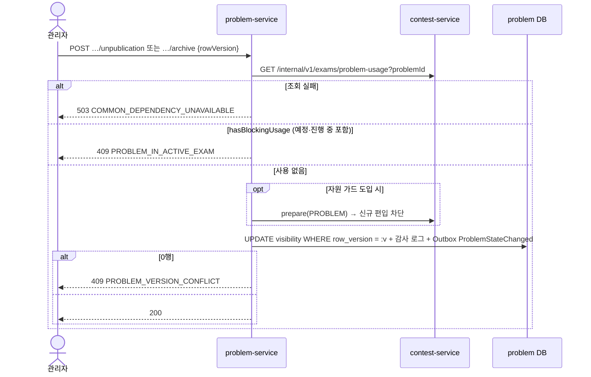
```mermaid
sequenceDiagram
    actor A as 관리자
    participant P as problem-service
    participant C as contest-service
    participant DB as problem DB
    A->>P: POST …/unpublication 또는 …/archive {rowVersion}
    P->>C: GET /internal/v1/exams/problem-usage?problemId
    alt 조회 실패
        P-->>A: 503 COMMON_DEPENDENCY_UNAVAILABLE
    else hasBlockingUsage (예정·진행 중 포함)
        P-->>A: 409 PROBLEM_IN_ACTIVE_EXAM
    else 사용 없음
        opt 자원 가드 도입 시
            P->>C: prepare(PROBLEM) → 신규 편입 차단
        end
        P->>DB: UPDATE visibility WHERE row_version = :v + 감사 로그 + Outbox ProblemStateChanged
        alt 0행
            P-->>A: 409 PROBLEM_VERSION_CONFLICT
        else
            P-->>A: 200
        end
    end
```

### 2.5 풀이 공유·Diff·댓글 권한

- 목적: 공유 권한을 조회 시점마다 재검증함을 보여준다.
- 경합·실패 포인트: 공유 후 스터디 탈퇴·강제 탈퇴, 복제본 이벤트 지연, 공유 취소 후 댓글.

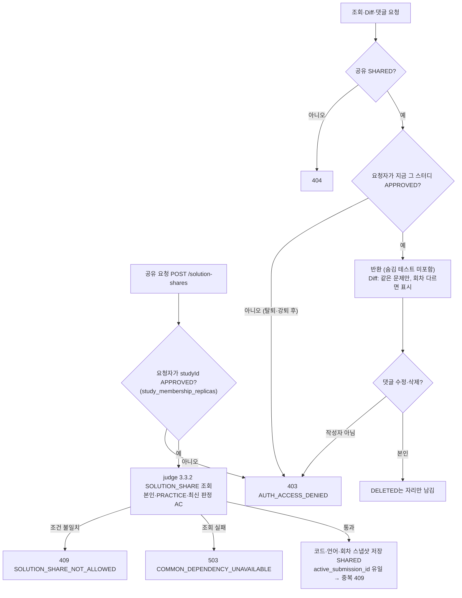
```mermaid
flowchart TD
    A["공유 요청 POST /solution-shares"] --> B{"요청자가 studyId APPROVED?<br/>(study_membership_replicas)"}
    B -->|"아니오"| X1["403 AUTH_ACCESS_DENIED"]
    B -->|"예"| C["judge 3.3.2 SOLUTION_SHARE 조회<br/>본인·PRACTICE·최신 판정 AC"]
    C -->|"조건 불일치"| X2["409 SOLUTION_SHARE_NOT_ALLOWED"]
    C -->|"조회 실패"| X3["503 COMMON_DEPENDENCY_UNAVAILABLE"]
    C -->|"통과"| D["코드·언어·회차 스냅샷 저장 SHARED<br/>active_submission_id 유일 → 중복 409"]
    E["조회·Diff·댓글 요청"] --> F{"공유 SHARED?"}
    F -->|"아니오"| X4["404"]
    F -->|"예"| G{"요청자가 지금 그 스터디 APPROVED?"}
    G -->|"아니오 (탈퇴·강퇴 후)"| X1
    G -->|"예"| H["반환 (숨김 테스트 미포함)<br/>Diff: 같은 문제만, 회차 다르면 표시"]
    H --> I{"댓글 수정·삭제?"}
    I -->|"작성자 아님"| X1
    I -->|"본인"| J["DELETED는 자리만 남김"]
```

- 복제본은 `StudyMemberJoined`·`StudyMemberLeft`의 `membershipId` 순서 규칙으로 갱신한다. 이벤트 지연 중에는 탈퇴자가 수 초간 볼 수 있다(허용 리스크, 확정 필요).

---

## 3. 제출·채점 (judge)

> 작성: 담당 B · 서비스: `judge-service`
> 
- [x]  일반 제출·채점 시퀀스 (3.1·3.2)
- [x]  제출·작업 상태 전이 (3.3)
- [x]  시스템 오류 재시도·임대 회수·장시간 작업 (3.4)
- [x]  시험·대회 요청 수신 중복 방어·DLQ (3.5)
- [x]  관리자 재채점·재처리 → 회차 증가 → 소비자 회차 비교 (3.6)
- [x]  대사 배치 (3.7)

### 3.1 일반 풀이 제출 (`PRACTICE`)

- 목적: 202 접수와 채점 완료가 분리되고, 같은 키 재요청이 같은 제출로 응답됨을 보여준다.
- 경합·실패 포인트: 응답 유실 재요청, 같은 키·다른 본문, 사전 검증 실패, Rate Limit.

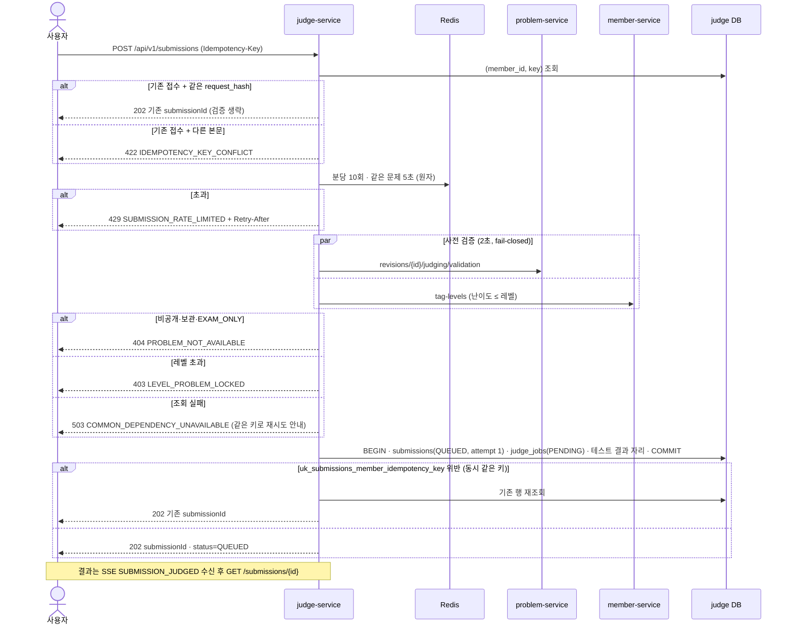
```mermaid
sequenceDiagram
    actor U as 사용자
    participant J as judge-service
    participant R as Redis
    participant P as problem-service
    participant M as member-service
    participant DB as judge DB
    U->>J: POST /api/v1/submissions (Idempotency-Key)
    J->>DB: (member_id, key) 조회
    alt 기존 접수 + 같은 request_hash
        J-->>U: 202 기존 submissionId (검증 생략)
    else 기존 접수 + 다른 본문
        J-->>U: 422 IDEMPOTENCY_KEY_CONFLICT
    end
    J->>R: 분당 10회 · 같은 문제 5초 (원자)
    alt 초과
        J-->>U: 429 SUBMISSION_RATE_LIMITED + Retry-After
    end
    par 사전 검증 (2초, fail-closed)
        J->>P: revisions/{id}/judging/validation
    and
        J->>M: tag-levels (난이도 ≤ 레벨)
    end
    alt 비공개·보관·EXAM_ONLY
        J-->>U: 404 PROBLEM_NOT_AVAILABLE
    else 레벨 초과
        J-->>U: 403 LEVEL_PROBLEM_LOCKED
    else 조회 실패
        J-->>U: 503 COMMON_DEPENDENCY_UNAVAILABLE (같은 키로 재시도 안내)
    end
    J->>DB: BEGIN · submissions(QUEUED, attempt 1) · judge_jobs(PENDING) · 테스트 결과 자리 · COMMIT
    alt uk_submissions_member_idempotency_key 위반 (동시 같은 키)
        J->>DB: 기존 행 재조회
        J-->>U: 202 기존 submissionId
    else
        J-->>U: 202 submissionId · status=QUEUED
    end
    Note over U,J: 결과는 SSE SUBMISSION_JUDGED 수신 후 GET /submissions/{id}
```

### 3.2 채점 실행기

- 목적: `judge_jobs`를 원천으로 선점·임대·결과 저장이 이뤄짐을 보여준다.
- 경합·실패 포인트: 두 실행기 동시 선점, 임대 만료 후 늦은 결과, Judge0 생성 응답 유실, 결과 조회 실패, 서킷 열림.

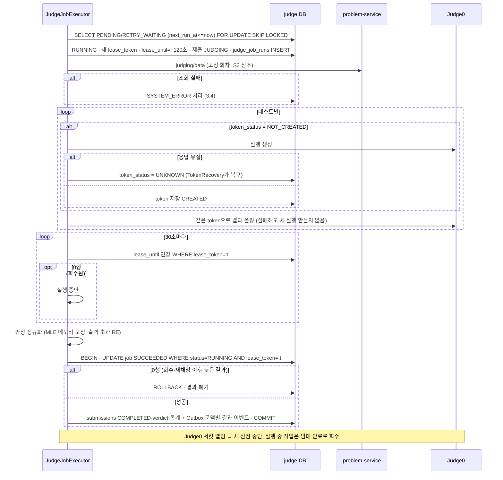
```mermaid
sequenceDiagram
    participant E as JudgeJobExecutor
    participant DB as judge DB
    participant P as problem-service
    participant J0 as Judge0
    E->>DB: SELECT PENDING/RETRY_WAITING (next_run_at<=now) FOR UPDATE SKIP LOCKED
    E->>DB: RUNNING · 새 lease_token · lease_until=+120초 · 제출 JUDGING · judge_job_runs INSERT
    E->>P: judging/data (고정 회차, S3 참조)
    alt 조회 실패
        E->>DB: SYSTEM_ERROR 처리 (3.4)
    end
    loop 테스트별
        alt token_status = NOT_CREATED
            E->>J0: 실행 생성
            alt 응답 유실
                E->>DB: token_status = UNKNOWN (TokenRecovery가 복구)
            else
                E->>DB: token 저장 CREATED
            end
        end
        E->>J0: 같은 token으로 결과 폴링 (실패해도 새 실행 만들지 않음)
    end
    loop 30초마다
        E->>DB: lease_until 연장 WHERE lease_token=:t
        opt 0행 (회수됨)
            E->>E: 실행 중단
        end
    end
    E->>E: 판정 정규화 (MLE 메모리 보정, 출력 초과 RE)
    E->>DB: BEGIN · UPDATE job SUCCEEDED WHERE status=RUNNING AND lease_token=:t
    alt 0행 (회수·재채점 이후 늦은 결과)
        E->>DB: ROLLBACK · 결과 폐기
    else 성공
        E->>DB: submissions COMPLETED·verdict·통계 + Outbox 문맥별 결과 이벤트 · COMMIT
    end
    Note over E,J0: Judge0 서킷 열림 → 새 선점 중단, 실행 중 작업은 임대 만료로 회수
```

### 3.3 제출·채점 작업 상태

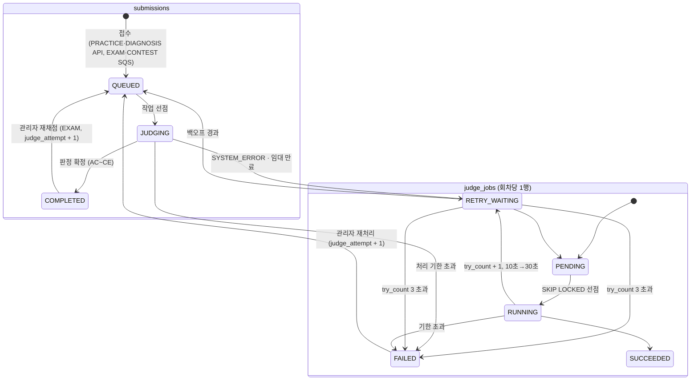
```mermaid
stateDiagram-v2
    state "submissions" as S {
        [*] --> QUEUED : 접수 (PRACTICE·DIAGNOSIS API, EXAM·CONTEST SQS)
        QUEUED --> JUDGING : 작업 선점
        JUDGING --> COMPLETED : 판정 확정 (AC~CE)
        JUDGING --> RETRY_WAITING : SYSTEM_ERROR · 임대 만료
        RETRY_WAITING --> QUEUED : 백오프 경과
        RETRY_WAITING --> FAILED : try_count 3 초과
        JUDGING --> FAILED : 처리 기한 초과
        FAILED --> QUEUED : 관리자 재처리 (judge_attempt + 1)
        COMPLETED --> QUEUED : 관리자 재채점 (EXAM, judge_attempt + 1)
    }
    state "judge_jobs (회차당 1행)" as JJ {
        [*] --> PENDING
        PENDING --> RUNNING : SKIP LOCKED 선점
        RUNNING --> SUCCEEDED
        RUNNING --> RETRY_WAITING : try_count + 1, 10초→30초
        RETRY_WAITING --> PENDING
        RETRY_WAITING --> FAILED : try_count 3 초과
        RUNNING --> FAILED : 기한 초과
    }
```

- 재채점·재처리는 기존 작업을 되살리지 않고 `(submission_id, judge_attempt + 1)` 새 작업 행을 만든다.

### 3.4 재시도·임대 회수·실패 종결

```mermaid
flowchart TD
    A["실행 결과"] --> B{"판정 종류"}
    B -->|"AC·WA·TLE·MLE·RE·CE"| OK["SUCCEEDED · COMPLETED · 결과 이벤트"]
    B -->|"SYSTEM_ERROR<br/>(Judge0 장애·타임아웃·데이터 조회 실패)"| C["try_count + 1"]
    L["JudgeLeaseRecovery 30초<br/>lease_until 경과 또는 RUNNING 10분 초과"] --> C
    C --> D{"try_count > 3<br/>또는 deadline_at 경과?"}
    D -->|"아니오"| W["RETRY_WAITING<br/>next_run_at = +10초 / +30초<br/>제출 QUEUED"]
    W --> S["다음 선점 (새 lease_token)"]
    D -->|"예"| F["작업·제출 FAILED<br/>Outbox SubmissionFailed"]
    F --> N["알림: 채점 실패, 재처리 예정"]
    F --> X{"문맥"}
    X -->|"PRACTICE"| X1["새 제출 안내"]
    X -->|"EXAM"| X2["contest 확정 보류 → 운영자 재처리(3.6) 또는 0점 확정"]
    X -->|"CONTEST"| X3["관리자 재처리 또는 무효 확정"]
    X -->|"DIAGNOSIS"| X4["쿨타임 면제"]
```

### 3.5 시험·대회 채점 요청 수신 (SQS)

- 경합·실패 포인트: 중복 수신, 저장 후 삭제 실패, DB 실패 반복(DLQ), Visibility 만료 중 재수신.

```mermaid
sequenceDiagram
    participant Q as exam-submission-queue
    participant J as judge consumer
    participant DB as judge DB
    J->>Q: 수신 (Visibility 120초)
    J->>DB: BEGIN · INSERT processed_events
    alt eventId 중복
        J->>DB: ROLLBACK
        J->>Q: 삭제
    else
        J->>DB: submissions(context, source_submission_id, submitted_at = receivedAt) · judge_jobs PENDING
        alt uk_submissions_context_source_submission 위반 (다른 eventId로 같은 접수)
            J->>DB: ROLLBACK 후 processed_events만 기록
            J->>Q: 삭제
        else
            J->>DB: COMMIT
            J->>Q: 삭제
            opt 삭제 실패
                Q-->>J: 재수신 → eventId 중복 경로
            end
        end
    end
    opt DB 예외
        J->>DB: ROLLBACK (삭제 안 함)
        Q-->>J: 재수신, 3회 초과 시 DLQ · 운영 알림
    end
    Note over J,DB: judge 수신 시각으로 마감을 재판정하지 않는다
```

### 3.6 재채점·재처리 → 회차 증가 → 소비자 비교

```mermaid
sequenceDiagram
    actor O as 시험 운영자·관리자
    participant C as contest-service
    participant J as judge-service
    participant DB as judge DB
    participant CON as 소비자 (contest·member·study…)
    O->>C: 시험 FAILED 제출 재처리 (4.5.1)
    C->>C: 권한·FINALIZED 전 확인, 관리자 작업 PENDING(operationId)
    C->>J: POST /internal/v1/submissions/{id}/reprocesses {operationId, expectedJudgeAttempt}
    alt 같은 operationId 재요청
        J-->>C: 기존 결과 반환
    else EXAM·FAILED·attempt 일치
        J->>DB: WHERE status=FAILED AND judge_attempt=:expected<br/>→ QUEUED, judge_attempt+1, 새 judge_jobs + 감사 로그
        J-->>C: 202 새 judgeAttempt
    else 조건 불일치
        J-->>C: 409 REJUDGE_NOT_ALLOWED
    end
    opt 응답 유실
        C->>C: 작업 PENDING 유지 → 5분 대사(스케줄러 4.7)
    end
    J->>J: 실행기 처리
    J-->>CON: ExamSubmissionJudged(judgeAttempt = N+1)
    CON->>CON: 저장 회차 < N+1 일 때만 반영, 이하면 무시
    Note over C,J: PRACTICE 재채점 없음. FINALIZED 이후 도착 결과는 재확정으로만 반영
```

### 3.7 대사 (Reconciliation)

```mermaid
flowchart TD
    A["5분마다: QUEUED·JUDGING 2분 이상 정체 제출"] --> B["최신 회차 judge_jobs 조회"]
    B --> C{"조합"}
    C -->|"작업 없음"| C1["기록·운영 알림 (자동 생성 금지)"]
    C -->|"JUDGING ↔ PENDING/RETRY_WAITING"| C2["제출 QUEUED 정정"]
    C -->|"QUEUED/JUDGING ↔ SUCCEEDED"| C3["제출 COMPLETED 보정<br/>+ 같은 회차 결과 이벤트 (소비자 멱등)"]
    C -->|"QUEUED/JUDGING ↔ FAILED"| C4["제출 FAILED + SubmissionFailed"]
    C -->|"RUNNING 임대 만료"| C5["임대 회수 스케줄러에 위임"]
    C2 & C3 & C4 --> D["모두 WHERE status=:observed AND judge_attempt=:attempt<br/>정상 경로가 먼저면 0행"]
```

---

## 4. 모의 코테·대회 (contest)

> 작성: 담당 C · 서비스: `contest-service`
> 

### 4.1 시험·대회 상태와 결과 공개

- 목적: 시간 종료, 자동 제출, 결과 확정이 서로 다른 단계임을 보여준다.
- 경합·실패 포인트: 개인 종료는 시험 전체 종료가 아니다. 미해결 FAILED·관리자 작업·자동 제출 누락이 있으면 확정하지 않는다.

```mermaid
flowchart TD
    ES["시험 SCHEDULED"] -->|"서버 시간 도달"| EI["IN_PROGRESS"]
    ES -->|"시작 전 취소"| EC["CANCELED"]
    EI -->|"서버 시각이 전체 endsAt 초과"| EL["CLOSED: 잠정 결과"]
    EL --> EA["입장자 최신 Draft 자동 제출<br>FINISHED 및 autoSubmittedAt 기록"]
    EA --> EF{"자동 제출 완료·활성 참가 종결<br>채점 종결·관리자 작업 없음?"}
    EF -->|"아니오"| EW["확정 보류·실패 운영 알림"]
    EW --> EF
    EF -->|"예"| EZ["FINALIZED<br>DB 재계산·불변 스냅샷·Outbox"]
    CS["대회 SCHEDULED"] -->|"서버 시간 도달"| CR["RUNNING: 판정·순위 공개"]
    CS -->|"시작 전 취소"| CC["CANCELED"]
    CR -->|"서버 시각이 endsAt 초과"| CE["ENDED: 늦은 채점 반영"]
    CE --> CF{"채점 종결·실패 무효 처리 완료?"}
    CF -->|"아니오"| CW["확정 보류"]
    CW --> CF
    CF -->|"예"| CZ["FINALIZED<br>ICPC 재계산·스냅샷·Outbox"]
    EZ --> N["확정 결과 알림"]
    CZ --> N
    EL --> SN["종료 알림 없음"]
    CE --> SN
```

### 4.2 생성·참가·입장·취소

- 목적: 생성 권한·고정 회차, 실제 입장과 단순 등록, 취소 후 재신청을 연결한다.
- 경합·실패 포인트: 문제 편입·회원 입장은 자원 가드와 직렬화한다. 시작 뒤 스터디 탈퇴는 기존 참가를 제거하지 않는다.

```mermaid
sequenceDiagram
    participant U as 사용자
    participant C as contest-service
    participant D as study-service
    participant B as problem-service
    participant DB as contest DB
    U->>C: 시험 생성
    C->>D: 현재 역할·스터디 상태 조회
    D-->>C: APPROVED LEADER 또는 MANAGER
    C->>B: GENERAL/PUBLIC 현재 회차 조회
    B-->>C: problemRevisionId·revisionNumber
    C->>DB: STUDY/PROBLEM 가드 잠금·회차 고정·시험 저장
    C-->>U: 201 examId·설정
    U->>C: 참가 등록
    C->>DB: MEMBER 가드·APPROVED 복제본 확인
    C->>DB: REGISTERED·이력·참가 이벤트 원자 저장
    alt 시작 전 취소
        U->>C: 참가 취소
        C->>DB: CANCELED·이력·취소 이벤트
        U->>C: 다시 등록
        C->>DB: 새 participantId 생성
    else 시작 뒤 입장
        U->>C: start API
        C->>DB: MEMBER 가드 잠금·enteredAt 최초 기록·STARTED
        C-->>U: 고정 개인 마감·serverNow
    end
```

### 4.3 Draft·직접 제출·재요청

- 목적: 전체 언어 공통 seq, 동일 요청 복구, 마감 판정을 보여준다.
- 경합·실패 포인트: 저장 성공은 DB 커밋 뒤 응답한다. Draft의 같거나 작은 seq는 무시한다. 직접 제출의 같은 seq·다른 본문은 충돌이며 숨김 채점 결과는 시험 중 반환하지 않는다.

```mermaid
flowchart TD
    A["Draft 또는 직접 제출"] --> B["인증·고정 회차·코드 검증<br>신규 요청만 잠금 전 ACTIVE 원격 조회"]
    B --> C["시험·참가자 잠금"]
    C --> D{"직접 제출의 같은 seq 접수 기록?"}
    D -->|"동일 본문"| R["기존 examSubmissionId 반환<br>마감 후 재요청도 허용"]
    D -->|"다른 본문"| X["422 IDEMPOTENCY_KEY_CONFLICT"]
    D -->|"없음 또는 Draft"| E{"신규 접수 시간 내·개인 미종료?"}
    E -->|"아니오"| F["409 EXAM_CLOSED"]
    E -->|"예"| V["트랜잭션 안 로컬 회원 상태 재검증"]
    V --> G{"전체 언어 최대 seq와 비교"}
    G -->|"Draft seq가 같거나 작음"| H["200 applied=false·serverSeq"]
    G -->|"이전 신규 제출"| I["409 DRAFT_SEQ_CONFLICT"]
    G -->|"새 Draft 또는 최신 이상 직접 제출"| J{"직접 제출?"}
    J -->|"Draft"| K["필요한 Draft만 갱신·커밋"]
    J -->|"제출"| EQ{"서버 seq와 같고<br>최신 Draft 언어·코드 불일치?"}
    EQ -->|"예"| I
    EQ -->|"아니오"| L["Draft·exam_submissions·Outbox<br>하나의 트랜잭션"]
    L --> M["202 접수 ID"]
    M --> Q["SQS ExamSubmissionRequested"]
```

### 4.4 자동 제출·마감·결과 확정 경합

- 목적: 종료 작업과 직접 제출의 중복·누락을 막는다.
- 경합·실패 포인트: +3초는 자동 처리 시점이며 신규 접수 유예가 아니다. 입장하지 않은 참가자는 ABSENT, 취소 참가자는 대상에서 제외한다.

```mermaid
sequenceDiagram
    participant U as 사용자 요청
    participant A as ExamAutoSubmissionScheduler
    participant F as ExamResultFinalizationScheduler
    participant DB as contest DB
    U->>DB: 시험 → 참가자 잠금 후 접수 시간 확인
    alt 시간 안 신규 제출
        U->>DB: Draft·제출·Outbox 저장 후 커밋
    else 마감 후 신규 요청
        DB-->>U: EXAM_CLOSED
    end
    A->>DB: 마감+3초 도달·시험 → 참가자 잠금
    A->>DB: 문제별 전체 언어 최신 seq 확인
    alt 새 비어 있지 않은 Draft
        A->>DB: 같은 seq 유일 제약으로 AUTO 제출·Outbox
    else 이미 제출 또는 최신 코드 빈 문자열
        A->>DB: 새 제출 없음
    end
    A->>DB: autoSubmittedAt·FINISHED·이력 원자 커밋
    F->>DB: CLOSED·활성 참가 종결·자동 제출 완료 확인
    F->>DB: 채점 종결·실패 처리·관리자 작업 종결 확인
    alt 모든 조건 만족
        F->>DB: 점수·순위·스냅샷·확정 이벤트 커밋
    else 조건 미충족
        DB-->>F: 다음 10초 주기까지 보류
    end
```

### 4.5 채점 결과·실패 재처리·재확정

- 목적: B 채점과 C 결과 집계, 원격 성공 응답 유실의 복구를 구분한다.
- 경합·실패 포인트: SQS 수신 보호와 judge_jobs 실행 임대는 별개다. 시험 FAILED만 FINALIZED 전에 재처리한다.

```mermaid
sequenceDiagram
    participant C as contest-service
    participant Q as SQS
    participant B as judge-service
    participant DB as contest DB
    participant N as notification-service
    C->>Q: Requested 이벤트·불변 receivedAt
    Q->>B: 메시지 전달
    B->>B: processed_events·submission·judge_job 원자 저장
    B->>Q: 수신 메시지 삭제
    B->>B: job 임대·실행·결과 저장
    B-->>C: ExamSubmissionJudged 또는 ContestSubmissionJudged
    C->>DB: receipt·회차·접수 시간 검증
    C->>DB: 큰 최초/허용 재처리 회차만 적용·processed_events·합계·resultRevision
    Note over C,DB: 같은 회차 동일 결과는 중복 무시<br>같은 회차 상충·미허용 새 회차는 격리
    alt EXAM FAILED 관리자·시험 운영자 재처리
        C->>DB: 관리자 작업 PENDING
        C->>B: 같은 operationId로 retry
        B-->>C: 새 judgeAttempt·QUEUED
        C->>DB: targetJudgeAttempt 저장·반영 회차 유지·REQUESTED 또는 종결 보존
        Note over C,DB: judge_attempt는 결과 반영 때만 증가<br>응답 유실은 작업 대사로 복구, 확정 보류
    else FAILED 관리자 종결
        C->>DB: 시험 0점 또는 대회 무효·감사 로그
    end
    C->>DB: 전체 종결 뒤 FINALIZED·불변 결과 스냅샷
    C-->>N: ExamFinalized 또는 ContestFinalized
    Note over C,N: 종료·잠정·건별 완료 알림 없음
    Note over C,DB: FINALIZED 후 새 재채점 금지<br>관리자 재확정은 기존 유효 기록 재집계만 허용
```

### 4.6 대회 ICPC·Redis·SSE

- 목적: 채점 도착 순서와 접수 순서를 분리하고 DB를 순위 원천으로 유지한다.
- 경합·실패 포인트: CE·SYSTEM_ERROR와 AC 이후 제출은 오답 패널티 제외. 캐시 장애는 접수·채점 DB 커밋을 취소하지 않는다.

```mermaid
flowchart TD
    A["ContestSubmissionJudged"] --> B{"eventId 중복·작은 회차<br>또는 같은 회차 동일 종결?"}
    B -->|"예"| C["반영 없이 성공"]
    B -->|"아니오"| V{"접수 식별·고정 회차 일치<br>마지막 반영보다 큰 허용 회차?"}
    V -->|"아니오"| Q["상충 종결·미허용 회차 격리"]
    V -->|"예"| D["receivedAt·id 순으로 문제 제출 재계산"]
    D --> E["최초 AC·그 이전 WA/TLE/MLE/RE만 집계"]
    E --> F["solvedCount·penaltyMinutes·lastAcceptedAt"]
    F --> G["DB 커밋<br>resultRevision 증가"]
    G --> H["같은 버전 Redis lex 키 원자 갱신"]
    H --> I{"Redis 성공·최신 버전?"}
    I -->|"예"| J["SSE 순위 변경 안내"]
    I -->|"아니오"| K["DB 조회·캐시 재구성"]
    K --> J
    J --> L["클라이언트 현재 페이지 최신 순위 재조회"]
    L --> M["동점 공동 순위·미제출자 제외"]
```

### 4.7 탈퇴·스터디 종료·문제 숨김 가드

- 목적: 확인 API 뒤 상태가 바뀌는 경합을 막는다(자원 가드 도입 결정 대기, API 부록 D).
- 경합·실패 포인트: 원격 처리 상태가 불명확하면 준비 가드를 TTL로 풀지 않는다. 스터디 종료 준비로 취소한 예정 시험은 자동 복원하지 않는다.

```mermaid
flowchart TD
    A["소유 서비스 prepare(operationId)"] --> B["C 자원 가드 비관적 락"]
    B --> C{"MEMBER / STUDY / PROBLEM"}
    C -->|"MEMBER"| M{"실제 입장한 미확정 문맥?"}
    M -->|"예"| X["409 탈퇴 차단"]
    M -->|"아니오"| P["PREPARED·신규 입장/등록 차단"]
    C -->|"STUDY"| S["PREPARED·신규 시험 차단<br>SCHEDULED 취소"]
    S --> T{"진행 중 시험이 CLOSED?"}
    T -->|"아니오"| W["202 ready=false·준비 유지"]
    W --> T
    T -->|"예"| R["ready=true"]
    C -->|"PROBLEM"| G{"예정 또는 진행 중 참조?"}
    G -->|"예"| Y["409 숨김 차단"]
    G -->|"아니오"| PP["PREPARED<br>신규 문제 편입 차단"]
    PP --> R
    P --> R
    R --> O["소유 서비스 자기 DB 상태 변경"]
    O --> D["complete 또는 소유 상태 이벤트"]
    D --> E["BLOCKED·sourceVersion 저장"]
    R -->|"소유 작업 ABORTED"| F["cancel·OPEN"]
    W --> Z["작업 상태 대사"]
    Z -->|"PENDING/조회 실패"| W
    Z -->|"COMMITTED"| D
    Z -->|"ABORTED"| F
```

### 4.8 Run과 제출 분리

- 목적: 공개 테스트 실행이 제출 이력이나 점수를 만들지 않음을 보여준다.
- 경합·실패 포인트: B가 전체 문맥에서 회원 공통 실행 중 락을 소유한다. 숨김 테스트·쿨다운 TTL 없음.

```mermaid
sequenceDiagram
    participant U as 참가자
    participant C as contest-service
    participant B as judge-service
    participant J as Judge0
    U->>C: runs API·코드·사용자 입력
    C->>C: ACTIVE·입장·고정 회차·시간 확인
    C->>B: 내부 Run
    B->>C: 문맥 RUN 권한 재검증
    C-->>B: 허용·고정 회차
    B->>B: run 회원 락 원자 획득
    alt 이미 실행 중
        B-->>C: 429 RUN_IN_PROGRESS
        C-->>U: 실행 중 오류
    else 락 획득 성공
        B->>J: 공개 예제·사용자 입력만 동기 실행
        alt 30초 이내 완료
            J-->>B: 출력·오류·시간·메모리
            B->>B: 소유 토큰으로 락 해제
            B-->>C: 결과
            C-->>U: 실행 결과
        else 실행 기한 초과
            B->>J: 실행 중단·상태 확인
            B->>B: 실행 종결 뒤 소유 토큰으로 락 해제
            B-->>C: 504 RUN_TIMEOUT
            C-->>U: 실행 시간 초과
        end
    end
    Note over C,B: Draft·제출·job·Outbox·점수 저장 없음<br>인스턴스 비정상 종료 락은 RunLockReconciliation(스케줄러 3.5)이 해제
```

### 4.9 종료 공개·풀이 공유·분석

- 목적: 대회 전용 문제 공개와 확정 결과 활용의 경계를 보여준다.
- 경합·실패 포인트: scope를 GENERAL로 바꾸지 않는다. 공유 코드는 본인 AC만, 분석은 불변 확정 스냅샷만 사용한다.

```mermaid
flowchart TD
    A["대회 ENDED"] --> B{"isProblemsPublicAfterEnd?"}
    B -->|"예"| C["C 공개 문제 화면<br>B 고정 회차 내부 권한 조회"]
    B -->|"아니오"| D["실제 입장한 본인 복기만"]
    C --> E["EXAM_ONLY 유지<br>일반 목록·문제집 노출 없음"]
    F["시험·대회 FINALIZED"] --> G["result_snapshots 불변 저장"]
    G --> H{"본인 AC 공유 요청?"}
    H -->|"예"| I["B가 C shareable API 조회<br>코드·회차 스냅샷"]
    I --> J["B가 스터디 권한 검증·공유 저장"]
    G --> K["분석 P3 확정 버전 조회"]
    K --> L["문제별 복기·후속 학습 후보"]
    K --> M["PRACTICE 승급·진행률·GitHub 동기화 제외"]
```

---

## 5. 스터디 (study)

> 작성: 담당 D · 서비스: `study-service`
> 

### 5.1 스터디 가입 — 즉시 가입 / 승인 가입, 경합

- 목적: 가입 요청이 정원·참여 상한·중복을 어떻게 원자적으로 통과하는지 보여준다.
- 경합·실패 포인트: 같은 스터디 마지막 자리에 동시 가입, 같은 회원이 서로 다른 스터디에 동시 가입, 같은 스터디 중복 신청, 가입과 문제집 개설 동시 발생(5.6)

```mermaid
sequenceDiagram
    actor U as 사용자
    participant GW as API Gateway
    participant SS as study-service
    participant DB as study DB
    participant OB as Outbox Relay
    participant SNS as SNS

    U->>GW: POST /api/v1/studies/{studyId}/memberships
    GW->>SS: X-User-Id 전달
    SS->>DB: member_replicas.member_status 확인
    alt 정지 회원
        SS-->>U: 403 MEMBER_SUSPENDED
    end

    alt 승인 가입 (APPROVAL)
        SS->>DB: studies 조회 (status = RECRUITING 확인)
        SS->>DB: INSERT study_memberships (PENDING, expires_at = now + 7일)<br/>INSERT study_membership_histories
        alt uk_study_memberships_study_active_member 위반
            SS-->>U: 409 STUDY_ALREADY_APPLIED
        else 신청 저장
            SS-->>U: 201 status = PENDING
        end
    else 즉시 가입 (INSTANT)
        SS->>DB: ① UPDATE study_member_quotas<br/>SET active_count + 1 WHERE active_count < 5
        alt 0행 (상한 5개)
            SS-->>U: 409 STUDY_JOIN_LIMIT_EXCEEDED (롤백)
        end
        SS->>DB: ② UPDATE studies SET member_count + 1, status 재계산, version + 1<br/>WHERE status = RECRUITING AND member_count < capacity
        alt 0행 (정원 초과 또는 모집 아님)
            SS-->>U: 409 STUDY_FULL 또는 STUDY_NOT_RECRUITING (전체 롤백)
        end
        SS->>DB: ③ SELECT assignments (SCHEDULED, OPEN) FOR SHARE
        SS->>DB: ④ INSERT study_memberships (APPROVED) + 이력
        alt uk_study_memberships_study_active_member 위반
            SS-->>U: 409 STUDY_ALREADY_APPLIED (전체 롤백, 카운터도 복구)
        end
        SS->>DB: ⑤ member_ac_replicas FOR SHARE (OPEN 문제집의 기존 풀이)<br/>⑥ upsert assignment_member_statuses, assignment_completions
        SS->>DB: INSERT outbox_events (StudyMemberJoined)
        SS-->>U: 201 status = APPROVED
        OB->>SNS: StudyMemberJoined v1
    end
```

- 비고: 확보 순서 ① 회원 카운터 → ② 스터디 정원은 스케줄러 문서 5.0 잠금 순서 규칙과 같다. 두 카운터는 조건부 UPDATE이므로 락을 조회~저장 내내 쥐지 않는다. 승인(`PATCH …/memberships/{id}`)도 ①~⑥이 같고, 맨 앞에 `PENDING → APPROVED`(`expires_at > now()`) 조건부 UPDATE가 추가되며, `StudyApplicationDecided`(`APPROVED`)도 함께 기록한다. 정지 확인 복제본은 공통 `member_replicas`(ERD §3.5)다.

### 5.2 가입 상태 전이

- 목적: 가입 상태가 허용된 흐름으로만 바뀌는 것을 보여준다.
- 경합·실패 포인트: 승인·만료·취소·탈퇴 전파가 같은 `PENDING` 행을 동시에 바꾸려는 경우 — 모두 `WHERE status = 'PENDING'` 조건부 UPDATE, 먼저 커밋한 쪽만 반영

```mermaid
stateDiagram-v2
    [*] --> PENDING : APPROVAL 스터디 신청
    [*] --> APPROVED : INSTANT 스터디 가입 또는 스터디 생성

    PENDING --> APPROVED : 운영진 승인 (만료 전, 정원과 상한 확보)
    PENDING --> REJECTED : 운영진 거절
    PENDING --> CANCELED : 본인 취소, 회원 탈퇴, 스터디 종료
    PENDING --> EXPIRED : 만료 스케줄러 (신청 후 7일)

    APPROVED --> LEFT : 본인 탈퇴 또는 회원 탈퇴 (LEADER는 위임 후)
    APPROVED --> REMOVED : 운영진 강제 탈퇴 (사유 필수)

    REJECTED --> [*]
    CANCELED --> [*]
    EXPIRED --> [*]
    LEFT --> [*]
    REMOVED --> [*]
```

- 비고: 종단 상태에서 재가입하면 새 행이 생기고 `membershipId`가 커진다. contest·problem의 구성원 복제본은 이 값으로 순서를 판단한다(이벤트 계약서 S1). 스터디가 `CLOSED`여도 `APPROVED`는 유지되며 읽기 전용이 된다.

### 5.3 채점 이벤트 → 과제 완료 반영

- 목적: 채점 결과가 중복·순서 역전·재채점과 관계없이 한 번, 올바른 유형으로 반영되는 과정을 보여준다.
- 경합·실패 포인트: 같은 이벤트 재전달, 같은 문제 AC 여러 번, 재채점 결과가 원래 결과보다 먼저 도착, 재채점으로 AC → WA, 문제집 개설과 동시 도착

```mermaid
sequenceDiagram
    participant JS as judge-service
    participant SNS as SNS
    participant SQ as SQS study-queue
    participant SS as study-service Consumer
    participant DB as study DB

    JS->>SNS: SubmissionJudged v1 (PRACTICE 전용)<br/>(verdict, judgeAttempt, submittedAt)
    SNS->>SQ: 팬아웃
    SS->>SQ: 메시지 수신

    SS->>DB: BEGIN / INSERT processed_events (event_id)
    alt 유일 제약 위반 (이미 처리)
        SS->>DB: ROLLBACK
        SS-->>SQ: 메시지 삭제 (멱등)
    else judgeAttempt = 1 이고 AC가 아님
        SS->>DB: COMMIT (기록만, 일반 오답은 복제하지 않음)
        SS-->>SQ: 메시지 삭제
    else 반영 대상
        SS->>DB: 대상 문제집 조회 (problem_id 포함, 멤버가 대상, status OPEN 또는 마감 CLOSED)<br/>SELECT assignments FOR SHARE (id 오름차순)
        SS->>DB: SELECT member_ac_replicas WHERE submission_id FOR UPDATE
        alt 저장된 judge_attempt >= 수신 judgeAttempt (늦게 온 이전 회차)
            SS->>DB: COMMIT (복제본 유지)
        else 새 회차
            SS->>DB: UPSERT member_ac_replicas (verdict, is_accepted, judge_attempt)
            loop 대상 문제집마다
                SS->>DB: 최초 유효 AC 조회 (접수 시각 오름차순)
                alt 유효 AC 없음 (재채점으로 AC 취소)
                    SS->>DB: assignment_completions → REVOKED
                else 유효 AC 있음
                    SS->>DB: UPSERT assignment_completions<br/>(근거 = 최초 유효 AC, 유형 = 5.4 판정)
                end
                SS->>DB: assignment_member_statuses 재계산<br/>(INCOMPLETE → COMPLETED 복귀 포함)
            end
            SS->>DB: COMMIT
        end
        SS-->>SQ: 메시지 삭제
    end

    opt 처리 중 예외
        SS->>DB: ROLLBACK
        Note over SS,SQ: 메시지를 삭제하지 않음 → SQS 재전달<br/>수신 한도 초과 시 study-queue-dlq, 운영 알림
    end
```

- 비고: 완료 기록은 “이번 이벤트의 유형”이 아니라 “현재 유효한 AC 중 가장 이른 제출”로 매번 다시 계산한다. 그래서 이벤트가 어떤 순서로 와도 결과가 같고, 이전 초안의 “상태 개선 / 역행 불가” 분기가 필요 없다. 문제집 행을 복제본보다 먼저 잠그는 이유는 스케줄러 문서 5.0·5.2 참조. `SubmissionJudged`는 `PRACTICE` 전용이라 문맥 분기를 두지 않는다(이벤트 계약서 J1).

### 5.4 완료 유형 판정

- 목적: 완료 유형이 입력값만으로 결정되는 순수 함수임을 보여준다.
- 경합·실패 포인트: 없음(입력이 같으면 결과가 같다). 입력 = 근거 제출의 접수 시각, 문제집 시작·마감 시각, 기존 풀이 인정 옵션

```mermaid
flowchart TD
    A["유효 AC 후보 목록<br/>(회원·문제, is_accepted = true)"] --> B{"기존 풀이 인정 옵션?"}
    B -- 켬 --> C["후보 전체"]
    B -- 끔 --> D["접수 시각 >= 시작 시각인 후보만"]
    C --> E{"후보가 있는가?"}
    D --> E
    E -- 없음 --> R["인정 없음<br/>(기존 기록이 있으면 REVOKED)"]
    E -- 있음 --> F["근거 = 접수 시각이 가장 이른 후보"]
    F --> G{"근거 접수 시각 < 시작 시각?"}
    G -- 예 --> P["PRE_SOLVED"]
    G -- 아니오 --> H{"마감 시각이 있는가?"}
    H -- 없음 --> O["ON_TIME"]
    H -- 있음 --> I{"근거 접수 시각 <= 마감 시각?"}
    I -- 예 --> O
    I -- 아니오 --> L["LATE"]
```

- 비고: 판정 시각은 채점 완료 시각이 아니라 **제출 접수 시각**이다(정책 D 변경 7). 마감 직전 접수·마감 후 채점 완료는 `ON_TIME`이다. `EXCLUDED` 문제는 판정 대상에서 뺀다.

### 5.5 스터디장 위임

- 목적: 위임 중에도 스터디장이 정확히 1명으로 유지되는 과정을 보여준다.
- 경합·실패 포인트: 대상이 구성원이 아님, 동시 위임 두 건, 대상이 이미 운영진

```mermaid
sequenceDiagram
    actor L as 현 LEADER
    participant GW as API Gateway
    participant SS as study-service
    participant DB as study DB

    L->>GW: POST /api/v1/studies/{studyId}/delegate-leader<br/>{targetMembershipId}
    GW->>SS: X-User-Id 전달
    SS->>DB: BEGIN
    SS->>DB: ① UPDATE study_memberships SET role = MANAGER<br/>WHERE id = 내 가입 AND role = LEADER AND status = APPROVED
    alt 0행 (이미 위임됨 또는 LEADER 아님)
        SS->>DB: ROLLBACK
        SS-->>L: 403 AUTH_ACCESS_DENIED
    end
    SS->>DB: ② UPDATE study_memberships SET role = LEADER<br/>WHERE id = target AND study_id = ? AND status = APPROVED
    alt 0행 (대상이 구성원 아님)
        SS->>DB: ROLLBACK
        SS-->>L: 404 STUDY_MEMBERSHIP_NOT_FOUND
    else 성공
        SS->>DB: manager_count 조정 (대상이 MANAGER였으면 변화 없음, MEMBER였으면 +1)<br/>INSERT study_membership_histories x2
        SS->>DB: COMMIT
        SS-->>L: 200 스터디장이 위임되었습니다
    end
    Note over DB: leader_key 유일 인덱스는 문장 단위로 검사된다<br/>① 강등 뒤 ② 승격 순서라야 위반이 생기지 않는다<br/>동시 위임 두 건은 ①의 role = LEADER 조건으로 하나만 성공
```

- 비고: 대상이 `MEMBER`이면 기존 스터디장이 `MANAGER`가 되면서 운영진이 1명 늘어난다. 이때 `manager_count < 2` 조건을 만족하지 못하면 `STUDY_MANAGER_LIMIT_EXCEEDED`로 롤백하고, 화면은 “운영진 1명을 해제한 뒤 위임”을 안내한다.

### 5.6 가입과 문제집 개설 동시 발생

- 목적: 가입 트랜잭션과 개설 스케줄러가 동시에 돌아도 새 구성원의 과제 상태·기존 풀이 인정이 누락되지 않음을 보여준다.
- 경합·실패 포인트: 가입은 `SCHEDULED`로 보고, 개설은 아직 커밋되지 않은 구성원을 못 보는 경우(이전 초안의 누락 구간)

```mermaid
sequenceDiagram
    participant J as 가입 트랜잭션
    participant DB as study DB
    participant O as 개설 스케줄러

    alt 개설이 먼저 문제집 행을 잠금
        O->>DB: UPDATE assignments SET OPEN (행 잠금 X)
        J->>DB: SELECT assignments FOR SHARE
        Note over J: O 커밋까지 대기
        O->>DB: 구성원 FOR SHARE 조회 (J는 아직 가입 행을 쓰지 않음)<br/>기존 구성원만 upsert
        O->>DB: COMMIT
        J->>DB: 문제집이 OPEN으로 보임
        J->>DB: INSERT 가입 + 과제 상태 upsert + 기존 풀이 완료 기록 upsert
        J->>DB: COMMIT
    else 가입이 먼저 문제집 행을 잠금
        J->>DB: SELECT assignments FOR SHARE (SCHEDULED)
        O->>DB: UPDATE assignments SET OPEN
        Note over O: J 커밋까지 대기
        J->>DB: INSERT 가입 + 과제 상태 upsert (SCHEDULED라 완료 기록 없음)
        J->>DB: COMMIT
        O->>DB: 구성원 FOR SHARE 조회 → 새 구성원 보임
        O->>DB: 과제 상태 upsert (중복 무시) + 기존 풀이 완료 기록 upsert
        O->>DB: COMMIT
    end
    Note over J,O: 두 경로 모두 유일 제약 upsert → 결과 1건<br/>잠금 순서 = 문제집 → 가입 → 복제본 → 과제 (스케줄러 5.0)
```

- 비고: 개설 쪽 조회를 일반 SELECT로 하면 `REPEATABLE READ` 스냅샷 때문에 대기 후에도 새 구성원을 못 볼 수 있다. 반드시 잠금 읽기(`FOR SHARE`)로 조회한다.

### 5.7 문제집·과제 상태 전이

- 목적: 문제집과 멤버별 과제 상태가 어떤 사건으로 바뀌는지 한눈에 보여준다.
- 경합·실패 포인트: 마감 후 AC(지각 완료), 재채점으로 완료 취소, 스터디 종료

```mermaid
stateDiagram-v2
    state "문제집 (assignments)" as A {
        [*] --> SCHEDULED : 생성
        SCHEDULED --> OPEN : 시작 시각 도달 (스케줄러)
        OPEN --> CLOSED : 마감 시각 도달 또는 스터디 종료
        SCHEDULED --> CLOSED : 스터디 종료
    }

    state "멤버별 과제 (assignment_member_statuses)" as M {
        [*] --> NOT_STARTED : 대상 편입 (생성, 가입, 개설)
        NOT_STARTED --> IN_PROGRESS : 첫 문제 인정
        IN_PROGRESS --> COMPLETED : ACTIVE 문제 전부 인정
        NOT_STARTED --> INCOMPLETE : 마감
        IN_PROGRESS --> INCOMPLETE : 마감
        INCOMPLETE --> COMPLETED : 마감 후 모두 인정 (LATE 포함)
        COMPLETED --> IN_PROGRESS : 재채점으로 인정 취소 (마감 전)
        COMPLETED --> INCOMPLETE : 재채점으로 인정 취소 (마감 후)
    }
```

- 비고: 문제가 비공개(`EXCLUDED`)되면 분모가 줄어 `IN_PROGRESS → COMPLETED`가 될 수 있다. 연속 2회 `INCOMPLETE`는 운영진 알림만 보내고 자동 강퇴하지 않는다.

### 5.8 스터디 추천 (조회형)

- 목적: 학습 프로필 유무에 따라 개인화 추천과 인기순 목록이 나뉘는 과정을 보여준다.
- 경합·실패 포인트: 프로필 없음, 추천 결과가 비어 있음, 결과가 오래됨, 프로필 이벤트가 배치 중 도착

```mermaid
flowchart TD
    A["GET /api/v1/studies/recommendations"] --> B{"학습 프로필 복제본이 있는가?"}
    B -- 없음 --> P["POPULAR 모드<br/>RECRUITING, 정원 여유, 미가입<br/>최근 7일 활동 → 현재 인원 순<br/>isProfileRequired = true"]
    B -- 있음 --> C{"추천 결과가 1일 이내인가?"}
    C -- 예 --> D["저장된 결과 조회"]
    C -- 아니오 --> E["규칙 점수 재계산<br/>목표 40 + 실력 30 + 언어 20 + 시간 10"]
    E --> F["회원 결과 교체 (한 트랜잭션)"]
    F --> D
    D --> G{"현재 가입 가능한 결과가 있는가?<br/>(모집 중, 정원 여유, 미가입)"}
    G -- 없음 --> P2["POPULAR 모드로 대체<br/>isProfileRequired = false"]
    G -- 있음 --> H["PERSONALIZED 모드<br/>점수와 근거 반환"]

    subgraph BG["백그라운드"]
        R1["RecommendationRefreshScheduler 03:00"] --> E
        R2["LearningProfileUpdated 수신<br/>(profile_version 비교)"] --> E
    end
```

- 비고: 이전 초안의 `409 STUDY_LEARNING_PROFILE_REQUIRED` 분기는 정책 D 변경 13에 따라 삭제했다. 저장된 결과라도 반환 직전에 가입 가능 여부를 다시 거른다(결과 생성 후 정원이 찰 수 있음).

---

## 6. AI 기능 (ai)

> 작성: 담당 D · 서비스: `study-service` AI 모듈
> 

### 6.1 힌트 요청 비동기 생성

- 목적: 힌트 요청이 접수부터 알림까지 어떤 검증·분기를 거치는지 보여준다. 검증 순서는 API 6.1.1(① 문제 문맥 ② 차단 ③ 단계 순서 ④ 기존 요청 ⑤ 일일 횟수)을 따른다.
- 경합·실패 포인트: 문제 문맥 조회 실패, 시험·진단 중 요청, 단계 건너뛰기, 같은 단계 중복 요청, 일일 한도, 캐시 적중, LLM 장애·타임아웃, 가드레일 실패, 생성 중 시험 시작

```mermaid
sequenceDiagram
    actor U as 사용자
    participant GW as API Gateway
    participant SS as study-service
    participant PS as problem-service
    participant DB as study DB
    participant RC as Redis 캐시
    participant LLM as LLM API
    participant OB as Outbox Relay
    participant NS as notification-service

    U->>GW: POST /api/v1/hint-requests {problemId, level}
    GW->>SS: X-User-Id 전달
    SS->>DB: member_replicas 정지 확인
    alt 정지 회원
        SS-->>U: 403 MEMBER_SUSPENDED
    end

    SS->>PS: GET /internal/v1/problems/{problemId}/hint-context (타임아웃 2초)
    alt 조회 실패
        SS-->>U: 503 COMMON_DEPENDENCY_UNAVAILABLE (fail-closed)
    else 비공개 또는 대회 전용
        SS-->>U: 404 HINT_PROBLEM_NOT_AVAILABLE
    end

    SS->>DB: hint_block_replicas 시각 판정
    alt 시험·대회 차단 대상 또는 조회 실패
        SS-->>U: 403 HINT_BLOCKED_DURING_EXAM
    else 진단 진행 중 (판정 경로 확정 필요)
        SS-->>U: 403 HINT_BLOCKED_DURING_DIAGNOSIS
    end

    SS->>DB: 같은 문제 level - 1 이 READY 또는 FALLBACK 인가
    alt 아님
        SS-->>U: 409 HINT_LEVEL_SKIPPED
    end

    SS->>DB: 같은 단계 기존 요청 확인
    alt 진행 중 또는 종결된 같은 단계 요청이 있음
        SS-->>U: 202 기존 요청 반환 (횟수 미차감)
    end

    SS->>DB: BEGIN / UPDATE hint_daily_usages<br/>SET used_count + 1 WHERE used_count < 20
    alt 0행
        SS->>DB: ROLLBACK
        SS-->>U: 429 HINT_DAILY_LIMIT_EXCEEDED
    end

    SS->>RC: GET hint:cache:{problemRevisionId}:{level}
    alt 캐시 적중
        SS->>DB: INSERT hint_requests (READY, is_cached)<br/>INSERT outbox_events (HintReady result = READY)
        SS->>DB: COMMIT
        SS-->>U: 202 status = READY, content 포함
    else 캐시 미스 또는 Redis 장애
        SS->>DB: INSERT hint_requests (REQUESTED)
        alt uk_hint_requests_member_problem_active_level 위반 (동시 중복 요청)
            SS->>DB: ROLLBACK
            SS-->>U: 202 기존 요청 반환 (횟수 미차감)
        end
        SS->>DB: COMMIT
        SS-->>U: 202 status = REQUESTED

        SS->>DB: UPDATE → GENERATING (WHERE status = REQUESTED)
        SS->>LLM: 생성 요청 (문제 본문, 태그, 단계, 이전 단계 캐시)
        alt 15초 안에 응답
            LLM-->>SS: Structured Output JSON
            SS->>SS: 가드레일 검사 (6.3), 실패 시 1회 재생성
        else 타임아웃 또는 장애 또는 서킷 열림
            Note over SS: 태그 기반 정적 폴백 준비
        end

        SS->>DB: 전달 직전 차단 재확인 (hint_block_replicas · 진단)
        alt 그사이 시험 참가로 차단됨
            SS->>DB: UPDATE → BLOCKED (WHERE status = GENERATING)<br/>used_count - 1, HintReady result = BLOCKED
        else 가드레일 통과
            SS->>DB: UPDATE → READY (WHERE status = GENERATING)<br/>HintReady result = READY
            SS->>RC: SET 캐시 (TTL 30일, 실패해도 무시)
        else 폴백
            SS->>DB: UPDATE → FALLBACK (WHERE status = GENERATING)<br/>HintReady result = FALLBACK
        end
        OB->>NS: HintReady v1
        NS->>U: SSE 알림 HINT_READY
    end
```

- 비고: 종결 전이는 모두 `WHERE status = 'GENERATING'` 조건부 UPDATE라서, 회수 스케줄러(스케줄러 6.1)와 늦은 LLM 응답이 겹쳐도 한 번만 종결된다. Redis는 캐시로만 쓰므로 장애 시 캐시 미스로 처리하고 요청을 막지 않는다. LLM 호출은 요청 트랜잭션 커밋 후 비동기 워커에서 한다.

### 6.2 힌트 요청 상태 전이

- 목적: 힌트 요청 상태가 어떤 사건으로 종결되는지 보여준다.
- 경합·실패 포인트: LLM 응답과 회수 스케줄러의 동시 종결, 전달 직전 차단

```mermaid
stateDiagram-v2
    [*] --> READY : 캐시 적중 (즉시 종결)
    [*] --> REQUESTED : 캐시 미스

    REQUESTED --> GENERATING : 비동기 생성 시작
    REQUESTED --> FALLBACK : 회수 스케줄러 (1분 초과, 작업 유실)
    REQUESTED --> BLOCKED : 회수 시 재확인에서 차단

    GENERATING --> READY : 가드레일 통과
    GENERATING --> FALLBACK : 타임아웃, LLM 장애, 재생성 후 가드레일 실패, 회수 스케줄러
    GENERATING --> BLOCKED : 전달 직전 재확인에서 시험·진단 중 (횟수 반환)

    READY --> [*]
    FALLBACK --> [*]
    BLOCKED --> [*]
```

- 비고: 요청 접수 시점의 차단·한도 초과는 행을 만들지 않고 오류로 응답한다(정책 §10의 `REQUESTED → BLOCKED`(접수 시 차단)는 이 의미로 역반영 요청). `BLOCKED` 행은 “접수 후 생성 중·회수 중에 차단된 요청”만 남는다.

### 6.3 가드레일

- 목적: LLM 응답이 사용자에게 전달되기 전 거치는 검사 순서를 보여준다.
- 경합·실패 포인트: 스키마 불일치, 코드 노출, 정답 노출, 단계 규칙 위반, 재생성도 실패

```mermaid
flowchart TD
    A["LLM 응답 수신"] --> B{"JSON 스키마 검증<br/>level 일치, content 존재, 길이 상한"}
    B -- 실패 --> F{"재생성 횟수 < 1?"}
    B -- 통과 --> C{"코드 패턴 감지<br/>코드 펜스, 언어 문법 토큰"}
    C -- 감지 --> F
    C -- 없음 --> D{"정답 노출 패턴 감지<br/>정답 값, 출력 예시 반복"}
    D -- 감지 --> F
    D -- 없음 --> E{"단계 규칙<br/>1단계 알고리즘 방향까지<br/>3단계 의사코드까지"}
    E -- 위반 --> F
    E -- 통과 --> OK["READY 후보<br/>(전달 직전 차단 재확인으로 이동)"]
    F -- 예 --> R["재생성 요청 (같은 입력)"]
    R --> A
    F -- 아니오 --> FB["FALLBACK<br/>태그 기반 정적 힌트, fallback_reason = GUARDRAIL"]
```

- 비고: 재생성은 **최대 1회**다(정책 §8.1). 감지 패턴 목록은 AI 설계 문서 §2.3에 둔다. 프롬프트·모델 변경 PR은 평가셋(최소 10문제 × 3단계) 통과가 필수다.

### 6.4 시험 중 힌트 차단 복제본

- 목적: 시험·대회 참가자에게 해당 문제 힌트가 나가지 않도록 차단 복제본을 유지하는 과정을 보여준다.
- 경합·실패 포인트: 시작 후 늦은 참가 등록, 같은 문제를 가진 시험 두 개에 동시 참가, 취소 후 늦게 온 등록, 설정 변경 역전, 종료 이벤트 유실, 이벤트 중복

```mermaid
sequenceDiagram
    participant CS as contest-service
    participant SNS as SNS
    participant SQ as SQS study-queue
    participant SS as study-service Consumer
    participant DB as study DB

    CS->>SNS: ExamParticipantRegistered v1<br/>{examId, participantId, memberId, participantRevision,<br/>contextRevision, problemIds, startsAt, endsAt}
    SNS->>SQ: 팬아웃
    SS->>SQ: 수신
    SS->>DB: BEGIN / INSERT processed_events
    alt 이미 처리된 이벤트
        SS->>DB: ROLLBACK
        SS-->>SQ: 삭제
    else 해당 시험 종단 표식 있음 또는 같은 participantId 취소 표식 있음
        SS->>DB: COMMIT (기록만)
        SS-->>SQ: 삭제
    else 신규
        SS->>DB: 문제마다 INSERT IGNORE hint_block_replicas<br/>(member, EXAM, examId, problemId, startsAt, endsAt, context_revision)
        SS->>DB: COMMIT
        SS-->>SQ: 삭제
    end
    Note over DB: 차단 판정은 startsAt <= now < endsAt (시각 기준)<br/>미입장(ABSENT)도 전체 종료까지 차단, 개인 FINISHED로 해제하지 않음

    opt ExamParticipantCanceled (시작 전 취소)
        CS->>SNS: {participantId, memberId, participantRevision}
        SS->>DB: 해당 참가 행 삭제 + 취소 표식 (participant_id 컬럼 추가 필요)
    end
    opt ExamUpdated (시작 전 설정 변경)
        CS->>SNS: {examRevision, problems[], startsAt, endsAt}
        SS->>DB: context_revision < examRevision 인 행만 문제·시각 교체
    end

    CS->>SNS: ExamClosed 또는 ExamCanceled v1 {examId}
    SNS->>SQ: 팬아웃
    SS->>SQ: 수신
    SS->>DB: INSERT processed_events<br/>DELETE hint_block_replicas WHERE context = EXAM, examId<br/>종단 표식 기록
    SS-->>SQ: 삭제
    Note over DB: 같은 문제를 포함한 다른 시험의 행은 context_id가 달라 유지된다

    opt 종료 이벤트 유실 또는 DLQ
        Note over DB: endsAt + 10분 이후 행은 차단에 쓰지 않음<br/>정리 스케줄러가 종료 1일 후 삭제 (스케줄러 6.2)<br/>장애 후 재구성은 contest GET /internal/v1/hint-blocks (4.7.7)
    end
    opt 시작 후 늦게 등록
        Note over SS: 등록 이벤트 도착 전 수 초는 차단 누락 가능 (허용 리스크)<br/>전달 직전 재확인으로 누락 구간을 줄인다
    end
```

- 비고: 이전 초안(Redis Set `hint:block:{userId}`)은 ① Redis 쓰기가 `processed_events` 트랜잭션 밖이라 부분 실패 시 영구 누락, ② 같은 문제를 가진 시험 두 개 중 하나가 끝나면 차단이 풀림, ③ 시작 후 등록자 누락 문제가 있어 교체했다(정책 D 변경 11). 대회는 `ContestParticipantRegistered`·`ContestParticipantCanceled`·`ContestEnded`·`ContestCanceled`로 같은 흐름이다(설정 변경 이벤트 없음, 이벤트 계약서 §8.2 #12).

---

## 7. 알림 (notification)

> 작성: 담당 A · 서비스: `notification-service`
> 
- [x]  도메인 이벤트 → 알림 생성 (`(source_event_id, member_id, type)` 중복 방지, 수신 설정 적용) (7.1)
- [x]  SSE 연결·하트비트·`Last-Event-ID` 재전송 (7.2)
- [x]  시험 시작 임박 예약 (7.3)
- [x]  읽음·전체 읽음·미읽음 개수 (7.4)

### 7.1 도메인 이벤트 → 알림 생성

- 목적: 이벤트를 받아 수신자·유형을 정하고, 중복 없이 저장한 뒤 SSE로 전달함을 보여준다.
- 경합·실패 포인트: 같은 이벤트 재전달, 수신 설정 off, 끌 수 없는 유형, 시험·대회 건별 채점(알림 없음), SSE 미연결, 전송 실패.

```mermaid
sequenceDiagram
    autonumber
    participant SNS as SNS 도메인 토픽
    participant Q as notification-queue
    participant NS as notification-service
    participant DB as notification DB
    participant SSE as SSE 연결 레지스트리 (메모리)
    participant B as 브라우저

    SNS->>Q: 도메인 이벤트 (구독 19종, 이벤트 계약서 §5)
    NS->>Q: 수신
    NS->>DB: BEGIN · INSERT processed_events
    alt eventId 중복
        NS->>DB: ROLLBACK
        NS->>Q: 삭제
    else 신규
        NS->>NS: 매핑표(이벤트 계약서 §6)로 type·수신자 목록 결정
        alt 알림 대상 아님 (ExamClosed·ContestEnded 등은 구독 안 함, StudyMemberLeft reason≠REMOVED)
            NS->>DB: COMMIT (기록만)
        else 예약형 (ExamParticipantRegistered·ExamUpdated·Canceled)
            NS->>DB: notification_reminders 생성·갱신·취소 (7.3) · COMMIT
        else 즉시 알림
            loop 수신자마다
                alt 수신 설정 off (SUBMISSION_JUDGED·SUBMISSION_FAILED는 끌 수 없음)
                    NS->>NS: 건너뜀
                else
                    NS->>DB: INSERT notifications (UNREAD)
                    alt uk_notifications_source_member_type 위반
                        NS->>NS: 이미 생성됨 → 건너뜀
                    end
                end
            end
            NS->>DB: COMMIT
        end
        NS->>Q: 삭제
        NS->>SSE: 커밋 후 생성된 알림 전송 요청
        alt 수신자 연결 있음
            SSE-->>B: event: notification · id: notificationId
        else 연결 없음·전송 실패
            SSE->>SSE: 무시 (재연결 시 Last-Event-ID로 재전송)
        end
    end
    opt DB 예외
        NS->>DB: ROLLBACK → 재수신 · DLQ
    end
```

- 비고: `PRACTICE`만 건별 채점 알림(`SubmissionJudged`). `EXAM`·`CONTEST`는 `ExamFinalized`·`ContestFinalized` 시점에만 결과 알림이며 `Exam/ContestSubmissionJudged`는 구독하지 않는다. 채점 실패(`SubmissionFailed`)는 문맥과 무관하게 알린다(정책 §9.2). 알림 실패는 원천 서비스 트랜잭션에 영향이 없다.

### 7.2 SSE 연결·재전송

- 목적: 하트비트·주기적 재연결·누락분 재전송으로 알림 유실이 없음을 보여준다.
- 경합·실패 포인트: 재연결 사이 생성된 알림, 같은 회원 여러 탭, 프록시 유휴 타임아웃.

```mermaid
sequenceDiagram
    participant B as 브라우저 (EventSource)
    participant GW as API Gateway
    participant NS as notification-service
    participant DB as notification DB
    B->>GW: GET /api/v1/notifications/subscribe (Last-Event-ID 선택)
    GW->>NS: X-User-Id (SSE 프록시, 인증 전달 방식 확정 필요)
    NS->>NS: 레지스트리에 emitter 등록 (회원당 탭별 다중 허용)
    alt Last-Event-ID 있음
        NS->>DB: id > lastId AND is_read=false AND created_at >= now-24h ORDER BY id
        NS-->>B: 누락 알림 순서대로 전송
    end
    loop 30초마다
        NS-->>B: event: heartbeat
    end
    Note over NS,B: 60초가 지나면 서버가 정상 종료 → 클라이언트가 마지막 id로 재연결
    opt 재연결 사이 생성된 알림
        Note over NS,DB: 저장은 이미 됐으므로 다음 연결의 재전송 범위에 포함
    end
    opt 탈퇴 (MemberWithdrawn)
        NS->>NS: 해당 회원 emitter 종료 · 알림 삭제
    end
```

### 7.3 시험 시작 임박 예약

```mermaid
stateDiagram-v2
    [*] --> SCHEDULED : ExamParticipantRegistered (fire_at = startsAt - 5분)
    SCHEDULED --> SCHEDULED : ExamUpdated (context_revision 큰 경우만 fire_at 갱신)
    SCHEDULED --> SENT : ExamReminderDispatchScheduler 발화 (EXAM_STARTING_SOON)
    SCHEDULED --> CANCELED : ExamParticipantCanceled · ExamCanceled · startsAt 경과
    SENT --> [*]
    CANCELED --> [*]
    note right of SCHEDULED
        등록 시점에 이미 임박이면 다음 회차 즉시 1회
        발화는 WHERE status = 'SCHEDULED' 조건부 UPDATE
    end note
```

### 7.4 읽음 처리·알림 상태

```mermaid
stateDiagram-v2
    [*] --> UNREAD : 알림 생성
    UNREAD --> READ : PATCH /notifications/{id}/read (본인만, 아니면 404)
    UNREAD --> READ : PATCH /notifications/read-all (본인 미읽음 일괄)
    READ --> READ : 재요청 멱등
    UNREAD --> [*] : 90일 정리 · 회원 탈퇴
    READ --> [*] : 90일 정리 · 회원 탈퇴
```

- 미읽음 개수는 `idx_notifications_member_is_read_created_at`로 조회한다. 정지 회원도 읽음 처리·수신 설정 변경은 할 수 있다.

---

## 8. GitHub 연동 (integration)

> 작성: 담당 A · 서비스: `integration-service`
> 
- [x]  저장소 인가·대상 저장소 설정 (8.1)
- [x]  Sync Job 실행: 코드 조회 → 커밋 → Rate Limit·재시도 → 실패 알림 (8.2)
- [x]  Sync Job 상태 전이 (8.3)
- [x]  연동 해제·권한 만료 (8.4)

### 8.1 GitHub App 설치·대상 저장소 설정

- 목적: 로그인 인가와 분리된 저장소 1개 쓰기 권한 인가를 보여준다.
- 경합·실패 포인트: `state` 위조, 저장소 2개 이상 선택, 이미 연동, 재연동.

```mermaid
sequenceDiagram
    actor U as 사용자
    participant I as integration-service
    participant GH as GitHub
    participant DB as integration DB
    U->>I: GET /api/v1/integrations/github/install-url
    I-->>U: 설치 주소 + state
    U->>GH: GitHub App 설치 (저장소 1개 선택 안내)
    GH-->>U: 리다이렉트 installationId
    U->>I: POST /api/v1/integrations/github/install {installationId, state}
    I->>I: state 검증
    alt state 불일치
        I-->>U: 400 GITHUB_INSTALLATION_INVALID
    end
    I->>GH: GET /app/installations/{id}, /installation/repositories (App JWT)
    alt 설치 없음
        I-->>U: 400 GITHUB_INSTALLATION_INVALID
    else 저장소 수 ≠ 1
        I-->>U: 409 GITHUB_REPOSITORY_INVALID
    end
    I->>DB: CONNECTED 행 있음?
    alt 이미 CONNECTED
        I-->>U: 409 GITHUB_ALREADY_CONNECTED
    else DISCONNECTED 행 있음
        I->>DB: 같은 행 CONNECTED로 재연결 · 저장소 정보 갱신
    else 없음
        I->>DB: INSERT CONNECTED (uk member_id · installation_id)
    end
    I-->>U: 200 저장소 owner/name · 자동 커밋 여부
    Note over I,GH: 저장 토큰 없음 — 실행 때마다 App 개인키로 1시간 설치 토큰 발급
```

### 8.2 Sync Job 실행

- 목적: AC 이벤트에서 커밋까지와 Rate Limit·재시도·권한 만료 분기를 보여준다.
- 경합·실패 포인트: 이벤트 중복, 재채점 이전 회차, 실행 중 연동 해제, 같은 경로 동시 커밋, 401·403·429·5xx.

```mermaid
flowchart TD
    EV["SubmissionJudged 수신 (PRACTICE)"] --> D1{"processed_events 중복?"}
    D1 -->|"예"| SKIP["반영 없이 성공"]
    D1 -->|"아니오"| D2{"verdict = AC<br/>CONNECTED · 자동 커밋 켜짐?"}
    D2 -->|"아니오"| SKIP
    D2 -->|"예"| CJ["github_sync_jobs PENDING<br/>uk submission_id (중복 무시)"]
    CJ --> W["GitHubSyncJobWorker 5초<br/>SKIP LOCKED 선점 → RUNNING"]
    W --> T["설치 토큰 발급"]
    T --> CODE["judge 3.3.3 AC 코드 조회"]
    CODE -->|"실패"| RW
    CODE --> PATH["경로: {난이도}/{문제번호}-{문제명}/Solution.{ext}<br/>+ README.md (문제 정보)"]
    PATH --> PUT["Contents API PUT<br/>(기존 파일이면 sha 포함, 재AC는 새 커밋)"]
    PUT --> R{"응답"}
    R -->|"200·201"| OK["SUCCEEDED · commit_sha"]
    R -->|"403·429·잔여 호출 기준 이하"| RL["RATE_LIMITED<br/>next_retry_at = x-ratelimit-reset"]
    R -->|"5xx·네트워크·409 sha 충돌"| RW["RETRY_WAITING<br/>retry_count + 1 · 1분 → 5분 → 30분"]
    R -->|"401 권한 만료"| AU["작업 FAILED · 연동 DISCONNECTED(AUTH_EXPIRED)<br/>대기 작업 CANCELED"]
    RL --> W
    RW --> CNT{"retry_count > 5?"}
    CNT -->|"아니오"| W
    CNT -->|"예"| FL["FAILED"]
    FL --> EVT["Outbox GitHubSyncFailed → GITHUB_SYNC_FAILED 알림"]
    AU --> EVT
    OK --> SAVE{"결과 저장 WHERE status = RUNNING"}
    SAVE -->|"0행 (그사이 해제)"| KEEP["커밋은 유지, 상태 변경 없음"]
```

- 비고: 동기화 대상은 `PRACTICE`·`AC`만이다(시험·대회·진단 제외). 이미 커밋된 파일은 연동 해제·탈퇴 시에도 삭제하지 않는다. 수동 동기화(8.1.7)는 `FAILED`를 `PENDING`(재시도 횟수 초기화)으로 되돌린다.

### 8.3 Sync Job 상태

```mermaid
stateDiagram-v2
    [*] --> PENDING : AC 이벤트 · 수동 동기화
    PENDING --> RUNNING : 워커 선점
    RUNNING --> SUCCEEDED : 커밋 성공
    RUNNING --> RETRY_WAITING : 5xx · 코드 조회 실패 · 정체 회수(5분)
    RUNNING --> RATE_LIMITED : 403 · 429 · 잔여 호출 부족
    RETRY_WAITING --> PENDING : next_retry_at 도달
    RATE_LIMITED --> PENDING : 초기화 시각 도달
    RETRY_WAITING --> FAILED : 재시도 5회 초과
    RUNNING --> FAILED : 401 권한 만료
    FAILED --> PENDING : 수동 동기화 (재시도 초기화)
    PENDING --> CANCELED : 연동 해제 · 탈퇴
    RETRY_WAITING --> CANCELED : 연동 해제 · 탈퇴
    RATE_LIMITED --> CANCELED : 연동 해제 · 탈퇴
    SUCCEEDED --> [*]
    CANCELED --> [*]
```

### 8.4 연동 해제·권한 만료

```mermaid
stateDiagram-v2
    [*] --> CONNECTED : 설치 완료
    CONNECTED --> DISCONNECTED : 사용자 해제 (USER_REQUEST)
    CONNECTED --> DISCONNECTED : 401 권한 만료 (AUTH_EXPIRED, 재인가 안내)
    CONNECTED --> DISCONNECTED : MemberWithdrawn (WITHDRAWN)
    DISCONNECTED --> CONNECTED : 재설치 (같은 행 재사용)
    note right of DISCONNECTED
        WHERE status = 'CONNECTED' 조건부 UPDATE
        설치 ID 파기, 대기 Sync Job CANCELED
        커밋된 파일은 삭제하지 않음
    end note
```

---

## 부록

### A. 서비스 간 종단 흐름

| 흐름 | 이어 붙일 절 | 상태 |
| --- | --- | --- |
| A.1 시험 마감부터 결과 확정·알림까지 | 4.4 → 0.3 → 3.5 → 3.2 → 4.5 → 7.1 | 작성 |
| A.2 회원 탈퇴가 전 서비스에 전파되는 과정 | 1.7 → 0.3 → 각 서비스 | 작성 |
| A.3 연습 AC 한 건의 팬아웃 | 3.1 → 3.2 → 0.3 → 1.6 · 5.3 · 8.2 · 7.1 | 작성 |
| 스터디 가입 → 문제집 대상 편입 → 채점 → 완료 반영 | 5.1 → 5.6 → 3.2 → 5.3 → 5.4 | 각 절 참조 |
| 재채점 → 완료 인정 취소·재계산 | 3.6 → 5.3 (`REVOKED` 경로) · 1.6 (하향) | 각 절 참조 |
| 시험 참가 등록 → 힌트 차단 → 시험 종료 → 차단 해제 | 4.2 → 6.4 → 6.1 | 각 절 참조 |
| 학습 프로필 변경 → 추천 즉시 갱신 | 1.6 (`LearningProfileUpdated`) → 5.8 | 각 절 참조 |

#### A.1 시험 마감 → 결과 확정 → 알림

- 경합·실패 포인트: 마감 직전 직접 제출과 자동 제출, Outbox 발행 지연, 채점 실패로 확정 보류.

```mermaid
sequenceDiagram
    participant U as 참가자
    participant C as contest-service
    participant R as Outbox Relay
    participant Q as exam-submission-queue
    participant J as judge-service
    participant SNS as SNS
    participant N as notification-service
    participant S as study-service
    U->>C: 마감 직전 직접 제출 (접수 시각 <= personal_ends_at)
    C->>C: exam_submissions(ACCEPTED, MANUAL) + Outbox
    Note over C: ends_at 경과 → ExamLifecycleScheduler CLOSED + ExamClosed
    C->>C: +3초 ExamAutoSubmissionScheduler<br/>최신 Draft seq > 마지막 접수 seq 이면 AUTO (received_at = ends_at)
    R->>Q: ExamSubmissionRequested (MANUAL·AUTO)
    R->>C: ACCEPTED → REQUESTED
    R->>SNS: ExamClosed
    SNS->>S: 힌트 차단 해제
    Q->>J: 접수 (processed_events·submissions·judge_jobs)
    J->>J: 실행기 채점
    alt 정상
        J->>SNS: ExamSubmissionJudged
        SNS->>C: JUDGED · 잠정 결과·SSE 갱신 (알림 없음)
    else 시도 상한 초과
        J->>SNS: SubmissionFailed
        SNS->>C: FAILED → 확정 보류 · 운영 알림
        SNS->>N: SUBMISSION_FAILED 알림
        Note over C,J: 운영자 재처리(3.6) 또는 0점 확정 후 진행
    end
    C->>C: ExamResultFinalizationScheduler (10초)<br/>미종결 0건 → 점수·순위 재계산 · FINALIZED · 스냅샷
    R->>SNS: ExamFinalized (resultRevision)
    SNS->>N: EXAM_FINALIZED → 참가자 SSE
```

#### A.2 회원 탈퇴 전파

- 경합·실패 포인트: 소비 서비스별 독립 처리(한 곳 실패가 다른 곳을 막지 않음), 탈퇴 직후 늦게 온 다른 이벤트, study의 2차 이벤트 발행.

```mermaid
sequenceDiagram
    participant M as member-service
    participant SNS as SNS member-events
    participant S as study
    participant P as problem
    participant C as contest
    participant N as notification
    participant I as integration
    M->>SNS: MemberWithdrawn (sourceVersion)
    par study
        SNS->>S: APPROVED → LEFT (카운터 −1) · PENDING → CANCELED<br/>프로필 복제본·추천·힌트 차단 삭제 · member_replicas 익명화
        S->>SNS: StudyMemberLeft(MEMBER_WITHDRAWN) × 가입 수
        SNS->>C: 구성원 복제본 해제 (기존 참가 유지)
        SNS->>P: 구성원 복제본 해제
    and problem
        SNS->>P: member_replicas 익명화 · 공유 풀이 CANCELED
    and contest
        SNS->>C: 익명화 · MEMBER 가드 완료(도입 시)
    and notification
        SNS->>N: 알림 삭제 · SSE 종료
    and integration
        SNS->>I: DISCONNECTED(WITHDRAWN) · 설치 정보 파기 · 대기 Sync Job CANCELED
    end
    Note over S,I: 각 소비는 processed_events + sourceVersion 비교<br/>실패는 각자 재수신·DLQ (다른 서비스 영향 없음)<br/>제출·member_ac_replicas·진행 기록은 익명화 후 보존
```

#### A.3 연습 AC 한 건의 팬아웃

```mermaid
flowchart LR
    SUB["POST /submissions 202"] --> JOB["judge_jobs 실행"]
    JOB --> EV["SubmissionJudged (AC, judgeAttempt 1)"]
    EV --> MEM["member: practice_result_replicas<br/>→ 성취도·레벨 재계산<br/>→ TagLevelChanged · LearningProfileUpdated"]
    EV --> PRB["problem: 풀이 상태 is_solved · 통계"]
    EV --> STU["study: member_ac_replicas<br/>→ 문제집 완료 유형 재계산"]
    EV --> INT["integration: Sync Job → GitHub 커밋"]
    EV --> NOT["notification: SUBMISSION_JUDGED"]
    MEM -->|"LearningProfileUpdated"| STU2["study: 추천 재계산"]
    MEM -->|"TagLevelChanged"| NOT2["notification: LEVEL_CHANGED"]
    INT -->|"실패 5회 초과"| NOT3["notification: GITHUB_SYNC_FAILED"]
```

- 다섯 소비자는 서로 독립이며, 어느 하나의 지연·실패가 채점 결과 저장이나 다른 소비자를 막지 않는다(정책 §11 장애 격리).

---

## 변경 이력

| 버전 | 일자 | 내용 |
| --- | --- | --- |
| v1.0 | 2026.10.07 | 0·1·2·3·7·8절과 종단 흐름 신규 작성, 4절(C) 유지, 5·6절(D)·7·8절 초안 정정(상단 정정표) |

---

end.