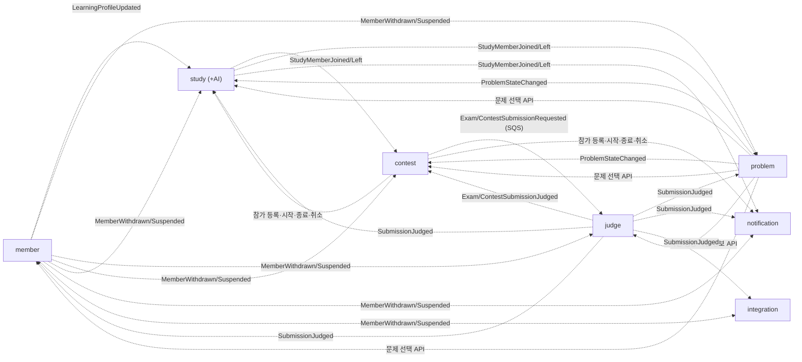

# 도메인 및 데이터베이스 v1.0

> 최종 수정일: 2026.10.07(수)
> 

---

| 번호 | 서비스 | 스키마 | 담당 |
| --- | --- | --- | --- |
| 1 | `member-service` | `member` | E |
| 2 | `problem-service` | `problem` | B |
| 3 | `judge-service` | `judge` | B |
| 4 | `contest-service` | `contest` | C |
| 5 | `study-service` (스터디·추천) | `study` | D |
| 6 | AI 기능 (`study-service` 내부 모듈, `ai-service` 후보) | `study` | D |
| 7 | `notification-service` | `notification` | A |
| 8 | `integration-service` | `integration` | A |
| 9 | `analytics-service` | — | — |

---

## 0. ERD

- ERD 도구: ERDCloud
- ERD 링크:

---

## 1. 주요 도메인

| 서비스 | 도메인 | 설명 | 주요 속성 | 담당 |
| --- | --- | --- | --- | --- |
| member | Member | 회원 계정·권한·상태 | GitHub ID, 닉네임, 역할, 상태 | E |
| member | LearningProfile | 학습 프로필 (추천 입력값) | 목표, 선호 언어, 활동 시간대, 프로필 버전 | E |
| member | TagLevel · TagAchievement · LevelHistory | 태그별 레벨, 난이도별 성취도, 레벨 변경 근거 | 레벨, 진단 최고 레벨, 획득·총 점수, 변경 사유 | E |
| member | DiagnosisAttempt · DiagnosisProblem · DiagnosisDraft · DiagnosisSubmission | 태그별 진단 응시와 문항·Draft·제출 | 시작·종료 시각, 종료 사유, 결과 레벨, `seq` | E |
| member | Replica | 채점 결과·힌트 사용 복제본 (레벨 재계산 입력) | 제출 ID, 난이도, 판정, 채점 회차, 힌트 사용 | E |
| problem | Problem · ProblemRevision | 문제와 불변 수정 회차 | `scope`, `visibility`, 회차 번호, 난이도, 실행 제한 | B |
| problem | Asset (Body · Test · Image) | S3에 저장한 본문·테스트·이미지 메타 | 객체 키, 객체 버전, SHA-256, 상태 | B |
| problem | Tag | 알고리즘 태그 (프로그래머스 고득점 Kit 기준) | 태그 이름 | B |
| problem | MemberProblemStatus | 회원별 일반 풀이 해결 여부 | 해결 여부, 최초 해결 제출 | B |
| problem | SolutionShare · SolutionComment | 스터디 대상 AC 풀이 공유와 라인 댓글 | 코드 스냅샷, 공유 상태, 라인 번호 | B |
| judge | Submission | 모든 문맥의 제출과 최종 판정 | 문맥, 회차 고정, 멱등키, 상태, 판정, 채점 회차 | B |
| judge | JudgeJob · JudgeJobRun · JudgeTestResult | 채점 작업(원천), 실행 시도 이력, 테스트별 결과 | 임대 토큰, 실행 시도 수, Judge0 token | B |
| contest | Exam · ExamProblem · ExamParticipant | 스터디 시험, 회차 고정 문제, 참가자 | 시작·종료, 배점, 개인 종료 시각, 총점 | C |
| contest | ExamDraft · ExamSubmission · ExamProblemResult | 시험 Draft, 시험 제출, 문제별 점수 | `seq`, 접수 시각, 부분 점수 | C |
| contest | Contest · ContestProblem · ContestParticipant · ContestSubmission · ContestProblemResult | 공개 대회와 ICPC 결과 | 공개 시각, 오답 수, 패널티 | C |
| contest | Replica | 스터디 구성원(참가 자격)·회원 표시 정보 복제본 | 구성원 상태, 순서 값 | C |
| study | Study · StudyMembership | 스터디와 가입 관계. 정원·역할·가입 상태 | 정원·현재 인원, 가입 방식, 역할, 가입 상태·만료 | D |
| study | StudyMemberQuota | 회원별 활성 참여 수 (상한 5) | `active_count` | D |
| study | Assignment · Completion | 문제집, 멤버별 과제 상태, 문제별 완료 인정 | 시작·마감, 기존 풀이 인정, 완료 유형, 인정 근거 제출 | D |
| study | Community | 스터디 게시글·댓글 | 공지·고정·숨김 | D |
| study | Recommendation | 회원별 추천 스터디 결과 | 점수, 근거 | D |
| study | Replica | 다른 서비스 데이터 복제본 (AC, 학습 프로필, 회원) | 원천 식별자, 순서 값 | D |
| AI | HintRequest · HintDailyUsage · HintBlockReplica | 힌트 요청, 일일 사용량, 시험 중 차단 | 단계, 상태, 폴백 여부, 차단 기간 | D |
| AI | SolutionAnalysis | 풀이 비교 분석 | P3 후보 — 이번 ERD 범위 외 | D |
| notification | Notification · NotificationPreference | 사용자 알림과 종류별 수신 설정 | 원천 이벤트 ID, 유형, 읽음 여부 | A |
| integration | GitHubConnection · GitHubSyncJob | GitHub 저장소 연동과 AC 코드 커밋 작업 | 설치 ID, 암호화 토큰, 작업 상태, 재시도 | A |
| analytics | — | — | — | — |

---

## 2. 도메인 관계

### 2.0 서비스 간 참조

서비스 간 참조는 FK 없이 ID만 저장하고 교차 조인을 금지한다. 다른 서비스의 화면 표시 정보는 복제본(`_replicas`)으로, 이벤트 안에 담긴 시점 값은 스냅샷 컬럼으로 둔다.




| 참조하는 서비스·테이블 | 컬럼 | 참조 대상 | 값을 받는 방법 | 복제본 여부 |
| --- | --- | --- | --- | --- |
| `member.member_tag_levels` | `tag_id` | `problem.tags.id` | `SubmissionJudged` 태그 스냅샷 · 진단 출제 API | N |
| `member.diagnosis_problems` | `problem_id`, `problem_revision_id` | `problem.problems.id`, `problem.problem_revisions.id` | 진단 출제 내부 API | N (난이도 스냅샷 포함) |
| `member.diagnosis_submissions` | `submission_id` | `judge.submissions.id` | 진단 채점 결과 이벤트 (분리 방식 미결정) | N |
| `member.practice_result_replicas` | `submission_id`, `problem_id` | judge / problem | `SubmissionJudged` | **Y** |
| `member.hint_usage_replicas` | `problem_id` | `problem.problems.id` | 힌트 사용 이벤트 (계약 확정 필요) | **Y** |
| `problem.problems` | `author_id` | `member.members.id` | 관리자 요청의 `X-User-Id` | N |
| `problem.member_problem_statuses` | `member_id`, `first_solved_submission_id` | member / judge | `SubmissionJudged` | N |
| `problem.solution_shares` | `submission_id`, `study_id` | `judge.submissions.id`, `study.studies.id` | 공유 요청 + judge 내부 API(코드 조회) | N (코드 스냅샷 포함) |
| `problem.study_membership_replicas` | `study_id`, `member_id` | `study.study_memberships` | `StudyMemberJoined`·`StudyMemberLeft` | **Y** |
| `problem.member_replicas` | `member_id` | `member.members.id` | 회원 정보 이벤트 | **Y** |
| `judge.submissions` | `member_id` | `member.members.id` | `X-User-Id` · 채점 요청 이벤트 | N |
| `judge.submissions` | `problem_id`, `problem_revision_id` | problem | 제출 요청 + 사전 검증 내부 API | N |
| `judge.submissions` | `source_submission_id` | `contest.exam_submissions.id` / `contest.contest_submissions.id` / `member.diagnosis_submissions.id` | `ExamSubmissionRequested`·`ContestSubmissionRequested` · 진단 접수 | N |
| `judge.judge_test_results` | `test_asset_id` | `problem.problem_test_assets.id` | 채점 정보 내부 API | N |
| `contest.exams` | `study_id`, `creator_id` | `study.studies.id`, `member.members.id` | 시험 생성 요청 | N |
| `contest.exam_problems` · `contest.contest_problems` | `problem_id`, `problem_revision_id` | problem | 문제 선택 API | N (제목 스냅샷 포함) |
| `contest.exam_submissions` · `contest.contest_submissions` | `submission_id` | `judge.submissions.id` | `ExamSubmissionJudged`·`ContestSubmissionJudged` | N |
| `contest.study_membership_replicas` | `study_id`, `member_id` | `study.study_memberships` | `StudyMemberJoined`·`StudyMemberLeft` | **Y** |
| `contest.member_replicas` | `member_id` | `member.members.id` | 회원 정보 이벤트 | **Y** |
| `study.study_memberships` | `member_id` | `member.members.id` | 가입 요청의 `X-User-Id` | N |
| `study.study_member_quotas` | `member_id` | `member.members.id` | 가입 요청의 `X-User-Id` | N |
| `study.assignment_problems` | `problem_id`, `assigned_revision_id` | `problem.problems.id`, `problem.problem_revisions.id` | 문제 선택 API | N (표시 스냅샷 포함) |
| `study.assignment_completions` | `basis_submission_id` | `judge.submissions.id` | `SubmissionJudged` | N |
| `study.member_ac_replicas` | `member_id`, `problem_id`, `submission_id` | member / problem / judge | `SubmissionJudged` | **Y** |
| `study.member_learning_profile_replicas` | `member_id` | `member.members.id` | `LearningProfileUpdated` | **Y** |
| `study.member_replicas` | `member_id` | `member.members.id` | 회원 정보 이벤트 | **Y** |
| `study.hint_requests` | `problem_id`, `problem_revision_id` | problem | 힌트 문맥 내부 API | N |
| `study.hint_block_replicas` | `member_id`, `context_id`, `problem_id` | member / contest / problem | 참가 등록·수정·종료·취소 이벤트 | **Y** |
| `notification.notifications` | `member_id` | `member.members.id` | 수신 이벤트의 회원 식별자 | N |
| `notification.notification_preferences` | `member_id` | `member.members.id` | `X-User-Id` | N |
| `integration.github_connections` | `member_id` | `member.members.id` | `X-User-Id` | N |
| `integration.github_sync_jobs` | `submission_id`, `problem_id` | judge / problem | `SubmissionJudged` | N |

### 2.1 member

> 작성: 담당 E
> 
- 서비스 내부 관계:
    
    ```
    members (1) ──1 learning_profiles (1)
    members (1) ──< member_tag_levels (N) ──< member_level_histories (N)
    members (1) ──< member_tag_achievements (N)
    members (1) ──< diagnosis_attempts (N)
    diagnosis_attempts (1) ──< diagnosis_problems (N)
    diagnosis_attempts (1) ──< diagnosis_drafts (N)
    diagnosis_attempts (1) ──< diagnosis_submissions (N)
    
    -- FK 없이 논리 연결 (복제본)
    practice_result_replicas  : (member_id, tag_id, difficulty) 로 
                                              member_tag_achievements 재계산
    hint_usage_replicas       : (member_id, problem_id) 로 힌트 사용 감점 판단
    ```
    
- 외부 참조: 2.0 표. 태그는 `problem-service`가 소유하고 member는 `tag_id`만 저장한다.
- 소유권·삭제 정책:
    - 회원 탈퇴는 `members.status = WITHDRAWN`과 표시 정보 익명화로 표현한다. 행은 삭제하지 않는다.
    - 레벨 변경 이력·진단 기록은 근거 조회와 감사를 위해 보존한다.
    - Refresh Token·Access Token 차단 목록은 Redis에 두고 DB 테이블을 만들지 않는다.
    - 물리 삭제 허용: 공통 정리 대상(`outbox_events` 7일, `processed_events` 14일).

### 2.2 problem

> 작성: 담당 B
> 
- 서비스 내부 관계:
    
    ```
    problems (1) ──< problem_revisions (N)
    problems (1) ──< problem_body_assets · problem_test_assets · problem_images (N, 최초 연결 전 NULL)
    problem_body_assets (1) ──< problem_revisions (N)          -- 본문 재사용
    problem_body_assets (1) ──< problem_body_images (N) >── (1) problem_images
    problem_revisions (1) ──< problem_revision_tests (N) >── (1) problem_test_assets
    problem_revisions (1) ──< problem_revision_tags (N) >── (1) tags
    problems (1) ──< member_problem_statuses (N)
    problems (1) ──< solution_shares (N) ──< solution_comments (N)
    ```
    
- 외부 참조: 2.0 표.
- 소유권·삭제 정책:
    - 문제는 삭제하지 않고 `visibility = ARCHIVED`로 표현한다. 제출이 있는 문제는 `ARCHIVED`로만 전환한다.
    - 공개된 수정 회차와 연결된 S3 파일은 불변이다. 수정은 새 회차·새 파일로만 한다.
    - 본문에 연결되지 않은 이미지(`status = PENDING`)는 대기 시간(미결정) 경과 후 S3 객체와 함께 물리 삭제한다.
    - 공유 풀이·댓글은 상태값(`CANCELED`·`DELETED`·`HIDDEN`)으로 표현한다. 회원 탈퇴 시 공유 풀이는 비공개 처리한다.

### 2.3 judge

> 작성: 담당 B
> 
- 서비스 내부 관계:
    
    ```
    submissions (1) ──< judge_jobs (N)               -- 채점 회차마다 1건
    judge_jobs (1) ──< judge_job_runs (N)            -- 실행 시도마다 1건, 불변
    judge_jobs (1) ──< judge_test_results (N)        -- 테스트별 결과
    ```
    
- 외부 참조: 2.0 표.
- 소유권·삭제 정책:
    - 제출과 회차별 작업·결과는 삭제하지 않는다. 이전 회차는 이력으로 보존하고 판정·성능은 최신 회차만 `submissions`에 반영한다.
    - 회원 탈퇴 시 제출은 통계 보존을 위해 유지하고, 표시 정보는 소비 서비스에서 익명화한다.
    - 제출 코드는 본인·관리자·내부 API(서비스 계정)만 조회한다.

### 2.4 contest

> 작성: 담당 C
> 
- 서비스 내부 관계:
    
    ```
    exams (1) ──< exam_problems (N)
    exams (1) ──< exam_participants (N) ──< exam_participant_histories (N)
    exam_participants (1) ──< exam_drafts (N)
    exam_participants (1) ──< exam_submissions (N)
    exam_participants (1) ──< exam_problem_results (N)
    
    contests (1) ──< contest_problems (N)
    contests (1) ──< contest_participants (N)
    contest_participants (1) ──< contest_participant_histories (N)
    contest_participants (1) ──< contest_submissions (N)
    contest_participants (1) ──< contest_problem_results (N)
    
    -- 문맥·자원으로 논리 연결 (외부 FK 없음)
    result_snapshots         : (context, context_id, result_revision) 확정 결과
    contest_admin_operations : (context, context_id, receipt_id) 관리자 작업
    contest_resource_guards  : (resource_type, resource_id) 외부 자원 작업
    
    -- 복제본 (외부 FK 없음)
    study_membership_replicas : (study_id, member_id) 로 시험 참가 자격 판정
    member_replicas          : 순위표 닉네임·회원 상태 표시
    ```
    
- 외부 참조: 2.0 표. 외부 DB에 FK를 연결하거나 직접 조회하지 않는다.
- 논리 연결·유일 제약: §4.4.14~§4.4.18.
- 소유권·삭제 정책:
    - 시험·대회는 `CANCELED`·`FINALIZED` 등 상태값으로 표현하고 삭제하지 않는다.
    - Draft·제출·결과는 결과 재확정과 분석 리포트를 위해 보존한다.
    - Redis 순위는 조회용이며 원천은 `exam_problem_results`·`contest_problem_results`다.

### 2.5 study

> 작성: 담당 D
> 
- 서비스 내부 관계:
    
    ```
    studies (1) ──< study_memberships (N) ──< study_membership_histories (N)
    studies (1) ──< assignments (N)
    assignments (1) ──< assignment_problems (N)
    assignments (1) ──< assignment_member_statuses (N)
    assignments (1) ──< assignment_completions (N)
    studies (1) ──< posts (N) ──< comments (N)
    
    -- FK 없이 논리 연결 (같은 서비스지만 복제본·파생 데이터)
    study_member_quotas       : member_id 로 study_memberships 와 연결
    member_ac_replicas        : (member_id, problem_id) 로 assignment_completions 재계산
    member_learning_profile_replicas, study_recommendations : member_id 기준
    ```
    
- 외부 참조: 2.0 표. 모두 ID만 저장, ERD 점선, 교차 조인 금지.
- 소유권·삭제 정책:
    - 모든 삭제는 상태값으로 표현한다: 스터디 `CLOSED`, 가입 `LEFT`·`REMOVED`·`CANCELED`, 게시글·댓글 `DELETED`·`HIDDEN`, 완료 인정 취소 `REVOKED`.
    - `CLOSED` 스터디는 읽기 전용 보존. 구성원 가입은 `APPROVED`로 남기되 참여 상한 카운터에서 제외한다.
    - 스터디 종료 전 예정·진행 중 시험이 없는지 확인한다(정책 §7). 시험은 `contest-service` 소유라 내부 API로 확인한다(fail-closed).
    - 회원 탈퇴(`MemberWithdrawn`): 가입 `APPROVED → LEFT`, `PENDING → CANCELED`, 카운터 차감, 학습 프로필 복제본·추천 결과·차단 복제본 정리, `member_replicas` 익명화. 게시글·완료 기록·`member_ac_replicas`는 `member_id`를 보존하고 표시만 "탈퇴한 사용자".
    - 물리 삭제 허용(기간·파생 데이터): 종료 후 1일 지난 `hint_block_replicas`, 재계산으로 대체된 `study_recommendations`, 공통 정리 대상(`outbox_events` 7일, `processed_events` 14일).

### 2.6 AI

> 작성: 담당 D
> 
- 서비스 내부 관계:
    
    ```json
    hint_requests      : (member_id, problem_id, level) 기준 이력
    hint_daily_usages  : (member_id, usage_date) 기준 1건
    hint_block_replicas: (member_id, context_type, context_id, problem_id) 기준 1건
    ```
    
- 외부 참조:
    
    
    | 컬럼 | 참조 대상 | 값을 받는 방법 | 복제본 여부 |
    | --- | --- | --- | --- |
    | `hint_requests.problem_id` | `problem.problems.id` | 힌트 요청 경로 변수 | N |
    | `hint_requests.problem_revision_id` | `problem.problem_revisions.id` | 요청 시점 조회 후 고정 | N |
- 소유권·삭제 정책:
    - `hint_requests` 이력 보존, 물리 삭제 없음.
    - 힌트 캐시는 Redis `hint:cache:{problemRevisionId}:{level}`(TTL 30일). 키에 회차가 들어가므로 새 회차 공개 시 별도 삭제 없이 자연히 무효화된다. 캐시는 유실돼도 재생성하면 되는 데이터라 Redis에 둔다.

### 2.7 notification

> 작성: 담당 A
> 
- 서비스 내부 관계:

```
notifications (N) ─ member_id ─ notification_preferences (1)   -- 논리 연결
```

- 외부 참조:
    
    
    | 컬럼 | 참조 대상 | 값을 받는 방법 | 복제본 여부 |
    | --- | --- | --- | --- |
    | `notifications.member_id` | `member.members.id` | 수신 이벤트의 회원 식별자
    (`userId`, `memberId`) | N |
    | `notification_preferences.member_id` | `member.members.id` | 수신 이벤트 및 API 인증 헤더
    (`X-User-Id`) | N |
- 소유권·삭제 정책:
    - 알림 내역(`notifications`)은 생성 후 90일이 지난 데이터만 새벽 스케줄러로 물리 삭제한다.
    - 읽음 여부는 논리 상태로 관리한다.
    - 회원 탈퇴 이벤트 수신 시 해당 회원의 알림을 삭제한다(정책 §9.4). `notification_preferences`도 함께 삭제한다.

### 2.8 integration

> 작성: 담당 A
> 
- 서비스 내부 관계:
    
    ```
    github_connections (1) ──< github_sync_jobs (N)
    ```
    
- 외부 참조:
    
    
    | 컬럼 | 참조 대상 | 값을 받는 방법 | 복제본 여부 |
    | --- | --- | --- | --- |
    | `github_connections.member_id` | `member.members.id` | API 인증 헤더(`X-User-Id`) | N |
    | `github_sync_jobs.submission_id` | `judge.submissions.id` | `SubmissionJudged` 이벤트 페이로드 | N |
    | `github_sync_jobs.problem_id` | `problem.problems.id` | `SubmissionJudged` 이벤트 페이로드 | N |
- 소유권·삭제 정책:
    - 연동 해제 시 `github_connections.status`를 `DISCONNECTED`로 전이하고 암호화 토큰을 파기(NULL)한다. 대기 중 Sync Job은 `CANCELED`로 전이한다. 이미 커밋된 파일은 삭제하지 않는다.
    - 회원 탈퇴 시에도 같은 처리(토큰 파기·`DISCONNECTED`·Job `CANCELED`)를 한다. 행 삭제 대신 상태값으로 표현한다(공통 규칙).
    - `github_sync_jobs` 이력은 감사 및 중복 커밋 방지를 위해 보존하며, 종단 상태(`SUCCEEDED`·`FAILED`·`CANCELED`) 후 30일이 지난 행만 물리 삭제를 허용한다.

---

## 3. 공통 테이블

> 작성: 담당 A
> 

**사용 서비스**

| 테이블 | member | problem | judge | contest | study | notification | integration |
| --- | --- | --- | --- | --- | --- | --- | --- |
| `outbox_events` | O | O | O | O | O |  | O |
| `processed_events` | O | O | O | O | O | O | O |
| `audit_logs` | O | O | O | O | O |  |  |
| `shedlock` | O | O | O | O | O | O | O |
| `member_replicas` |  | O |  | O | O |  |  |

| 테이블 | 서비스별 용도 |
| --- | --- |
| `outbox_events` |   • member: `LearningProfileUpdated`·`TagLevelChanged`·회원 이벤트 / 
  • problem: `ProblemStateChanged` / 
  • judge: 채점 결과 이벤트 / 
  • contest: 시험·대회 이벤트·채점 요청 / 
  • study: 스터디·문제집·힌트 이벤트 / 
  • integration: `GitHubSyncFailed` |
| `processed_events` | 이벤트를 소비하는 모든 서비스 |
| `audit_logs` |   • member: 회원 정지·권한 변경 / 
  • problem: 문제 공개·비공개·보관 / 
  • judge: 재채점·DLQ·실패 재처리 / 
  • contest: 재확정·0점 확정 / 
  • study: 강제 종료(9.5.1)·복제본 재동기화(9.5.2) |
| `shedlock` | 상태 전이 스케줄러와 만료 데이터 정리 배치
(Outbox Relay는 `SKIP LOCKED`로 처리하므로 대상 아님) |
| `member_replicas` |   • 닉네임·회원 상태 표시 (problem: 공유 풀이·댓글 작성자 / 
  • contest: 순위표 / study: 구성원·게시글) |

### 3.1 발행 대기 이벤트 (`outbox_events`)

상태 변경과 단일 트랜잭션으로 저장한 뒤 Relay 스케줄러가 `SELECT … FOR UPDATE SKIP LOCKED`로 선점해 발행한다.

| **컬럼** | **타입** | **NOT NULL** | **설명** |
| --- | --- | --- | --- |
| `id` | BIGINT AUTO_INCREMENT | Y | PK |
| `event_id` | VARCHAR(64) | Y | 이벤트 식별자 (UUID v4) |
| `event_type` | VARCHAR(50) | Y | 이벤트명 (예: `SubmissionJudged`) |
| `schema_version` | VARCHAR(10) | Y | 메시지 형식 버전 (`v1`) |
| `aggregate_type` | VARCHAR(30) | Y | 대상 애그리게이트 타입 (`EXAM`, `SUBMISSION` 등) |
| `aggregate_id` | VARCHAR(64) | Y | 대상 애그리게이트 ID |
| `correlation_id` | VARCHAR(64) | Y | 요청·메시지 추적 ID |
| `payload` | JSON | Y | 이벤트 메시지 본문 (순서 값 `judgeAttempt`·`examRevision` 등 포함) |
| `status` | VARCHAR(30) | Y | `PENDING` / `PUBLISHED` / `FAILED` |
| `retry_count` | INT | Y | 발행 재시도 횟수 (기본 0) |
| `occurred_at` | DATETIME(6) | Y | 이벤트 발생 시각 |
| `published_at` | DATETIME(6) | N | NULL 허용: 발행 전 |
| `created_at` | DATETIME(6) | Y | 생성 시각 |
| `updated_at` | DATETIME(6) | Y | 수정 시각 |
- 제약 및 인덱스
    - `uk_outbox_events_event_id(event_id)`
    - `idx_outbox_events_status_created_at(status, created_at)`: Outbox Relay 선점용
- 정리 정책: `PUBLISHED` 상태로 7일이 지난 데이터는 일 1회 ShedLock 정리 배치로 물리 삭제

### 3.2 처리 완료 이벤트 (`processed_events`) `[IMMUTABLE]`

이벤트를 소비하는 서비스에서 메시지 중복 처리를 차단하기 위한 멱등성 보장 테이블. 업무 반영과 같은 트랜잭션에서 기록한다.

| **컬럼** | **타입** | **NOT NULL** | **설명** |
| --- | --- | --- | --- |
| `id` | BIGINT AUTO_INCREMENT | Y | PK |
| `event_id` | VARCHAR(64) | Y | 수신한 이벤트 식별자 |
| `event_type` | VARCHAR(50) | Y | 이벤트명 |
| `processed_at` | DATETIME(6) | Y | 소비 처리 완료 시각 |
| `created_at` | DATETIME(6) | Y | 수신 시각 |
- 제약 및 인덱스
    - `uk_processed_events_event_id(event_id)`: 중복 실행 방지 유일 제약
    - `idx_processed_events_processed_at(processed_at)`: 정리 배치용
- 정리 정책: 처리 완료 후 14일이 지난 데이터는 일 1회 ShedLock 정리 배치로 물리 삭제

### 3.3 감사 로그 (`audit_logs`) `[IMMUTABLE]`

관리자 작업, 강제 종료, 재처리 등 추적이 필요한 행위를 보존한다. 감사 대상 작업과 같은 트랜잭션에서 기록하며, 각 서비스가 자기 DB에 둔다(공통-6).

| **컬럼** | **타입** | **NOT NULL** | **설명** |
| --- | --- | --- | --- |
| `id` | BIGINT AUTO_INCREMENT | Y | PK |
| `actor_id` | BIGINT | Y | 작업을 수행한 관리자/사용자 ID (COMMENT: `members.id`) |
| `action` | VARCHAR(50) | Y | 수행 행위 (예: `FORCE_EXAM_CLOSED`) |
| `target_type` | VARCHAR(30) | Y | 대상 리소스 타입 |
| `target_id` | VARCHAR(64) | Y | 대상 리소스 식별자 |
| `before_state` | JSON | N | NULL 허용: 생성 작업 |
| `after_state` | JSON | N | NULL 허용: 삭제 성격 작업 |
| `reason` | VARCHAR(500) | Y | 조치 사유 |
| `client_ip` | VARCHAR(45) | N | NULL 허용: 스케줄러·내부 처리 |
| `created_at` | DATETIME(6) | Y | 발생 시각 |
- 제약 및 인덱스
    - `idx_audit_logs_target(target_type, target_id, created_at)`
    - `idx_audit_logs_actor_created_at(actor_id, created_at)`

### 3.4 스케줄러 잠금 (`shedlock`)

다중 인스턴스 환경에서 스케줄러가 동시에 중복 실행되는 것을 막는다. ShedLock 라이브러리 표준 스키마를 그대로 쓴다(공통 컬럼 규칙 예외).

| **컬럼** | **타입** | **NOT NULL** | **설명** |
| --- | --- | --- | --- |
| `name` | VARCHAR(64) | Y | PK (스케줄러 작업 고유 이름) |
| `lock_until` | TIMESTAMP(3) | Y | 락 유효 만료 시각 |
| `locked_at` | TIMESTAMP(3) | Y | 락 선점 시각 |
| `locked_by` | VARCHAR(255) | Y | 락을 획득한 호스트/인스턴스 식별자 |

### 3.5 회원 정보 복제본 (`member_replicas`)

동기 호출 없이 닉네임·회원 상태를 표시하기 위한 공통 복제본. 공통-2에 따라 기존 `member_snapshots`에서 이름을 바꿨다.

| **컬럼** | **타입** | **NOT NULL** | **설명** |
| --- | --- | --- | --- |
| `id` | BIGINT AUTO_INCREMENT | Y | PK |
| `member_id` | BIGINT | Y | 회원 식별자 (외부 참조) |
| `nickname` | VARCHAR(50) | Y | 회원 닉네임 (탈퇴 시 "탈퇴한 사용자") |
| `profile_image_url` | VARCHAR(500) | N | NULL 허용: 이미지 미설정·탈퇴 |
| `member_status` | VARCHAR(30) | Y | `ACTIVE` / `SUSPENDED` / `WITHDRAWN` |
| `source_version` | BIGINT | Y | 원천 순서 값 (지연 이벤트 덮어쓰기 방지) |
| `synced_at` | DATETIME(6) | Y | 마지막 동기화 시각 |
| `created_at` | DATETIME(6) | Y | 생성 시각 |
| `updated_at` | DATETIME(6) | Y | 수정 시각 |
- 제약 및 인덱스
    - `uk_member_replicas_member_id(member_id)`
- 반영 조건: `incoming.source_version > stored.source_version`

---

## 4. 테이블 목록

### 4.1 member

> 작성: 담당 E
> 

#### 4.1.1 회원 (`members`)

| 컬럼 | 타입 | NOT NULL | 설명 |
| --- | --- | --- | --- |
| `id` | BIGINT AUTO_INCREMENT | Y | PK |
| `github_id` | BIGINT | Y | GitHub 사용자 고유 ID (로그인 식별자) |
| `github_login` | VARCHAR(50) | Y | GitHub 로그인명 |
| `nickname` | VARCHAR(50) | Y | 서비스 표시 이름 |
| `email` | VARCHAR(255) | N | NULL 허용: GitHub에서 이메일 비공개 |
| `profile_image_url` | VARCHAR(500) | N | NULL 허용: 이미지 미설정 |
| `role` | VARCHAR(30) | Y | `USER` / `ADMIN` |
| `status` | VARCHAR(30) | Y | `ACTIVE` / `SUSPENDED` / `WITHDRAWN` |
| `profile_version` | BIGINT | Y | 회원 표시 정보 변경 순번 (`member_replicas.source_version` 원천) |
| `suspended_at` | DATETIME(6) | N | NULL 허용: 정지 상태가 아님 |
| `withdrawn_at` | DATETIME(6) | N | NULL 허용: 탈퇴 전 |
| `created_at` | DATETIME(6) | Y |  |
| `updated_at` | DATETIME(6) | Y |  |

**제약 및 인덱스**

| 이름 | 컬럼 | 설명 |
| --- | --- | --- |
| `uk_members_github_id` | `github_id` | GitHub 계정당 회원 1명 |
| `idx_members_status_created_at` | `(status, created_at)` | 관리자 회원 목록 |

**상태값**

| 상태 | 의미 | 전이 |
| --- | --- | --- |
| `ACTIVE` | 정상 | → `SUSPENDED` / `WITHDRAWN` |
| `SUSPENDED` | 정지 (조회만 허용) | → `ACTIVE` / `WITHDRAWN` |
| `WITHDRAWN` | 탈퇴 (종단) | 표시 정보 익명화, `github_id`는 재가입 정책 확정 시 처리 |

#### 4.1.2 학습 프로필 (`learning_profiles`)

| 컬럼 | 타입 | NOT NULL | 설명 |
| --- | --- | --- | --- |
| `id` | BIGINT AUTO_INCREMENT | Y | PK |
| `member_id` | BIGINT | Y | FK → `members.id` |
| `goal` | VARCHAR(30) | N | NULL 허용: 미입력. 목표 (취업·학습 등 Enum) |
| `preferred_languages_json` | JSON | N | NULL 허용: 미입력. 선호 언어 배열 (단일/배열 확정 시 조정) |
| `active_time_slots_json` | JSON | N | NULL 허용: 미입력. 활동 시간대 배열 (값 체계 미결정) |
| `profile_version` | BIGINT | Y | 프로필 변경 순번 (`LearningProfileUpdated` 순서 값) |
| `created_at` | DATETIME(6) | Y |  |
| `updated_at` | DATETIME(6) | Y |  |

| 이름 | 컬럼 | 설명 |
| --- | --- | --- |
| `fk_learning_profiles_member` | `member_id` → `members.id` | 서비스 내부 FK |
| `uk_learning_profiles_member` | `member_id` | 회원당 1건 |

> `profile_version`은 프로필 항목 변경과 태그 레벨 변경 모두에서 1 증가한다(`LearningProfileUpdated` 발행 시점 ①~④).
> 

#### 4.1.3 태그 레벨 (`member_tag_levels`)

| 컬럼 | 타입 | NOT NULL | 설명 |
| --- | --- | --- | --- |
| `id` | BIGINT AUTO_INCREMENT | Y | PK |
| `member_id` | BIGINT | Y | FK → `members.id` |
| `tag_id` | BIGINT | Y | 태그 ID (외부 참조, COMMENT: `problem.tags.id`) |
| `level` | VARCHAR(30) | Y | `LV0` / `LV1` / `LV2` / `LV3` / `MASTER` (재계산 값) |
| `diagnosed_level` | VARCHAR(30) | N | NULL 허용: 진단 미응시. 진단 결과 중 최고 레벨 |
| `last_diagnosis_ended_at` | DATETIME(6) | N | NULL 허용: 진단 미응시. 쿨타임 계산 기준 (`FAILED` 응시 제외) |
| `entered_at` | DATETIME(6) | Y | 태그 최초 진입 시각 |
| `created_at` | DATETIME(6) | Y |  |
| `updated_at` | DATETIME(6) | Y |  |

| 이름 | 컬럼 | 설명 |
| --- | --- | --- |
| `fk_member_tag_levels_member` | `member_id` → `members.id` | 서비스 내부 FK |
| `uk_member_tag_levels_member_tag` | `(member_id, tag_id)` | 회원·태그당 1건 |

**상태값**

| 레벨 | 의미 | 전이 |
| --- | --- | --- |
| `LV0` | 미시작 · 첫 진단 응시 중 | → `LV1` (건너뛰기·진단) / `LV2` / `LV3` (진단) |
| `LV1` · `LV2` · `LV3` | 접근 가능 난이도 1 / 1~2 / 1~3 | 승급·진단으로 상승, 재채점 재계산으로만 하향 |
| `MASTER` | `LV3`에서 마스터 기준 달성 (배지) | 재채점 재계산으로만 하향 |

**상태 이력:** `member_level_histories` (4.1.5)

#### 4.1.4 태그·난이도별 성취도 (`member_tag_achievements`)

> 재계산 결과 저장(조회·약점 분석용). 원천은 `practice_result_replicas`.
> 

| 컬럼 | 타입 | NOT NULL | 설명 |
| --- | --- | --- | --- |
| `id` | BIGINT AUTO_INCREMENT | Y | PK |
| `member_id` | BIGINT | Y | FK → `members.id` |
| `tag_id` | BIGINT | Y | 태그 ID (외부 참조) |
| `difficulty` | INT | Y | 1 / 2 / 3 |
| `solved_count` | INT | Y | AC 문제 수 (`PRACTICE`, `COMPLETED`만) |
| `earned_points` | DECIMAL(6,2) | Y | 획득 점수 (힌트 사용 AC는 1/2) |
| `total_points` | DECIMAL(6,2) | Y | 총 문항 점수 |
| `achievement_rate` | DECIMAL(6,2) | Y | 성취도(%) = 획득 ÷ 총 × 100 |
| `recalculated_at` | DATETIME(6) | Y | 마지막 재계산 시각 |
| `created_at` | DATETIME(6) | Y |  |
| `updated_at` | DATETIME(6) | Y |  |

| 이름 | 컬럼 | 설명 |
| --- | --- | --- |
| `fk_member_tag_achievements_member` | `member_id` → `members.id` | 서비스 내부 FK |
| `uk_member_tag_achievements_member_tag_difficulty` | `(member_id, tag_id, difficulty)` | 회원·태그·난이도당 1건 |
| `idx_member_tag_achievements_member_rate` | `(member_id, achievement_rate)` | 약점(부족 구간) 조회 |

#### 4.1.5 레벨 변경 이력 (`member_level_histories`) `[IMMUTABLE]`

| 컬럼 | 타입 | NOT NULL | 설명 |
| --- | --- | --- | --- |
| `id` | BIGINT AUTO_INCREMENT | Y | PK |
| `member_tag_level_id` | BIGINT | Y | FK → `member_tag_levels.id` |
| `from_level` | VARCHAR(30) | N | NULL 허용: 최초 진입 |
| `to_level` | VARCHAR(30) | Y |  |
| `reason_type` | VARCHAR(30) | Y | `ENTRY_SKIP` / `DIAGNOSIS` / `PROMOTION` / `REJUDGE` |
| `diagnosis_attempt_id` | BIGINT | N | NULL 허용: 진단이 아닌 변경. FK → `diagnosis_attempts.id` |
| `source_submission_id` | BIGINT | N | NULL 허용: 제출과 무관한 변경. 근거 제출 (외부 참조) |
| `created_at` | DATETIME(6) | Y |  |

| 이름 | 컬럼 | 설명 |
| --- | --- | --- |
| `fk_member_level_histories_tag_level` | `member_tag_level_id` → `member_tag_levels.id` | 서비스 내부 FK |
| `fk_member_level_histories_diagnosis` | `diagnosis_attempt_id` → `diagnosis_attempts.id` | 서비스 내부 FK |
| `idx_member_level_histories_tag_level_created_at` | `(member_tag_level_id, created_at)` | 갱신 근거 조회 |

#### 4.1.6 진단 응시 (`diagnosis_attempts`)

> 테이블명·상태명은 정책 §10 초안 기준(확정 필요).
> 

| 컬럼 | 타입 | NOT NULL | 설명 |
| --- | --- | --- | --- |
| `id` | BIGINT AUTO_INCREMENT | Y | PK |
| `member_id` | BIGINT | Y | FK → `members.id` |
| `tag_id` | BIGINT | Y | 태그 ID (외부 참조) |
| `status` | VARCHAR(30) | Y | `IN_PROGRESS` / `CLOSED` / `SCORED` |
| `active_tag_id` | BIGINT `[GENERATED]` | N | `IF(status = 'IN_PROGRESS', tag_id, NULL)`. NULL 허용: 종료된 응시 |
| `started_at` | DATETIME(6) | Y | 시작 시각 |
| `ends_at` | DATETIME(6) | Y | 제한 시각 (`started_at + 60분`) |
| `closed_at` | DATETIME(6) | N | NULL 허용: 진행 중. 실제 종료 시각 (쿨타임 기준) |
| `close_reason` | VARCHAR(30) | N | NULL 허용: 진행 중. `SUBMITTED` / `EXPIRED` |
| `score` | DECIMAL(6,2) | N | NULL 허용: 채점 전. 획득 점수 (총 6점) |
| `result_level` | VARCHAR(30) | N | NULL 허용: 채점 전. 진단 결과 레벨 (`LV1`~`LV3`) |
| `is_cooldown_exempt` | BOOLEAN | Y | 채점 장애(`FAILED`) 발생으로 쿨타임 미적용 |
| `scored_at` | DATETIME(6) | N | NULL 허용: 채점 전 |
| `created_at` | DATETIME(6) | Y |  |
| `updated_at` | DATETIME(6) | Y |  |

| 이름 | 컬럼 | 설명 |
| --- | --- | --- |
| `fk_diagnosis_attempts_member` | `member_id` → `members.id` | 서비스 내부 FK |
| `uk_diagnosis_attempts_member_active_tag` | `(member_id, active_tag_id)` | 태그당 진행 중 진단 1건 |
| `idx_diagnosis_attempts_status_ends_at` | `(status, ends_at)` | 만료 자동 종료 스케줄러 |
| `idx_diagnosis_attempts_member_tag_closed_at` | `(member_id, tag_id, closed_at)` | 쿨타임·이력 조회 |

**상태값**

| 상태 | 의미 | 전이 |
| --- | --- | --- |
| `IN_PROGRESS` | 응시 중 | → `CLOSED` (최종 제출 / 제한 시각 도달 + 자동 제출) |
| `CLOSED` | 종료, 채점 대기 | → `SCORED` (모든 제출 종결 후 레벨 반영) |
| `SCORED` | 결과 확정 (종단) | — |

#### 4.1.7 진단 문항 (`diagnosis_problems`)

| 컬럼 | 타입 | NOT NULL | 설명 |
| --- | --- | --- | --- |
| `id` | BIGINT AUTO_INCREMENT | Y | PK |
| `diagnosis_attempt_id` | BIGINT | Y | FK → `diagnosis_attempts.id` |
| `problem_id` | BIGINT | Y | 문제 ID (외부 참조) |
| `problem_revision_id` | BIGINT | Y | 출제 시점 회차 
(COMMENT: `problem.problem_revisions.id`) |
| `difficulty` | INT | Y | 1 / 2 / 3 (출제 스냅샷) |
| `is_accepted` | BOOLEAN | Y | 제한 시간 안에 AC를 한 번이라도 받았는지 (레벨 판정) |
| `final_submission_id` | BIGINT | N | NULL 허용: 미제출. 문항별 최종 제출 (외부 참조) |
| `final_verdict` | VARCHAR(30) | N | NULL 허용: 미제출·채점 전 |
| `created_at` | DATETIME(6) | Y |  |
| `updated_at` | DATETIME(6) | Y |  |

| 이름 | 컬럼 | 설명 |
| --- | --- | --- |
| `fk_diagnosis_problems_attempt` | `diagnosis_attempt_id` → `diagnosis_attempts.id` | 서비스 내부 FK |
| `uk_diagnosis_problems_attempt_difficulty` | `(diagnosis_attempt_id, difficulty)` | 난이도별 1문항 |

#### 4.1.8 진단 Draft (`diagnosis_drafts`)

> 모의 코테 Draft 규칙과 동일(정책 §5.3).
> 

| 컬럼 | 타입 | NOT NULL | 설명 |
| --- | --- | --- | --- |
| `id` | BIGINT AUTO_INCREMENT | Y | PK |
| `diagnosis_attempt_id` | BIGINT | Y | FK → `diagnosis_attempts.id` |
| `problem_id` | BIGINT | Y | 문제 ID (외부 참조) |
| `language` | VARCHAR(30) | Y | 언어 (공통 모듈 Enum) |
| `source_code` | MEDIUMTEXT | Y | 작성 중 코드 |
| `seq` | BIGINT | Y | 클라이언트 순번. 
`WHERE seq < :incomingSeq` 조건부 UPDATE |
| `saved_at` | DATETIME(6) | Y | 서버 저장 시각 |
| `version` | BIGINT | Y | 낙관적 락 |
| `created_at` | DATETIME(6) | Y |  |
| `updated_at` | DATETIME(6) | Y |  |

| 이름 | 컬럼 | 설명 |
| --- | --- | --- |
| `fk_diagnosis_drafts_attempt` | `diagnosis_attempt_id` → `diagnosis_attempts.id` | 서비스 내부 FK |
| `uk_diagnosis_drafts_attempt_problem_language` | `(diagnosis_attempt_id, problem_id, language)` | 문항·언어별 Draft 1건 |

#### 4.1.9 진단 제출 (`diagnosis_submissions`)

> 진단 제출 접수 경로는 미결정. 아래는 `member-service`가 접수하고 채점을 요청하는 초안 기준.
> 

| 컬럼 | 타입 | NOT NULL | 설명 |
| --- | --- | --- | --- |
| `id` | BIGINT AUTO_INCREMENT | Y | PK (judge 멱등키) |
| `diagnosis_attempt_id` | BIGINT | Y | FK → `diagnosis_attempts.id` |
| `problem_id` | BIGINT | Y | 문제 ID (외부 참조) |
| `draft_seq` | BIGINT | Y | 제출한 Draft 순번 |
| `submission_type` | VARCHAR(30) | Y | `MANUAL` / `AUTO` (만료 자동 제출) |
| `received_at` | DATETIME(6) | Y | 접수 시각. `<= ends_at` |
| `status` | VARCHAR(30) | Y | `ACCEPTED` / `REQUESTED` / `JUDGED` / `FAILED` |
| `submission_id` | BIGINT | N | NULL 허용: 채점 연결 전 (외부 참조) |
| `judge_attempt` | INT | N | NULL 허용: 채점 전. 반영한 채점 회차 |
| `verdict` | VARCHAR(30) | N | NULL 허용: 채점 전 |
| `created_at` | DATETIME(6) | Y |  |
| `updated_at` | DATETIME(6) | Y |  |

| 이름 | 컬럼 | 설명 |
| --- | --- | --- |
| `fk_diagnosis_submissions_attempt` | `diagnosis_attempt_id` → `diagnosis_attempts.id` | 서비스 내부 FK |
| `uk_diagnosis_submissions_attempt_problem_seq` | `(diagnosis_attempt_id, problem_id, draft_seq)` | 같은 코드 버전 1회 제출 |
| `idx_diagnosis_submissions_submission` | `submission_id` | 채점 결과 연결 |

#### 4.1.10 연습 채점 결과 복제본 (`practice_result_replicas`)

> `SubmissionJudged`(`PRACTICE`, 판정 무관)로 유지. 레벨·성취도 재계산의 원천.
> 

| 컬럼 | 타입 | NOT NULL | 설명 |
| --- | --- | --- | --- |
| `id` | BIGINT AUTO_INCREMENT | Y | PK |
| `submission_id` | BIGINT | Y | 제출 ID (외부 참조) |
| `member_id` | BIGINT | Y |  |
| `problem_id` | BIGINT | Y |  |
| `difficulty` | INT | Y | 1 / 2 / 3 (이벤트 스냅샷) |
| `verdict` | VARCHAR(30) | Y | 최신 회차 판정 |
| `judge_attempt` | INT | Y | 반영한 채점 회차 (순서 값) |
| `submitted_at` | DATETIME(6) | Y | 제출 접수 시각 |
| `synced_at` | DATETIME(6) | Y |  |
| `created_at` | DATETIME(6) | Y |  |
| `updated_at` | DATETIME(6) | Y |  |

| 이름 | 컬럼 | 설명 |
| --- | --- | --- |
| `uk_practice_result_replicas_submission` | `submission_id` | 제출당 1건 |
| `idx_practice_result_replicas_member_problem` | `(member_id, problem_id)` | 재계산 대상 조회 |

#### 4.1.11 연습 결과 태그 (`practice_result_replica_tags`)

> 한 문제에 태그가 여러 개라 태그별 집계용으로 분리(JSON은 검색 불가 규칙).
> 

| 컬럼 | 타입 | NOT NULL | 설명 |
| --- | --- | --- | --- |
| `id` | BIGINT AUTO_INCREMENT | Y | PK |
| `practice_result_replica_id` | BIGINT | Y | FK → `practice_result_replicas.id` |
| `tag_id` | BIGINT | Y | 태그 ID (이벤트 스냅샷) |
| `created_at` | DATETIME(6) | Y |  |

| 이름 | 컬럼 | 설명 |
| --- | --- | --- |
| `fk_practice_result_replica_tags_replica` | `practice_result_replica_id` → `practice_result_replicas.id` | 서비스 내부 FK |
| `uk_practice_result_replica_tags_replica_tag` | `(practice_result_replica_id, tag_id)` | 중복 방지 |
| `idx_practice_result_replica_tags_tag` | `tag_id` | 태그별 재계산 |

#### 4.1.12 힌트 사용 복제본 (`hint_usage_replicas`)

> 힌트를 사용한 AC는 점수 1/2. 힌트 데이터는 `study-service`(AI 모듈) 소유라 이벤트로 받는다(이벤트 계약 확정 필요).
> 

| 컬럼 | 타입 | NOT NULL | 설명 |
| --- | --- | --- | --- |
| `id` | BIGINT AUTO_INCREMENT | Y | PK |
| `member_id` | BIGINT | Y |  |
| `problem_id` | BIGINT | Y |  |
| `first_used_at` | DATETIME(6) | Y | 최초 힌트 수신 시각 |
| `created_at` | DATETIME(6) | Y |  |
| `updated_at` | DATETIME(6) | Y |  |

| 이름 | 컬럼 | 설명 |
| --- | --- | --- |
| `uk_hint_usage_replicas_member_problem` | `(member_id, problem_id)` | 회원·문제당 1건 |

### 4.2 problem

> 작성: 담당 B
> 
- ERD (v1.0)
    
    ```mermaid
    erDiagram
        problems ||--o{ member_problem_statuses : "회원별 풀이 상태"
        problems ||--|{ problem_revisions : "수정 회차 보유"
        problems o|--o{ problem_body_assets : "본문 소유"
        problems o|--o{ problem_test_assets : "테스트 소유"
        problems o|--o{ problem_images : "이미지 소유"
        problem_body_assets ||--o{ problem_revisions : "본문 재사용"
        problem_body_assets ||--o{ problem_body_images : "이미지 연결"
        problem_images ||--o{ problem_body_images : "본문에서 사용"
        problem_revisions ||--|{ problem_revision_tests : "테스트 구성"
        problem_test_assets ||--o{ problem_revision_tests : "테스트 재사용"
        problem_revisions ||--o{ problem_revision_tags : "태그 연결"
        tags ||--o{ problem_revision_tags : "수정 회차에서 사용"
        problems ||--o{ solution_shares : "풀이 공유"
        solution_shares ||--o{ solution_comments : "라인 댓글"
        problems {
            bigint id PK
            bigint author_id "작성 관리자 - members.id"
            varchar scope "GENERAL / EXAM_ONLY"
            varchar visibility "PRIVATE / PUBLIC / ARCHIVED"
        }
        member_problem_statuses {
            bigint id PK
            bigint member_id "외부 참조"
            bigint problem_id FK
            boolean is_solved "일반 풀이 AC 이력"
        }
        problem_revisions {
            bigint id PK
            bigint problem_id FK
            int revision_number "표시용 회차 번호"
            bigint body_asset_id FK
            varchar title
            int difficulty "1~3"
            json function_spec
            int time_limit_ms
            int memory_limit_kb
        }
        problem_body_assets {
            bigint id PK
            bigint problem_id FK "최초 연결 전 NULL"
            varchar status
            varchar object_key
            char sha256
        }
        problem_images {
            bigint id PK
            bigint problem_id FK "최초 연결 전 NULL"
            varchar status
            varchar object_key
            char sha256
        }
        problem_body_images {
            bigint id PK
            bigint body_asset_id FK
            bigint image_id FK
        }
        problem_test_assets {
            bigint id PK
            bigint problem_id FK "최초 연결 전 NULL"
            varchar status
            varchar object_key
            char sha256
        }
        problem_revision_tests {
            bigint id PK
            bigint problem_revision_id FK
            bigint test_asset_id FK
            boolean is_sample
        }
        tags {
            bigint id PK
            varchar name UK
        }
        problem_revision_tags {
            bigint id PK
            bigint problem_revision_id FK
            bigint tag_id FK
        }
        solution_shares {
            bigint id PK
            bigint submission_id "외부 참조"
            bigint study_id "외부 참조"
            varchar status
        }
        solution_comments {
            bigint id PK
            bigint solution_share_id FK
            int line_number
            varchar status
        }
    ```
    
- 테이블 계층화
    
    ```mermaid
    flowchart TB
        P["problems"]
        U["member_problem_statuses"]
        R["problem_revisions"]
        S["solution_shares"]
        SC["solution_comments"]
        B["problem_body_assets"]
        RT["problem_revision_tests"]
        RG["problem_revision_tags"]
        BI["problem_body_images"]
        T["problem_test_assets"]
        G["tags"]
        I["problem_images"]
    
        P --> U
        P --> R
        P --> S
        S --> SC
        R --> B
        R --> RT
        R --> RG
        B --> BI
        BI --> I
        RT --> T
        RG --> G
    ```
    

#### 4.2.1 문제 (`problems`)

| 컬럼 | 타입 | NOT NULL | 설명 |
| --- | --- | --- | --- |
| `id` | BIGINT AUTO_INCREMENT | Y | PK |
| `author_id` | BIGINT | Y | 작성 관리자 (COMMENT: `members.id`) |
| `scope` | VARCHAR(30) | Y | `GENERAL` / `EXAM_ONLY` |
| `visibility` | VARCHAR(30) | Y | `PRIVATE` / `PUBLIC` / `ARCHIVED` |
| `contest_id` | BIGINT | N | NULL 허용: 일반 문제. 대회 전용 문제의 대회 (외부 참조) |
| `published_at` | DATETIME(6) | N | NULL 허용: 공개 전. 최초 공개 시각 |
| `created_at` | DATETIME(6) | Y |  |
| `updated_at` | DATETIME(6) | Y |  |

| 이름 | 컬럼 | 설명 |
| --- | --- | --- |
| `idx_problems_scope_visibility_created_at` | `(scope, visibility, created_at)` | 공개 문제 목록 |

**상태값**

| 상태 | 의미 | 전이 |
| --- | --- | --- |
| `PRIVATE` | 비공개 (작성 중 포함) | → `PUBLIC` (공개 회차 1개 이상) / `ARCHIVED` |
| `PUBLIC` | 공개 | → `PRIVATE` (진행 중 시험·대회 포함 시 차단) / `ARCHIVED` |
| `ARCHIVED` | 미사용 (소프트 딜리트, 종단) | — |

#### 4.2.2 문제 수정 회차 (`problem_revisions`) `[IMMUTABLE]`

> 공개된 회차는 수정하지 않는다. 수정은 새 행으로만 한다. 식별·고정은 `id`, 표시는 `revision_number`.
> 

| 컬럼 | 타입 | NOT NULL | 설명 |
| --- | --- | --- | --- |
| `id` | BIGINT AUTO_INCREMENT | Y | PK (`problemRevisionId`) |
| `problem_id` | BIGINT | Y | FK → `problems.id` |
| `revision_number` | INT | Y | 문제별 회차 번호 (1부터) |
| `body_asset_id` | BIGINT | Y | FK → `problem_body_assets.id` |
| `title` | VARCHAR(200) | Y | 문제 제목 |
| `difficulty` | INT | Y | 1 / 2 / 3 |
| `function_spec` | JSON | Y | 함수 명세 (이름·매개변수·반환 타입) |
| `time_limit_ms` | INT | Y | 기준 시간 제한 (기본 2,000, 최소 1,000) |
| `memory_limit_kb` | INT | Y | 기준 메모리 제한 (기본 262,144) |
| `author_id` | BIGINT | Y | 회차 작성 관리자 (COMMENT: `members.id`) |
| `created_at` | DATETIME(6) | Y |  |
| `wall_time_limit_ms` | INT | Y | 해당 회차의 최종 wall time 제한(ms). 팀 논의 B-5의 CPU 제한 + 공통 여유값을 적용하여 저장한다. |
| `output_limit_kb` | INT | Y | 해당 회차의 최종 출력 크기 제한(KB). API의 executionLimits.outputLimitKb에 대응한다. |

| 이름 | 컬럼 | 설명 |
| --- | --- | --- |
| `fk_problem_revisions_problem` | `problem_id` → `problems.id` | 서비스 내부 FK |
| `fk_problem_revisions_body_asset` | `body_asset_id` → `problem_body_assets.id` | 서비스 내부 FK |
| `uk_problem_revisions_problem_revision_number` | `(problem_id, revision_number)` | 회차 번호 중복 방지 |
| `idx_problem_revisions_difficulty` | `difficulty` | 난이도 필터·진단 출제 |

#### 4.2.3 본문 파일 (`problem_body_assets`)

| 컬럼 | 타입 | NOT NULL | 설명 |
| --- | --- | --- | --- |
| `id` | BIGINT AUTO_INCREMENT | Y | PK |
| `problem_id` | BIGINT | N | NULL 허용: 최초 연결 전. FK → `problems.id` |
| `owner_id` | BIGINT | Y | 파일 작성 관리자 (COMMENT: `members.id`) |
| `status` | VARCHAR(30) | Y | `PENDING` / `LINKED` / `DISCARDED` |
| `object_key` | VARCHAR(500) `_bin` | Y | S3 객체 키 (회차별 불변 경로) |
| `object_version` | VARCHAR(200) | N | NULL 허용: 버전 관리 미사용 버킷 |
| `sha256` | CHAR(64) `_bin` | Y | SHA-256 체크섬 |
| `size_bytes` | BIGINT | Y | 파일 크기 |
| `created_at` | DATETIME(6) | Y |  |
| `updated_at` | DATETIME(6) | Y |  |

| 이름 | 컬럼 | 설명 |
| --- | --- | --- |
| `fk_problem_body_assets_problem` | `problem_id` → `problems.id` | 서비스 내부 FK |
| `uk_problem_body_assets_object_key` | `object_key` | 객체 키 중복 방지 |

#### 4.2.4 이미지 파일 (`problem_images`)

| 컬럼 | 타입 | NOT NULL | 설명 |
| --- | --- | --- | --- |
| `id` | BIGINT AUTO_INCREMENT | Y | PK |
| `problem_id` | BIGINT | N | NULL 허용: 최초 연결 전. FK → `problems.id` |
| `owner_id` | BIGINT | Y | 파일 작성 관리자 (COMMENT: `members.id`) |
| `status` | VARCHAR(30) | Y | `PENDING`(미연결) / `LINKED` / `DISCARDED` |
| `object_key` | VARCHAR(500) `_bin` | Y | S3 객체 키 |
| `object_version` | VARCHAR(200) | N | NULL 허용: 버전 관리 미사용 버킷 |
| `sha256` | CHAR(64) `_bin` | Y | SHA-256 체크섬 |
| `content_type` | VARCHAR(100) | Y | MIME 타입 |
| `size_bytes` | BIGINT | Y | 파일 크기 |
| `created_at` | DATETIME(6) | Y |  |
| `updated_at` | DATETIME(6) | Y |  |

| 이름 | 컬럼 | 설명 |
| --- | --- | --- |
| `fk_problem_images_problem` | `problem_id` → `problems.id` | 서비스 내부 FK |
| `uk_problem_images_object_key` | `object_key` | 객체 키 중복 방지 |
| `idx_problem_images_status_created_at` | `(status, created_at)` | 미연결 이미지 정리 스케줄러 |

#### 4.2.5 본문 이미지 연결 (`problem_body_images`) `[IMMUTABLE]`

| 컬럼 | 타입 | NOT NULL | 설명 |
| --- | --- | --- | --- |
| `id` | BIGINT AUTO_INCREMENT | Y | PK |
| `body_asset_id` | BIGINT | Y | FK → `problem_body_assets.id` |
| `image_id` | BIGINT | Y | FK → `problem_images.id` |
| `created_at` | DATETIME(6) | Y |  |

| 이름 | 컬럼 | 설명 |
| --- | --- | --- |
| `fk_problem_body_images_body_asset` | `body_asset_id` → `problem_body_assets.id` | 서비스 내부 FK |
| `fk_problem_body_images_image` | `image_id` → `problem_images.id` | 서비스 내부 FK |
| `uk_problem_body_images_body_asset_image` | `(body_asset_id, image_id)` | 중복 연결 방지 |

#### 4.2.6 테스트 파일 (`problem_test_assets`)

| 컬럼 | 타입 | NOT NULL | 설명 |
| --- | --- | --- | --- |
| `id` | BIGINT AUTO_INCREMENT | Y | PK |
| `problem_id` | BIGINT | N | NULL 허용: 최초 연결 전. FK → `problems.id` |
| `owner_id` | BIGINT | Y | 파일 작성 관리자 (COMMENT: `members.id`) |
| `status` | VARCHAR(30) | Y | `PENDING` / `LINKED` / `DISCARDED` |
| `object_key` | VARCHAR(500) `_bin` | Y | S3 객체 키 (비공개 버킷) |
| `object_version` | VARCHAR(200) | N | NULL 허용: 버전 관리 미사용 버킷 |
| `sha256` | CHAR(64) `_bin` | Y | SHA-256 체크섬 |
| `size_bytes` | BIGINT | Y | 파일 크기 |
| `created_at` | DATETIME(6) | Y |  |
| `updated_at` | DATETIME(6) | Y |  |

| 이름 | 컬럼 | 설명 |
| --- | --- | --- |
| `fk_problem_test_assets_problem` | `problem_id` → `problems.id` | 서비스 내부 FK |
| `uk_problem_test_assets_object_key` | `object_key` | 객체 키 중복 방지 |

#### 4.2.7 회차별 테스트 구성 (`problem_revision_tests`) `[IMMUTABLE]`

| 컬럼 | 타입 | NOT NULL | 설명 |
| --- | --- | --- | --- |
| `id` | BIGINT AUTO_INCREMENT | Y | PK |
| `problem_revision_id` | BIGINT | Y | FK → `problem_revisions.id` |
| `test_asset_id` | BIGINT | Y | FK → `problem_test_assets.id` |
| `test_order` | INT | Y | 테스트 번호 (결과 화면 표시) |
| `is_sample` | BOOLEAN | Y | true 공개 예제 / false 숨김 |
| `created_at` | DATETIME(6) | Y |  |

| 이름 | 컬럼 | 설명 |
| --- | --- | --- |
| `fk_problem_revision_tests_revision` | `problem_revision_id` → `problem_revisions.id` | 서비스 내부 FK |
| `fk_problem_revision_tests_test_asset` | `test_asset_id` → `problem_test_assets.id` | 서비스 내부 FK |
| `uk_problem_revision_tests_revision_test_asset` | `(problem_revision_id, test_asset_id)` | 중복 구성 방지 |
| `uk_problem_revision_tests_revision_order` | `(problem_revision_id, test_order)` | 테스트 번호 중복 방지 |

**불변식:** 회차마다 `is_sample = true` 1개 이상, `false` 1개 이상 (작성 단계 검증).

#### 4.2.8 태그 (`tags`)

| 컬럼 | 타입 | NOT NULL | 설명 |
| --- | --- | --- | --- |
| `id` | BIGINT AUTO_INCREMENT | Y | PK |
| `name` | VARCHAR(200) | Y | 태그 이름 (프로그래머스 고득점 Kit 기준) |
| `display_order` | INT | Y | 표시 순서 |
| `created_at` | DATETIME(6) | Y |  |
| `updated_at` | DATETIME(6) | Y |  |

| 이름 | 컬럼 | 설명 |
| --- | --- | --- |
| `uk_tags_name` | `name` | 태그 이름 중복 방지 |

#### 4.2.9 회차별 태그 (`problem_revision_tags`) `[IMMUTABLE]`

| 컬럼 | 타입 | NOT NULL | 설명 |
| --- | --- | --- | --- |
| `id` | BIGINT AUTO_INCREMENT | Y | PK |
| `problem_revision_id` | BIGINT | Y | FK → `problem_revisions.id` |
| `tag_id` | BIGINT | Y | FK → `tags.id` |
| `created_at` | DATETIME(6) | Y |  |

| 이름 | 컬럼 | 설명 |
| --- | --- | --- |
| `fk_problem_revision_tags_revision` | `problem_revision_id` → `problem_revisions.id` | 서비스 내부 FK |
| `fk_problem_revision_tags_tag` | `tag_id` → `tags.id` | 서비스 내부 FK |
| `uk_problem_revision_tags_revision_tag` | `(problem_revision_id, tag_id)` | 중복 방지 |
| `idx_problem_revision_tags_tag` | `tag_id` | 태그 필터·진단 출제 |

#### 4.2.10 회원별 풀이 상태 (`member_problem_statuses`)

> `SubmissionJudged`(`PRACTICE`)로 갱신. 한 번 해결되면 이후 오답·문제 수정으로 초기화하지 않는다.
> 

| 컬럼 | 타입 | NOT NULL | 설명 |
| --- | --- | --- | --- |
| `id` | BIGINT AUTO_INCREMENT | Y | PK |
| `member_id` | BIGINT | Y | 회원 ID (외부 참조) |
| `problem_id` | BIGINT | Y | FK → `problems.id` |
| `is_solved` | BOOLEAN | Y | 일반 풀이 AC 이력 여부 |
| `first_solved_submission_id` | BIGINT | N | NULL 허용: 미해결. 최초 AC 제출 (외부 참조) |
| `first_solved_at` | DATETIME(6) | N | NULL 허용: 미해결. 최초 AC 접수 시각 |
| `attempt_count` | INT | Y | 일반 풀이 제출 수 |
| `created_at` | DATETIME(6) | Y |  |
| `updated_at` | DATETIME(6) | Y |  |

| 이름 | 컬럼 | 설명 |
| --- | --- | --- |
| `fk_member_problem_statuses_problem` | `problem_id` → `problems.id` | 서비스 내부 FK |
| `uk_member_problem_statuses_member_problem` | `(member_id, problem_id)` | 회원·문제당 1건 |

#### 4.2.11 풀이 공유 (`solution_shares`)

> 정책 §4.1. 공유 시점 코드·언어·회차를 스냅샷으로 저장한다(코드는 judge 내부 API로 조회).
> 

| 컬럼 | 타입 | NOT NULL | 설명 |
| --- | --- | --- | --- |
| `id` | BIGINT AUTO_INCREMENT | Y | PK |
| `problem_id` | BIGINT | Y | FK → `problems.id` |
| `problem_revision_id` | BIGINT | Y | FK → `problem_revisions.id` |
| `submission_id` | BIGINT | Y | 공유한 AC 제출 (외부 참조) |
| `author_id` | BIGINT | Y | 공유자 (COMMENT: `members.id`) |
| `study_id` | BIGINT | Y | 공유 대상 스터디 (외부 참조) |
| `language` | VARCHAR(30) | Y | 언어 스냅샷 |
| `source_code` | MEDIUMTEXT | Y | 코드 스냅샷 |
| `status` | VARCHAR(30) | Y | `SHARED` / `CANCELED` / `HIDDEN`(탈퇴·관리) |
| `active_submission_id` | BIGINT `[GENERATED]` | N | `IF(status = 'SHARED', submission_id, NULL)`. NULL 허용: 공유 취소 |
| `shared_at` | DATETIME(6) | Y |  |
| `canceled_at` | DATETIME(6) | N | NULL 허용: 공유 중 |
| `created_at` | DATETIME(6) | Y |  |
| `updated_at` | DATETIME(6) | Y |  |

| 이름 | 컬럼 | 설명 |
| --- | --- | --- |
| `fk_solution_shares_problem` | `problem_id` → `problems.id` | 서비스 내부 FK |
| `fk_solution_shares_revision` | `problem_revision_id` → `problem_revisions.id` | 서비스 내부 FK |
| `uk_solution_shares_study_active_submission` | `(study_id, active_submission_id)` | 같은 스터디에 같은 제출 1건 |
| `idx_solution_shares_study_problem_status` | `(study_id, problem_id, status)` | 스터디 공유 풀이 목록 |

#### 4.2.12 라인 댓글 (`solution_comments`)

| 컬럼 | 타입 | NOT NULL | 설명 |
| --- | --- | --- | --- |
| `id` | BIGINT AUTO_INCREMENT | Y | PK |
| `solution_share_id` | BIGINT | Y | FK → `solution_shares.id` |
| `author_id` | BIGINT | Y | 작성자 (COMMENT: `members.id`) |
| `line_number` | INT | Y | 코드 라인 번호 (1부터) |
| `content` | TEXT | Y |  |
| `status` | VARCHAR(30) | Y | `VISIBLE` / `DELETED` |
| `created_at` | DATETIME(6) | Y |  |
| `updated_at` | DATETIME(6) | Y |  |

| 이름 | 컬럼 | 설명 |
| --- | --- | --- |
| `fk_solution_comments_share` | `solution_share_id` → `solution_shares.id` | 서비스 내부 FK |
| `idx_solution_comments_share_line` | `(solution_share_id, line_number, created_at)` | 라인별 댓글 조회 |

#### 4.2.13 스터디 구성원 복제본 (`study_membership_replicas`)

> 공유 풀이 조회 권한(조회 시점 재검증)용. `StudyMemberJoined`·`StudyMemberLeft`로 유지. contest의 같은 이름 테이블과 구조 동일.
> 

| 컬럼 | 타입 | NOT NULL | 설명 |
| --- | --- | --- | --- |
| `id` | BIGINT AUTO_INCREMENT | Y | PK |
| `study_id` | BIGINT | Y | 스터디 ID (외부 참조) |
| `member_id` | BIGINT | Y | 회원 ID (외부 참조) |
| `membership_id` | BIGINT | Y | 원천 가입 ID (순서 값) |
| `is_active` | BOOLEAN | Y | `APPROVED` 구성원 여부 |
| `synced_at` | DATETIME(6) | Y |  |
| `created_at` | DATETIME(6) | Y |  |
| `updated_at` | DATETIME(6) | Y |  |

| 이름 | 컬럼 | 설명 |
| --- | --- | --- |
| `uk_study_membership_replicas_study_member` | `(study_id, member_id)` | 스터디·회원당 1건 |
| `idx_study_membership_replicas_member_active` | `(member_id, is_active)` | 내가 속한 스터디 |

> 반영 조건: `incoming.membership_id >= stored.membership_id` (재가입은 새 가입 행이므로 ID가 크다). 같은 가입 ID의 Joined·Left 역전은 Left 우선.
> 

#### 4.2.14 문제별 통계 (`problem_statistics`)

> `SubmissionJudged`(`PRACTICE`)를 소비해 갱신한다. 집계 문맥은 협의 E-4 미결정 전까지 `PRACTICE`만. 재채점 대상이 아니므로(`PRACTICE` 재채점 미지원) 판정이 바뀌는 경우는 없다.
> 

| 컬럼 | 타입 | NOT NULL | 설명 |
| --- | --- | --- | --- |
| `problem_id` | BIGINT | Y | PK, FK → `problems.id` |
| `submission_count` | INT | Y | 채점 종결(`COMPLETED`) `PRACTICE` 제출 수 |
| `accepted_submission_count` | INT | Y | 그중 `AC` 제출 수 |
| `updated_at` | DATETIME(6) | Y | 마지막 갱신 시각 |

| 이름 | 컬럼 | 설명 |
| --- | --- | --- |
| `fk_problem_statistics_problem` | `problem_id` → `problems.id` | 서비스 내부 FK |

### 4.3 judge

> 작성: 담당 B
> 

#### 4.3.1 제출 (`submissions`)

| 컬럼 | 타입 | NOT NULL | 설명 |
| --- | --- | --- | --- |
| `id` | BIGINT AUTO_INCREMENT | Y | PK (`submissionId`) |
| `member_id` | BIGINT | Y | 제출자 (외부 참조) |
| `problem_id` | BIGINT | Y | 문제 ID (외부 참조) |
| `problem_revision_id` | BIGINT | Y | 접수 시 고정한 회차 (COMMENT: `problem.problem_revisions.id`). 변경 불가 |
| `context` | VARCHAR(30) | Y | `PRACTICE` / `EXAM` / `CONTEST` / `DIAGNOSIS` |
| `context_id` | BIGINT | N | NULL 허용: `PRACTICE`. 시험·대회·진단 응시 ID (외부 참조) |
| `source_submission_id` | BIGINT | N | NULL 허용: `PRACTICE`. `examSubmissionId`·`contestSubmissionId`·진단 제출 ID (멱등키) |
| `idempotency_key` | VARCHAR(100) `_bin` | N | NULL 허용: `PRACTICE` 외. `Idempotency-Key` 헤더 |
| `request_hash` | CHAR(64) `_bin` | N | NULL 허용: `PRACTICE` 외. 같은 키·다른 본문 판별용 SHA-256 |
| `language` | VARCHAR(30) | Y | 언어 (공통 모듈 Enum) |
| `source_code` | MEDIUMTEXT | Y | 제출 코드 (불변) |
| `code_size_bytes` | INT | Y | 코드 크기 (64KB 이하) |
| `status` | VARCHAR(30) | Y | `QUEUED` / `JUDGING` / `RETRY_WAITING` / `COMPLETED` / `FAILED` |
| `verdict` | VARCHAR(30) | N | NULL 허용: `COMPLETED` 전. `AC` / `WA` / `TLE` / `MLE` / `RE` / `CE` |
| `judge_attempt` | INT | Y | 채점 회차 (1부터, 재채점마다 +1, 감소 불가) |
| `passed_count` | INT | N | NULL 허용: 채점 전. 통과 테스트 수 |
| `total_count` | INT | N | NULL 허용: 채점 전. 전체 테스트 수 |
| `max_time_ms` | INT | N | NULL 허용: 채점 전·`CE`. 테스트별 최대 CPU 시간 |
| `max_memory_kb` | INT | N | NULL 허용: 채점 전·`CE`. 테스트별 최대 메모리 |
| `compile_message` | MEDIUMTEXT | N | NULL 허용: `CE`가 아님. 본인에게만 표시 |
| `submitted_at` | DATETIME(6) | Y | 서버 접수 시각. `EXAM`·`CONTEST`는 contest의 `received_at` |
| `judged_at` | DATETIME(6) | N | NULL 허용: 종결 전 |
| `created_at` | DATETIME(6) | Y |  |
| `updated_at` | DATETIME(6) | Y |  |

**제약 및 인덱스**

| 이름 | 컬럼 | 설명 |
| --- | --- | --- |
| `uk_submissions_member_idempotency_key` | `(member_id, idempotency_key)` | `PRACTICE` 멱등 (NULL은 중복 아님) |
| `uk_submissions_context_source_submission` | `(context, source_submission_id)` | 시험·대회·진단 채점 요청 멱등 |
| `idx_submissions_member_created_at` | `(member_id, created_at)` | 내 제출 이력 최신순 |
| `idx_submissions_member_problem_created_at` | `(member_id, problem_id, created_at)` | 문제별 내 제출 |
| `idx_submissions_status_updated_at` | `(status, updated_at)` | 대사 배치 |
| `idx_submissions_context_member_verdict` | `(context, member_id, verdict)` | 회원별 `PRACTICE` AC 내부 API |

**상태값**

| 상태 | 의미 | 전이 |
| --- | --- | --- |
| `QUEUED` | 채점 대기 | → `JUDGING` |
| `JUDGING` | 채점 중 | → `COMPLETED` / `RETRY_WAITING` / `FAILED` |
| `RETRY_WAITING` | 시스템 오류 후 재시도 대기 | → `QUEUED` / `FAILED` |
| `COMPLETED` | 판정 확정 | → `QUEUED` (관리자 재채점, `judge_attempt + 1`) |
| `FAILED` | 시스템 실패 | → `QUEUED` (관리자 재처리) |

**불변식**

- `status = COMPLETED` ⇔ `verdict IS NOT NULL`
- `idempotency_key` 보관 24시간: 판단은 `created_at`으로 하고 행은 삭제하지 않는다.

#### 4.3.2 채점 작업 (`judge_jobs`)

> 채점 작업의 원천. SQS 메시지는 작업 생성 수단일 뿐이다.
> 

| 컬럼 | 타입 | NOT NULL | 설명 |
| --- | --- | --- | --- |
| `id` | BIGINT AUTO_INCREMENT | Y | PK |
| `submission_id` | BIGINT | Y | FK → `submissions.id` |
| `judge_attempt` | INT | Y | 이 작업이 처리하는 채점 회차 |
| `status` | VARCHAR(30) | Y | `PENDING` / `RUNNING` / `RETRY_WAITING` / `SUCCEEDED` / `FAILED` |
| `try_count` | INT | Y | 회차 안 실행 시도 수 (상한 3) |
| `lease_token` | VARCHAR(64) | N | NULL 허용: 선점 전. 선점마다 새로 발급 |
| `lease_until` | DATETIME(6) | N | NULL 허용: 선점 전. `now + 120초`, 30초마다 연장 |
| `next_run_at` | DATETIME(6) | Y | 선점 가능 시각 (백오프 10→30초 반영) |
| `deadline_at` | DATETIME(6) | Y | 전체 처리 기한 (`RUNNING` 10분 초과 회수 기준 포함) |
| `started_at` | DATETIME(6) | N | NULL 허용: 최초 선점 전 |
| `finished_at` | DATETIME(6) | N | NULL 허용: 종결 전 |
| `last_error` | VARCHAR(500) | N | NULL 허용: 오류 없음 |
| `created_at` | DATETIME(6) | Y |  |
| `updated_at` | DATETIME(6) | Y |  |

**제약 및 인덱스**

| 이름 | 컬럼 | 설명 |
| --- | --- | --- |
| `fk_judge_jobs_submission` | `submission_id` → `submissions.id` | 서비스 내부 FK |
| `uk_judge_jobs_submission_attempt` | `(submission_id, judge_attempt)` | 회차당 작업 1건 |
| `idx_judge_jobs_status_next_run_at` | `(status, next_run_at)` | `SKIP LOCKED` 선점 |
| `idx_judge_jobs_status_lease_until` | `(status, lease_until)` | 임대 만료 회수 스케줄러 |

**상태값**

| 상태 | 의미 | 전이 |
| --- | --- | --- |
| `PENDING` | 선점 대기 | → `RUNNING` |
| `RUNNING` | 실행기 점유 중 | → `SUCCEEDED` / `RETRY_WAITING` / `FAILED` |
| `RETRY_WAITING` | 백오프 대기 | → `PENDING` / `FAILED` (`try_count` 3 초과) |
| `SUCCEEDED` · `FAILED` | 종단 | 재채점은 새 행 |

**불변식**

- 선점: `status IN ('PENDING','RETRY_WAITING') AND next_run_at <= now()`
- 결과 저장: `WHERE status = 'RUNNING' AND lease_token = :token` (이전 실행기·이전 회차 결과 폐기)

#### 4.3.3 실행 시도 이력 (`judge_job_runs`) `[IMMUTABLE]`

| 컬럼 | 타입 | NOT NULL | 설명 |
| --- | --- | --- | --- |
| `id` | BIGINT AUTO_INCREMENT | Y | PK |
| `judge_job_id` | BIGINT | Y | FK → `judge_jobs.id` |
| `try_count` | INT | Y | 시도 번호 |
| `lease_token` | VARCHAR(64) | Y | 해당 시도의 임대 토큰 |
| `result` | VARCHAR(30) | Y | `SUCCEEDED` / `SYSTEM_ERROR` / `LEASE_EXPIRED` |
| `error_message` | VARCHAR(500) | N | NULL 허용: 성공 |
| `started_at` | DATETIME(6) | Y |  |
| `finished_at` | DATETIME(6) | Y |  |
| `created_at` | DATETIME(6) | Y |  |

| 이름 | 컬럼 | 설명 |
| --- | --- | --- |
| `fk_judge_job_runs_job` | `judge_job_id` → `judge_jobs.id` | 서비스 내부 FK |
| `uk_judge_job_runs_job_try` | `(judge_job_id, try_count)` | 시도당 1건 |

#### 4.3.4 테스트별 결과 (`judge_test_results`)

| 컬럼 | 타입 | NOT NULL | 설명 |
| --- | --- | --- | --- |
| `id` | BIGINT AUTO_INCREMENT | Y | PK |
| `judge_job_id` | BIGINT | Y | FK → `judge_jobs.id` |
| `test_asset_id` | BIGINT | Y | 테스트 파일 (외부 참조, COMMENT: `problem.problem_test_assets.id`) |
| `test_order` | INT | Y | 테스트 번호 |
| `is_sample` | BOOLEAN | Y | 공개 테스트 여부 (결과 공개 범위 판단) |
| `judge0_token` | VARCHAR(64) | N | NULL 허용: 실행 생성 전 |
| `token_status` | VARCHAR(30) | Y | `NOT_CREATED` / `CREATED` / `UNKNOWN`(생성 응답 유실) / `DONE` |
| `created_try_count` | INT | N | NULL 허용: 실행 생성 전. token을 만든 시도 번호 |
| `verdict` | VARCHAR(30) | N | NULL 허용: 결과 전. 테스트별 판정 (`SYSTEM_ERROR` 포함) |
| `time_ms` | INT | N | NULL 허용: 결과 전 |
| `memory_kb` | INT | N | NULL 허용: 결과 전 |
| `actual_output` | MEDIUMTEXT | N | NULL 허용: 숨김 테스트는 저장하지 않음 |
| `created_at` | DATETIME(6) | Y |  |
| `updated_at` | DATETIME(6) | Y |  |

| 이름 | 컬럼 | 설명 |
| --- | --- | --- |
| `fk_judge_test_results_job` | `judge_job_id` → `judge_jobs.id` | 서비스 내부 FK |
| `uk_judge_test_results_job_order` | `(judge_job_id, test_order)` | 테스트당 1건 |
| `idx_judge_test_results_token_status` | `(token_status, updated_at)` | 결과 폴링·응답 유실 복구 |

### 4.4 contest

> 작성: 담당 C
> 

#### 4.4.1 시험 (`exams`)

| 컬럼 | 타입 | NOT NULL | 설명 |
| --- | --- | --- | --- |
| `id` | BIGINT AUTO_INCREMENT | Y | PK |
| `study_id` | BIGINT | Y | 스터디 ID (외부 참조) |
| `creator_id` | BIGINT | Y | 개설자 (COMMENT: `members.id`) |
| `title` | VARCHAR(200) | Y | 시험·대회 제목 |
| `mode` | VARCHAR(30) | Y | `FIXED` / `WINDOW`(P3) |
| `starts_at` | DATETIME(6) | Y | 시작 시각 |
| `ends_at` | DATETIME(6) | Y | 종료 시각 |
| `duration_minutes` | INT | N | NULL 허용: `FIXED`. `WINDOW` 개인 제한 시간 |
| `status` | VARCHAR(30) | Y | `SCHEDULED` / `IN_PROGRESS` / `CLOSED` / `FINALIZED` / `CANCELED` |
| `exam_revision` | INT | Y | 시험 설정 변경 순번 (`ExamUpdated` 순서 값, 참가 등록으로는 증가 안 함) |
| `total_score` | DECIMAL(6,2) | Y | 배점 합계 (기본 100) |
| `closed_at` | DATETIME(6) | N | NULL 허용: 종료 전 |
| `result_revision` | BIGINT | Y | 기본 0. 잠정 결과 갱신·최초 확정·재확정 시 +1. SSE·캐시·이벤트 순서 값 |
| `finalized_at` | DATETIME(6) | N | NULL 허용: 확정 전 |
| `canceled_at` | DATETIME(6) | N | NULL 허용: 취소되지 않음 |
| `version` | BIGINT | Y | 낙관적 락 (시작 전 수정 경합) |
| `created_at` | DATETIME(6) | Y | 생성 시각 |
| `updated_at` | DATETIME(6) | Y | 마지막 갱신 시각 |

**제약 및 인덱스**

| 이름 | 컬럼 | 설명 |
| --- | --- | --- |
| `idx_exams_study_starts_at` | `(study_id, starts_at)` | 스터디 시험 목록 |
| `idx_exams_status_starts_at` | `(status, starts_at)` | `IN_PROGRESS` 전이 스케줄러 |
| `idx_exams_status_ends_at` | `(status, ends_at)` | 종료·자동 제출 스케줄러 |

**상태값**

| 상태 | 의미 | 전이 |
| --- | --- | --- |
| `SCHEDULED` | 시작 전 (수정·취소 가능) | → `IN_PROGRESS` / `CANCELED` |
| `IN_PROGRESS` | 진행 중 | → `CLOSED` |
| `CLOSED` | 종료, 잠정 결과 | → `FINALIZED` (모든 제출 종결) |
| `FINALIZED` | 확정 | → `FINALIZED` (관리자 재확정, 감사 로그) |
| `CANCELED` | 취소 (종단) | — |

#### 4.4.2 시험 문제 (`exam_problems`)

| 컬럼 | 타입 | NOT NULL | 설명 |
| --- | --- | --- | --- |
| `id` | BIGINT AUTO_INCREMENT | Y | PK |
| `exam_id` | BIGINT | Y | FK → `exams.id` |
| `problem_id` | BIGINT | Y | 문제 ID (외부 참조) |
| `problem_revision_id` | BIGINT | Y | 생성 시 고정한 회차 (COMMENT: `problem.problem_revisions.id`) |
| `problem_title` | VARCHAR(200) | Y | 고정 스냅샷 |
| `revision_number` | INT | Y | 표시용 회차 번호 스냅샷 |
| `score` | DECIMAL(6,2) | Y | 배점 |
| `display_order` | INT | Y | 문맥 안 문제 표시 순서. 1부터 연속 |
| `created_at` | DATETIME(6) | Y | 생성 시각 |
| `updated_at` | DATETIME(6) | Y | 마지막 갱신 시각 |

**제약 및 인덱스**

| 이름 | 컬럼 | 설명 |
| --- | --- | --- |
| `fk_exam_problems_exam` | `exam_id` → `exams.id` | 서비스 내부 FK |
| `uk_exam_problems_exam_problem` | `(exam_id, problem_id)` | 중복 문제 방지 |
| `idx_exam_problems_problem` | `problem_id` | 비공개 전환 차단 확인 |

#### 4.4.3 시험 참가자 (`exam_participants`)

| 컬럼 | 타입 | NOT NULL | 설명 |
| --- | --- | --- | --- |
| `id` | BIGINT AUTO_INCREMENT | Y | PK |
| `exam_id` | BIGINT | Y | FK → `exams.id` |
| `member_id` | BIGINT | Y | 회원 ID (외부 참조) |
| `status` | VARCHAR(30) | Y | `REGISTERED` / `STARTED` / `FINISHED` / `ABSENT` / `CANCELED` |
| `active_member_id` | BIGINT `[GENERATED]` | N | `IF(status <> 'CANCELED', member_id, NULL)`. NULL 허용: 취소 후 재신청 허용 |
| `participant_revision` | BIGINT | Y | 기본 1. 참가 상태 전이마다 +1. 참가 상태·이력·Outbox와 같은 트랜잭션에 저장 |
| `registered_at` | DATETIME(6) | Y | 현재 참가 등록 시각 |
| `entered_at` | DATETIME(6) | N | NULL 허용: 미입장. 최초 입장 시각 (탈퇴 차단 기준) |
| `personal_ends_at` | DATETIME(6) | Y | 개인 종료 시각 (`FIXED`: `exams.ends_at`, 수동 종료 시 그 시각) |
| `finished_at` | DATETIME(6) | N | NULL 허용: 진행 중 |
| `total_score` | DECIMAL(6,2) | Y | 문제별 점수 합 (재계산 값) |
| `last_valid_submitted_at` | DATETIME(6) | N | NULL 허용: 제출 없음. 동점 정렬 기준 |
| `auto_submitted_at` | DATETIME(6) | N | NULL: 자동 제출 미완료. 제출 생성·FINISHED 전이와 같은 트랜잭션에서 기록 |
| `is_ranked` | BOOLEAN | Y | 순위 포함 여부 (한 문제도 제출하지 않으면 false) |
| `final_rank` | INT | N | NULL 허용: 확정 전. `rank`는 예약어라 사용하지 않음 |
| `version` | BIGINT | Y | 낙관적 락 (참가자 결과) |
| `created_at` | DATETIME(6) | Y | 생성 시각 |
| `updated_at` | DATETIME(6) | Y | 마지막 갱신 시각 |

**제약 및 인덱스**

| 이름 | 컬럼 | 설명 |
| --- | --- | --- |
| `fk_exam_participants_exam` | `exam_id` → `exams.id` | 서비스 내부 FK |
| `uk_exam_participants_exam_active_member` | `(exam_id, active_member_id)` | 진행 중 참가 1건 |
| `idx_exam_participants_member_status` | `(member_id, status)` | 내 시험·탈퇴 차단 확인 |

**상태값**

| 상태 | 의미 | 전이 |
| --- | --- | --- |
| `REGISTERED` | 등록 | → `STARTED` / `ABSENT` / `CANCELED`(시작 전만) |
| `STARTED` | 입장 | → `FINISHED` |
| `FINISHED` · `ABSENT` · `CANCELED` | 종단 | 취소 후 재신청은 새 행 |

**상태 이력:** `exam_participant_histories` (4.4.4)

#### 4.4.4 참가자 상태 이력 (`exam_participant_histories`) `[IMMUTABLE]`

| 컬럼 | 타입 | NOT NULL | 설명 |
| --- | --- | --- | --- |
| `id` | BIGINT AUTO_INCREMENT | Y | PK |
| `exam_participant_id` | BIGINT | Y | FK → `exam_participants.id` |
| `from_status` | VARCHAR(30) | N | NULL 허용: 최초 생성 |
| `to_status` | VARCHAR(30) | Y | 전이 후 시험 참가 상태: REGISTERED / STARTED / FINISHED / CANCELED / ABSENT |
| `actor_member_id` | BIGINT | N | NULL 허용: 스케줄러 처리 |
| `reason` | VARCHAR(500) | N | NULL 허용: 사유 없는 전이 |
| `created_at` | DATETIME(6) | Y | 생성 시각 |

**제약 및 인덱스**

| 이름 | 컬럼 | 설명 |
| --- | --- | --- |
| `fk_exam_participant_histories_participant` | `exam_participant_id` → `exam_participants.id` | 서비스 내부 FK |
| `idx_exam_participant_histories_participant_created_at` | `(exam_participant_id, created_at)` | 이력 조회 |

#### 4.4.5 시험 Draft (`exam_drafts`)

| 컬럼 | 타입 | NOT NULL | 설명 |
| --- | --- | --- | --- |
| `id` | BIGINT AUTO_INCREMENT | Y | PK |
| `exam_participant_id` | BIGINT | Y | FK → `exam_participants.id` |
| `problem_id` | BIGINT | Y | 문제 ID (외부 참조) |
| `language` | VARCHAR(30) | Y | 언어: JAVA / PYTHON / CPP. B 어댑터에서 java / python3 / cpp로 매핑 |
| `source_code` | MEDIUMTEXT | Y | 작성 중 코드 |
| `seq` | BIGINT | Y | 문제별 클라이언트 순번. `WHERE seq < :incomingSeq` 조건부 UPDATE |
| `saved_at` | DATETIME(6) | Y | 서버 접수 시각. `<= personal_ends_at` |
| `version` | BIGINT | Y | 낙관적 락 |
| `created_at` | DATETIME(6) | Y | 생성 시각 |
| `updated_at` | DATETIME(6) | Y | 마지막 갱신 시각 |

**제약 및 인덱스**

| 이름 | 컬럼 | 설명 |
| --- | --- | --- |
| `fk_exam_drafts_participant` | `exam_participant_id` → `exam_participants.id` | 서비스 내부 FK |
| `uk_exam_drafts_participant_problem_language` | `(exam_participant_id, problem_id, language)` | 참가자·문제·언어별 1건 |

#### 4.4.6 시험 제출 (`exam_submissions`)

| 컬럼 | 타입 | NOT NULL | 설명 |
| --- | --- | --- | --- |
| `id` | BIGINT AUTO_INCREMENT | Y | PK (`examSubmissionId`, judge 멱등키) |
| `exam_participant_id` | BIGINT | Y | FK → `exam_participants.id` |
| `exam_id` | BIGINT | Y | FK → `exams.id` |
| `problem_id` | BIGINT | Y | 문제 ID (외부 참조) |
| `draft_seq` | BIGINT | Y | 제출한 Draft 순번 |
| `language` | VARCHAR(30) | Y | JAVA / PYTHON / CPP |
| `source_code` | MEDIUMTEXT | Y | 채점 요청 이벤트에 담을 코드 |
| `submission_type` | VARCHAR(30) | Y | `MANUAL` / `AUTO` |
| `received_at` | DATETIME(6) | Y | 접수 시각 (자동 제출은 `personal_ends_at`) |
| `status` | VARCHAR(30) | Y | `ACCEPTED` / `REQUESTED` / `JUDGED` / `FAILED` |
| `submission_id` | BIGINT | N | NULL 허용: 채점 연결 전 (외부 참조) |
| `judge_attempt` | INT | N | NULL 허용: 종결 결과 반영 전. 마지막 반영 회차; 재처리 요청·QUEUED 응답으로 증가시키지 않음 |
| `verdict` | VARCHAR(30) | N | NULL 허용: 채점 전 |
| `passed_count` | INT | N | NULL 허용: 채점 전 |
| `total_count` | INT | N | NULL 허용: 채점 전 |
| `score` | DECIMAL(6,2) | N | NULL 허용: 채점 전. `배점 × 통과 / 전체` (둘째 자리 버림) |
| `is_zero_confirmed` | BOOLEAN | Y | `FAILED` 제출의 관리자 0점 확정 여부 |
| `created_at` | DATETIME(6) | Y | 생성 시각 |
| `updated_at` | DATETIME(6) | Y | 마지막 갱신 시각 |

**제약 및 인덱스**

| 이름 | 컬럼 | 설명 |
| --- | --- | --- |
| `fk_exam_submissions_participant` | `exam_participant_id` → `exam_participants.id` | 서비스 내부 FK |
| `fk_exam_submissions_exam` | `exam_id` → `exams.id` | 서비스 내부 FK |
| `uk_exam_submissions_participant_problem_seq` | `(exam_participant_id, problem_id, draft_seq)` | 같은 코드 버전 1회 제출 (자동·수동 경합 차단) |
| `idx_exam_submissions_exam_status` | `(exam_id, status)` | 채점 진행률·확정 판정 |
| `idx_exam_submissions_status_created_at` | `(status, created_at)` | `ACCEPTED` 1분 초과 감시 |
| `idx_exam_submissions_submission` | `submission_id` | 채점 결과 연결 |

#### 4.4.7 시험 문제별 결과 (`exam_problem_results`)

| 컬럼 | 타입 | NOT NULL | 설명 |
| --- | --- | --- | --- |
| `id` | BIGINT AUTO_INCREMENT | Y | PK |
| `exam_participant_id` | BIGINT | Y | FK → `exam_participants.id` |
| `problem_id` | BIGINT | Y | 문맥에 고정 편입된 문제 ID. problem-service 외부 참조 |
| `last_valid_exam_submission_id` | BIGINT | N | NULL 허용: 제출 없음. FK → `exam_submissions.id` |
| `score` | DECIMAL(6,2) | Y | 마지막 유효 제출 점수 |
| `version` | BIGINT | Y | 낙관적 락 |
| `created_at` | DATETIME(6) | Y | 생성 시각 |
| `updated_at` | DATETIME(6) | Y | 마지막 갱신 시각 |

**제약 및 인덱스**

| 이름 | 컬럼 | 설명 |
| --- | --- | --- |
| `fk_exam_problem_results_participant` | `exam_participant_id` → `exam_participants.id` | 서비스 내부 FK |
| `fk_exam_problem_results_submission` | `last_valid_exam_submission_id` → `exam_submissions.id` | 서비스 내부 FK |
| `uk_exam_problem_results_participant_problem` | `(exam_participant_id, problem_id)` | 참가자·문제당 1건 |

#### 4.4.8 대회 (`contests`)

| 컬럼 | 타입 | NOT NULL | 설명 |
| --- | --- | --- | --- |
| `id` | BIGINT AUTO_INCREMENT | Y | PK |
| `creator_id` | BIGINT | Y | 개설 관리자 (COMMENT: `members.id`) |
| `title` | VARCHAR(200) | Y | 시험·대회 제목 |
| `starts_at` | DATETIME(6) | Y | 대회 시작 시각 |
| `ends_at` | DATETIME(6) | Y | 대회 전체 제출 마감 시각 |
| `status` | VARCHAR(30) | Y | `SCHEDULED` / `RUNNING` / `ENDED` / `FINALIZED` / `CANCELED` |
| `contest_revision` | INT | Y | 대회 설정 변경 순번 |
| `is_problems_public_after_end` | BOOLEAN | Y | 종료 후 전용 문제 공개 여부 |
| `result_revision` | BIGINT | Y | 기본 0. 잠정 결과 갱신·최초 확정·재확정 시 +1. SSE·캐시·이벤트 순서 값 |
| `finalized_at` | DATETIME(6) | N | NULL 허용: 확정 전 |
| `canceled_at` | DATETIME(6) | N | NULL 허용: 취소되지 않음 |
| `version` | BIGINT | Y | 낙관적 락 |
| `created_at` | DATETIME(6) | Y | 생성 시각 |
| `updated_at` | DATETIME(6) | Y | 마지막 갱신 시각 |

**제약 및 인덱스**

| 이름 | 컬럼 | 설명 |
| --- | --- | --- |
| `idx_contests_status_starts_at` | `(status, starts_at)` | 목록·`RUNNING` 전이 |
| `idx_contests_status_ends_at` | `(status, ends_at)` | `ENDED` 전이 |

#### 4.4.9 대회 문제 (`contest_problems`)

| 컬럼 | 타입 | NOT NULL | 설명 |
| --- | --- | --- | --- |
| `id` | BIGINT AUTO_INCREMENT | Y | PK |
| `contest_id` | BIGINT | Y | FK → `contests.id` |
| `problem_id` | BIGINT | Y | 문제 ID (외부 참조, 주로 `EXAM_ONLY`) |
| `problem_revision_id` | BIGINT | Y | 고정 회차 |
| `problem_title` | VARCHAR(200) | Y | 스냅샷 |
| `label` | VARCHAR(30) | Y | 문제 라벨 (`A`, `B` …) |
| `visible_at` | DATETIME(6) | Y | 문제 공개 시각 |
| `display_order` | INT | Y | 문맥 안 문제 표시 순서. 1부터 연속 |
| `created_at` | DATETIME(6) | Y | 생성 시각 |
| `updated_at` | DATETIME(6) | Y | 마지막 갱신 시각 |

**제약 및 인덱스**

| 이름 | 컬럼 | 설명 |
| --- | --- | --- |
| `fk_contest_problems_contest` | `contest_id` → `contests.id` | 서비스 내부 FK |
| `uk_contest_problems_contest_problem` | `(contest_id, problem_id)` | 중복 방지 |
| `uk_contest_problems_contest_label` | `(contest_id, label)` | 라벨 중복 방지 |

#### 4.4.10 대회 참가자 (`contest_participants`)

| 컬럼 | 타입 | NOT NULL | 설명 |
| --- | --- | --- | --- |
| `id` | BIGINT AUTO_INCREMENT | Y | PK |
| `contest_id` | BIGINT | Y | FK → `contests.id` |
| `member_id` | BIGINT | Y | 회원 ID (외부 참조) |
| `status` | VARCHAR(30) | Y | `REGISTERED` / `STARTED` / `CANCELED` |
| `active_member_id` | BIGINT `[GENERATED]` | N | `IF(status <> 'CANCELED', member_id, NULL)`. NULL 허용: 취소 |
| `participant_revision` | BIGINT | Y | 기본 1. 참가 상태 전이마다 +1. 참가 상태·이력·Outbox와 같은 트랜잭션에 저장 |
| `registered_at` | DATETIME(6) | Y | 참가 등록 시각 |
| `entered_at` | DATETIME(6) | N | NULL 허용: 미입장 |
| `solved_count` | INT | Y | 맞힌 문제 수 (재계산 값) |
| `penalty_minutes` | INT | Y | 패널티 합 (재계산 값) |
| `last_accepted_at` | DATETIME(6) | N | NULL: AC 없음. 최종 동점 판단용 마지막 최초 AC 접수 시각 |
| `last_accepted_minutes` | INT | N | NULL 허용: AC 없음. 마지막 AC 경과 분 |
| `is_ranked` | BOOLEAN | Y | 한 문제도 제출하지 않으면 false |
| `final_rank` | INT | N | NULL 허용: 확정 전 |
| `version` | BIGINT | Y | 낙관적 락 (참가자 결과) |
| `created_at` | DATETIME(6) | Y | 생성 시각 |
| `updated_at` | DATETIME(6) | Y | 마지막 갱신 시각 |

**제약 및 인덱스**

| 이름 | 컬럼 | 설명 |
| --- | --- | --- |
| `fk_contest_participants_contest` | `contest_id` → `contests.id` | 서비스 내부 FK |
| `uk_contest_participants_contest_active_member` | `(contest_id, active_member_id)` | 진행 중 참가 1건 |
| `idx_contest_participants_contest_rank` | `(contest_id, solved_count, penalty_minutes)` | DB 기준 순위 재계산 |

#### 4.4.11 대회 제출 (`contest_submissions`)

| 컬럼 | 타입 | NOT NULL | 설명 |
| --- | --- | --- | --- |
| `id` | BIGINT AUTO_INCREMENT | Y | PK (`contestSubmissionId`, judge 멱등키) |
| `contest_participant_id` | BIGINT | Y | FK → `contest_participants.id` |
| `contest_id` | BIGINT | Y | FK → `contests.id` |
| `problem_id` | BIGINT | Y | 문맥에 고정 편입된 문제 ID. problem-service 외부 참조 |
| `idempotency_key` | VARCHAR(100) `_bin` | Y | 클라이언트 재시도 멱등키 |
| `language` | VARCHAR(30) | Y | JAVA / PYTHON / CPP |
| `source_code` | MEDIUMTEXT | Y | 접수 후 불변 코드. UTF-8, API 공통 크기 제한 적용 |
| `request_hash` | CHAR(64) | Y | problemId·language·sourceCode를 길이 구분 UTF-8로 직렬화한 SHA-256. 멱등키 재사용 본문 비교 |
| `received_at` | DATETIME(6) | Y | 접수 시각 (패널티 계산 기준) |
| `status` | VARCHAR(30) | Y | `ACCEPTED` / `REQUESTED` / `JUDGED` / `FAILED` |
| `submission_id` | BIGINT | N | NULL 허용: 채점 연결 전 |
| `judge_attempt` | INT | N | NULL 허용: 종결 결과 미반영. 마지막 반영 종결 회차; 요청·QUEUED 응답에서는 증가하지 않음 |
| `verdict` | VARCHAR(30) | N | NULL 허용: 채점 전 |
| `is_void_confirmed` | BOOLEAN | Y | 기본 false. FAILED의 관리자 무효 처리. SYSTEM_ERROR로 패널티 제외; 감사 로그 필수 |
| `created_at` | DATETIME(6) | Y | 생성 시각 |
| `updated_at` | DATETIME(6) | Y | 마지막 갱신 시각 |

**제약 및 인덱스**

| 이름 | 컬럼 | 설명 |
| --- | --- | --- |
| `fk_contest_submissions_participant` | `contest_participant_id` → `contest_participants.id` | 서비스 내부 FK |
| `fk_contest_submissions_contest` | `contest_id` → `contests.id` | 서비스 내부 FK |
| `uk_contest_submissions_participant_idempotency_key` | `(contest_participant_id, idempotency_key)` | 재시도 중복 방지 |
| `idx_contest_submissions_contest_status` | `(contest_id, status)` | 확정 판정 |
| `idx_contest_submissions_submission` | `submission_id` | 채점 결과 연결 |

#### 4.4.12 대회 문제별 결과 (`contest_problem_results`)

| 컬럼 | 타입 | NOT NULL | 설명 |
| --- | --- | --- | --- |
| `id` | BIGINT AUTO_INCREMENT | Y | PK |
| `contest_participant_id` | BIGINT | Y | FK → `contest_participants.id` |
| `problem_id` | BIGINT | Y | 문맥에 고정 편입된 문제 ID. problem-service 외부 참조 |
| `is_accepted` | BOOLEAN | Y | 유효 최초 AC 존재 여부 |
| `wrong_count` | INT | Y | AC 전 오답 수 (`CE`·`SYSTEM_ERROR` 제외) |
| `first_accepted_contest_submission_id` | BIGINT | N | NULL: 미해결. FK → `contest_submissions.id`. 접수 순서상 최초 유효 AC |
| `accepted_at` | DATETIME(6) | N | NULL: 미해결. 최초 AC의 received_at |
| `accepted_minutes` | INT | N | NULL 허용: 미해결. 대회 시작부터 AC 접수까지 분 |
| `penalty_minutes` | INT | Y | `accepted_minutes + wrong_count × 20` (미해결 0) |
| `version` | BIGINT | Y | 낙관적 락 |
| `created_at` | DATETIME(6) | Y | 생성 시각 |
| `updated_at` | DATETIME(6) | Y | 마지막 갱신 시각 |

**제약 및 인덱스**

| 이름 | 컬럼 | 설명 |
| --- | --- | --- |
| `fk_contest_problem_results_participant` | `contest_participant_id` → `contest_participants.id` | 서비스 내부 FK |
| `fk_contest_problem_results_submission` | `first_accepted_contest_submission_id` → `contest_submissions.id` | 서비스 내부 FK. 최초 AC 연결은 같은 참가자·문제인지도 검증 |
| `uk_contest_problem_results_participant_problem` | `(contest_participant_id, problem_id)` | 참가자·문제당 1건 |

#### 4.4.13 스터디 구성원 복제본 (`study_membership_replicas`)

> 시험 참가 자격 판정용. (study_id, member_id)별 큰 membership_id가 우선이며 같은 가입에서는 탈퇴가 가입보다 우선한다. 삭제하지 않고 is_active=false로 남겨 지연 가입 이벤트의 복원을 막는다.
> 

| 컬럼 | 타입 | NOT NULL | 설명 |
| --- | --- | --- | --- |
| `id` | BIGINT AUTO_INCREMENT | Y | PK |
| `study_id` | BIGINT | Y | 스터디 ID (외부 참조) |
| `member_id` | BIGINT | Y | 회원 ID (외부 참조) |
| `membership_id` | BIGINT | Y | 원천 가입 ID (순서 값) |
| `is_active` | BOOLEAN | Y | `APPROVED` 구성원 여부 |
| `synced_at` | DATETIME(6) | Y | 마지막 원천 가입 상태 동기화 시각 |
| `created_at` | DATETIME(6) | Y | 생성 시각 |
| `updated_at` | DATETIME(6) | Y | 마지막 갱신 시각 |

**제약 및 인덱스**

| 이름 | 컬럼 | 설명 |
| --- | --- | --- |
| `uk_study_membership_replicas_study_member` | `(study_id, member_id)` | 스터디·회원당 1건 |

#### 4.4.14 대회 참가 상태 이력 (`contest_participant_histories`) `[IMMUTABLE]`

| 컬럼 | 타입 | NOT NULL | 설명 |
| --- | --- | --- | --- |
| `id` | BIGINT AUTO_INCREMENT | Y | PK |
| `contest_participant_id` | BIGINT | Y | FK → `contest_participants.id` |
| `from_status` | VARCHAR(30) | N | 최초 등록 NULL |
| `to_status` | VARCHAR(30) | Y | REGISTERED / STARTED / CANCELED |
| `actor_member_id` | BIGINT | N | NULL 허용: 스케줄러 처리 |
| `reason` | VARCHAR(500) | N | NULL 허용: 사유 없는 전이 |
| `created_at` | DATETIME(6) | Y | 상태 변경 시간 |

**제약 및 인덱스**

| 이름 | 컬럼 | 설명 |
| --- | --- | --- |
| `fk_contest_participant_histories_participant` | `contest_participant_id` → `contest_participants.id` | 서비스 내부 FK |
| `idx_contest_participant_histories_participant_created_at` | `(contest_participant_id, created_at)` | 이력 조회 |

#### 4.4.15 확정 결과 스냅샷 (`result_snapshots`) `[IMMUTABLE]`

| 컬럼 | 타입 | NOT NULL | 설명 |
| --- | --- | --- | --- |
| `id` | BIGINT AUTO_INCREMENT | Y | PK |
| `context` | VARCHAR(30) | Y | EXAM / CONTEST |
| `context_id` | BIGINT | Y | examId / contestId. 문맥별 논리 연결 |
| `result_revision` | BIGINT | Y | 확정한 결과 버전 |
| `payload` | JSON | Y | 문제 회차·배점, 참가자별 순위·문제별 결과·제출 ID의 확정 스냅샷. 코드·숨김 테스트·회원 이메일 제외 |
| `created_at` | DATETIME(6) | Y | 확정 시간 |

**제약 및 인덱스**

| 이름 | 컬럼 | 설명 |
| --- | --- | --- |
| `uk_result_snapshots_context_revision` | `(context, context_id, result_revision)` | 같은 확정 결과 1건 |
| `idx_result_snapshots_context_id` | `(context, context_id)` | 문맥별 스냅샷 목록 조회 |

#### 4.4.16 자원 작업 가드 (`contest_resource_guards`)

| 컬럼 | 타입 | NOT NULL | 설명 |
| --- | --- | --- | --- |
| `id` | BIGINT AUTO_INCREMENT | Y | PK |
| `resource_type` | VARCHAR(30) | Y | MEMBER / STUDY / PROBLEM |
| `resource_id` | BIGINT | Y | 소유 서비스 ID. 외부 FK 없음 |
| `operation_id` | VARCHAR(100) `_bin` | N | 현재 또는 마지막 외부 작업 ID. 최초 생성만 NULL; 완료·취소 뒤에도 반복 요청 판별용으로 보존 |
| `operation_type` | VARCHAR(30) | N | WITHDRAWAL / STUDY_CLOSE / PROBLEM_HIDE. 최초 생성만 NULL |
| `expected_source_version` | BIGINT | N | prepare 요청의 원천 버전. 최초 생성만 NULL, 완료 뒤 보존 |
| `request_hash` | CHAR(64) | N | resourceType·resourceId·operationId·operationType·expectedSourceVersion의 정규화 SHA-256. 최초 생성만 NULL |
| `state` | VARCHAR(30) | Y | OPEN / PREPARED / BLOCKED |
| `source_version` | BIGINT | Y | 기본 0. 소유 서비스 상태 이벤트의 순서 값 |
| `prepared_at` | DATETIME(6) | N | 준비 시각. 준비 전 NULL |
| `version` | BIGINT | Y | 기본 0. 낙관적 락 |
| `created_at` | DATETIME(6) | Y | 생성 시간 |
| `updated_at` | DATETIME(6) | Y | 갱신 시간 |

**제약 및 인덱스**

| 이름 | 컬럼 | 설명 |
| --- | --- | --- |
| `uk_contest_resource_guards_type_id` | `(resource_type, resource_id)` | 자원별 1행 |
| `idx_contest_resource_guards_state_prepared_at` | `(state, prepared_at)` | 장시간 준비 작업 대사 |

**처리 규칙**

| 항목 | 규칙 |
| --- | --- |
| 직렬화 | 가드 준비와 신규 생성·등록·최초 입장은 같은 자원 행의 비관적 락. 기존 등록자의 제출·자동 제출은 STUDY/PROBLEM 가드로 차단하지 않음 |
| 회원 탈퇴 | 실제 입장한 미확정 시험·대회가 없을 때만 PREPARED. 이후 신규 등록·입장 차단, MemberWithdrawn 수신 시 BLOCKED |
| 스터디 종료 | 신규 시험 생성 차단·예정 시험 취소. 진행 시험의 CLOSED까지 준비 유지. CLOSED 이후 채점·확정 계속 |
| 문제 숨김 | SCHEDULED 또는 서버 시간상 진행 중인 사용이 있으면 준비 거절. 성공 뒤 신규 편입 차단. 고정 회차 결과 조회·채점 유지 |
| 준비 정보 | operation_id·expected_source_version·정규화 request_hash 함께 저장. 동일 operationId의 다른 해시 거절 |
| 반복 요청 | 동일 operationId의 prepare·complete·cancel 멱등. 취소된 OPEN의 동일 ID prepare는 OPEN 반환. 새 ID만 재준비 |
| 완료 버전 | complete.sourceVersion > expected_source_version 및 >= stored.source_version. 이전 버전은 거절 |
| 복구 | TTL로 자동 해제하지 않음. 소유 서비스 작업 상태 조회 또는 감사 로그를 남기는 관리자 대사로 완료·취소 확인. API §4.7.3·§4.7.4 / 스케줄러 §4.7 |

#### 4.4.17 회원 정보 복제본 (`member_replicas`)

- 구조·인덱스·반영 조건은 공통 §3.5와 동일하다. contest-service DB에 저장하며 회원 상태 검증 결과와 회원 정보 이벤트로 갱신한다.

| 컬럼 | 타입 | NOT NULL | 설명 |
| --- | --- | --- | --- |
| `id` | BIGINT AUTO_INCREMENT | Y | PK |
| `member_id` | BIGINT | Y | 회원 식별자 (외부 참조) |
| `nickname` | VARCHAR(50) | Y | 회원 닉네임 (탈퇴 시 "탈퇴한 사용자") |
| `profile_image_url` | VARCHAR(500) | N | NULL 허용: 이미지 미설정·탈퇴 |
| `member_status` | VARCHAR(30) | Y | `ACTIVE` / `SUSPENDED` / `WITHDRAWN` |
| `source_version` | BIGINT | Y | 원천 순서 값 (지연 이벤트 덮어쓰기 방지) |
| `synced_at` | DATETIME(6) | Y | 마지막 동기화 시각 |
| `created_at` | DATETIME(6) | Y | 생성 시각 |
| `updated_at` | DATETIME(6) | Y | 수정 시각 |

**제약 및 인덱스**

| 이름 | 컬럼 | 설명 |
| --- | --- | --- |
| `uk_member_replicas_member_id` | `member_id` | 회원당 복제본 1건 |
- 반영 조건: `incoming.source_version > stored.source_version`

#### 4.4.18 관리자 작업 (`contest_admin_operations`)

| 컬럼 | 타입 | NOT NULL | 설명 |
| --- | --- | --- | --- |
| `id` | BIGINT AUTO_INCREMENT | Y | PK |
| `operation_id` | VARCHAR(100) `_bin` | Y | 호출자 생성 멱등 작업 ID |
| `operation_type` | VARCHAR(30) | Y | EXAM_RETRY / EXAM_ZERO_CONFIRM / CONTEST_VOID_CONFIRM / RESULT_REFINALIZE |
| `context` | VARCHAR(30) | Y | EXAM / CONTEST |
| `context_id` | BIGINT | Y | 부모 시험·대회 ID (문맥별 논리 연결) |
| `receipt_id` | BIGINT | N | 제출 작업이면 `exam_submissions.id` / `contest_submissions.id`. RESULT_REFINALIZE는 NULL |
| `request_hash` | CHAR(64) | Y | 대상·회차·사유·집행자 포함 불변 요청 SHA-256 |
| `expected_judge_attempt` | INT | N | 재처리·실패 종결 대상 회차. RESULT_REFINALIZE는 NULL |
| `target_judge_attempt` | INT | N | B가 확인한 재처리 회차. EXAM_RETRY 외 또는 확인 전 NULL |
| `expected_result_revision` | BIGINT | N | RESULT_REFINALIZE의 이전 버전. 다른 작업은 NULL |
| `state` | VARCHAR(30) | Y | PENDING / SUCCEEDED / FAILED |
| `actor_member_id` | BIGINT | Y | 집행 회원 ID. 일반 관리자 작업은 ADMIN, EXAM_RETRY는 해당 시험 운영자도 허용 |
| `reason` | VARCHAR(500) | Y | 불변 작업 사유 |
| `last_error_code` | VARCHAR(100) | N | 실패 또는 조회 지연 코드. 오류 없으면 NULL |
| `created_at` | DATETIME(6) | Y | 생성 |
| `updated_at` | DATETIME(6) | Y | 갱신 |

**제약 및 인덱스**

| 이름 | 컬럼 | 설명 |
| --- | --- | --- |
| `uk_contest_admin_operations_operation_id` | `operation_id` | 중복 원격 작업 방지 |
| `idx_contest_admin_operations_context_state` | `(context, context_id, state)` | 결과 확정 차단·작업 대사 |

**처리 규칙**

| 항목 | 규칙 |
| --- | --- |
| 확정 차단 | PENDING/FAILED 재처리 작업의 원격 성공 여부가 불명확하면 최종 확정 보류. B 상태 조회·동일 operationId 재요청으로 SUCCEEDED 또는 확정 실패 종결 |
| 회차 저장 | judge_attempt는 마지막 반영 종결 회차. 원격 목표 회차는 target_judge_attempt에 저장 |
| 재처리 응답 | 현재 judge_attempt < target_judge_attempt인 경우만 REQUESTED 전이. 이미 목표 이상 결과가 반영됐으면 상태·판정 유지. 늦은 성공 응답으로 결과를 되돌리지 않음 |
| 감사 | audit_logs는 불변 이력. 현재 작업 상태는 이 테이블에 갱신하고 완료 시 감사 로그 별도 기록 |
| 종결 경계 | 시험 실패 재처리·실패 종결은 FINALIZED 전만 허용. FINALIZED에서는 기존 유효 기록 재집계의 재확정만 허용. 미종결 제출 0건 유지. API §4.6 / DB §6.4.2 |

### 4.5 study

> 작성: 담당 D
> 

#### 4.5.1 스터디 (`studies`)

> `version` 컬럼 있음 (낙관적 락 대상)
> 

| 컬럼 | 타입 | NOT NULL | 설명 |
| --- | --- | --- | --- |
| `id` | BIGINT AUTO_INCREMENT | Y | PK |
| `name` | VARCHAR(200) | Y | 스터디 이름 |
| `description` | VARCHAR(500) | N | 설명. NULL 허용: 선택 입력 |
| `goal` | VARCHAR(30) | Y | 목표 (취업·학습 등 Enum) |
| `skill_level` | VARCHAR(30) | Y | 대상 레벨 (Enum). 태그 레벨 집계 방식 확정 시 조정 |
| `preferred_language` | VARCHAR(30) | Y | 선호 언어 (공통 모듈 Enum) |
| `active_time_slot` | VARCHAR(30) | Y | 활동 시간대 (Enum) |
| `capacity` | INT | Y | 정원 2~10 (스터디장 포함) |
| `member_count` | INT | Y | 현재 `APPROVED` 수. 조건부 UPDATE로만 변경 |
| `manager_count` | INT | Y | 현재 `MANAGER` 수 (상한 2). 조건부 UPDATE로만 변경 |
| `join_type` | VARCHAR(30) | Y | `INSTANT` / `APPROVAL` |
| `is_auto_reopen` | BOOLEAN | Y | 결원 시 `ACTIVE → RECRUITING` 자동 복귀 여부 |
| `status` | VARCHAR(30) | Y | `RECRUITING` / `ACTIVE` / `CLOSED` |
| `last_activity_at` | DATETIME(6) | N | 최근 활동 시각(문제집 완료·게시글). NULL 허용: 활동 전. 콜드 스타트 정렬용 |
| `closed_at` | DATETIME(6) | N | NULL 허용: `CLOSED` 전이 시각 |
| `version` | BIGINT | Y | 낙관적 락. 카운터 UPDATE에서도 +1 |
| `created_at` | DATETIME(6) | Y |  |
| `updated_at` | DATETIME(6) | Y |  |

**제약 및 인덱스**

| 이름 | 컬럼 | 설명 |
| --- | --- | --- |
| `idx_studies_status_created_at` | `(status, created_at)` | 모집 중 목록 기본 정렬 |
| `idx_studies_status_skill_level` | `(status, skill_level)` | 대상 레벨 필터 |
| `idx_studies_status_last_activity_at` | `(status, last_activity_at)` | 추천 콜드 스타트 |

**상태값**

| 상태 | 의미 | 전이 |
| --- | --- | --- |
| `RECRUITING` | 모집 중 | 정원 도달 시 → `ACTIVE`(가입 UPDATE 문 안에서 계산) |
| `ACTIVE` | 모집 마감 | 결원 + `is_auto_reopen = true` → `RECRUITING` |
| `CLOSED` | 종료 (불가역) | `LEADER`·관리자 종료. 예정·진행 중 시험이 없을 때만 |

**불변식**

- `0 <= member_count <= capacity`, `0 <= manager_count <= 2`
- `member_count` = 해당 스터디 `APPROVED` 가입 수 (대사 스케줄러로 검증)

#### 4.5.2 스터디 가입 (`study_memberships`)

| 컬럼 | 타입 | NOT NULL | 설명 |
| --- | --- | --- | --- |
| `id` | BIGINT AUTO_INCREMENT | Y | PK |
| `study_id` | BIGINT | Y | FK → `studies.id` |
| `member_id` | BIGINT | Y | 회원 ID (외부 참조) |
| `role` | VARCHAR(30) | Y | `LEADER` / `MANAGER` / `MEMBER`. `PENDING`은 `MEMBER` |
| `status` | VARCHAR(30) | Y | 아래 상태값 |
| `active_member_id` | BIGINT `[GENERATED]` | N | `IF(status IN ('PENDING','APPROVED'), member_id, NULL)`. NULL 허용: 종료된 가입 |
| `leader_key` | BIGINT `[GENERATED]` | N | `IF(role = 'LEADER' AND status = 'APPROVED', study_id, NULL)`. NULL 허용: 스터디장이 아닌 행 |
| `applied_at` | DATETIME(6) | Y | 신청 시각 (즉시 가입은 가입 시각) |
| `expires_at` | DATETIME(6) | N | NULL 허용: 즉시 가입. `PENDING` 만료 시각(신청 + 7일) |
| `joined_at` | DATETIME(6) | N | NULL 허용: `APPROVED` 전 |
| `left_at` | DATETIME(6) | N | NULL 허용: `LEFT`·`REMOVED` 전 |
| `removed_reason` | VARCHAR(500) | N | NULL 허용: 강제 탈퇴가 아닌 경우 |
| `created_at` | DATETIME(6) | Y |  |
| `updated_at` | DATETIME(6) | Y |  |

**제약 및 인덱스**

| 이름 | 컬럼 | 설명 |
| --- | --- | --- |
| `fk_study_memberships_study` | `study_id` → `studies.id` | 서비스 내부 FK |
| `uk_study_memberships_study_active_member` | `(study_id, active_member_id)` | 진행 중 가입 1건 (중복 신청 차단) |
| `uk_study_memberships_leader_key` | `leader_key` | 스터디당 `APPROVED` 스터디장 1명 |
| `idx_study_memberships_status_expires_at` | `(status, expires_at)` | 만료 스케줄러 |
| `idx_study_memberships_member_status` | `(member_id, status)` | 내 스터디 목록, 대사 |
| `idx_study_memberships_study_status` | `(study_id, status)` | 구성원·대기 목록 |

**상태값**

| 상태 | 의미 | 전이 |
| --- | --- | --- |
| `PENDING` | 승인 대기 | → `APPROVED` / `REJECTED` / `CANCELED` / `EXPIRED` |
| `APPROVED` | 활성 구성원 | → `LEFT` / `REMOVED` |
| `REJECTED` · `CANCELED` · `EXPIRED` · `LEFT` · `REMOVED` | 종단 | 재신청은 새 행 |

**상태 이력:** `study_membership_histories` (4.5.3)

**불변식**

- 스터디당 `APPROVED` `LEADER` = 1명 (`CLOSED` 포함 — 종료 후에도 기록상 1명 유지)
- 위임은 강등 → 승격 순서 (유일 인덱스가 문장 단위로 검사됨)

#### 4.5.3 가입 상태 이력 (`study_membership_histories`) `[IMMUTABLE]`

| 컬럼 | 타입 | NOT NULL | 설명 |
| --- | --- | --- | --- |
| `id` | BIGINT AUTO_INCREMENT | Y | PK |
| `membership_id` | BIGINT | Y | FK → `study_memberships.id` |
| `from_status` | VARCHAR(30) | N | NULL 허용: 최초 생성 |
| `to_status` | VARCHAR(30) | Y |  |
| `from_role` | VARCHAR(30) | N | NULL 허용: 최초 생성 |
| `to_role` | VARCHAR(30) | Y |  |
| `actor_member_id` | BIGINT | N | NULL 허용: 스케줄러·이벤트 처리 |
| `reason` | VARCHAR(500) | N | NULL 허용: 사유 없는 전이 |
| `created_at` | DATETIME(6) | Y |  |

| 이름 | 컬럼 | 설명 |
| --- | --- | --- |
| `fk_study_membership_histories_membership` | `membership_id` → `study_memberships.id` | 서비스 내부 FK |
| `idx_study_membership_histories_membership_created_at` | `(membership_id, created_at)` | 가입별 이력 조회 |

#### 4.5.4 회원별 참여 카운터 (`study_member_quotas`)

| 컬럼 | 타입 | NOT NULL | 설명 |
| --- | --- | --- | --- |
| `id` | BIGINT AUTO_INCREMENT | Y | PK |
| `member_id` | BIGINT | Y | 회원 ID |
| `active_count` | INT | Y | `CLOSED`가 아닌 스터디의 `APPROVED` 수 (상한 5) |
| `created_at` | DATETIME(6) | Y |  |
| `updated_at` | DATETIME(6) | Y |  |

| 이름 | 컬럼 | 설명 |
| --- | --- | --- |
| `uk_study_member_quotas_member` | `member_id` | 회원당 1건 (첫 가입 시 `INSERT … ON DUPLICATE KEY UPDATE`) |

> 가입 트랜잭션은 **이 테이블을 먼저**, 그다음 `studies`를 잠근다(교착 방지 순서 고정).
> 

#### 4.5.5 문제집 (`assignments`)

| 컬럼 | 타입 | NOT NULL | 설명 |
| --- | --- | --- | --- |
| `id` | BIGINT AUTO_INCREMENT | Y | PK |
| `study_id` | BIGINT | Y | FK → `studies.id` |
| `title` | VARCHAR(200) | Y |  |
| `tag_id` | BIGINT | N | NULL 허용: 태그 혼합 문제집. 대표 태그 (외부 참조, 태그 단위 구성 B-13) |
| `goal` | VARCHAR(500) | N | NULL 허용: 선택 입력 |
| `is_pre_solved_allowed` | BOOLEAN | Y | 기존 풀이 인정 여부 (애플리케이션 기본 true) |
| `starts_at` | DATETIME(6) | Y | 시작 시각 |
| `deadline_at` | DATETIME(6) | N | NULL 허용: 마감 없음 |
| `status` | VARCHAR(30) | Y | `SCHEDULED` / `OPEN` / `CLOSED` |
| `reminder_sent_at` | DATETIME(6) | N | NULL 허용: 마감 알림 전. 알림 1회 보장용 |
| `closed_at` | DATETIME(6) | N | NULL 허용: `CLOSED` 전 |
| `created_at` | DATETIME(6) | Y |  |
| `updated_at` | DATETIME(6) | Y |  |

**제약 및 인덱스**

| 이름 | 컬럼 | 설명 |
| --- | --- | --- |
| `fk_assignments_study` | `study_id` → `studies.id` | 서비스 내부 FK |
| `idx_assignments_status_starts_at` | `(status, starts_at)` | `OPEN` 전이 스케줄러 |
| `idx_assignments_status_deadline_at` | `(status, deadline_at)` | 마감 전이·알림 스케줄러 |
| `idx_assignments_study_starts_at` | `(study_id, starts_at)` | 문제집 목록 |

**상태값**

| 상태 | 전이 조건 |
| --- | --- |
| `SCHEDULED` | → `OPEN` (`starts_at <= now()`) |
| `OPEN` | → `CLOSED` (`deadline_at <= now()` 또는 스터디 종료) |
| `CLOSED` | 종단. 마감으로 닫힌 경우 `LATE` 인정은 계속, 스터디 종료로 닫힌 경우 변경 없음 |

#### 4.5.6 문제집 문제 (`assignment_problems`)

| 컬럼 | 타입 | NOT NULL | 설명 |
| --- | --- | --- | --- |
| `id` | BIGINT AUTO_INCREMENT | Y | PK |
| `assignment_id` | BIGINT | Y | FK → `assignments.id` |
| `problem_id` | BIGINT | Y | 문제 ID (외부 참조). **진행 인정 기준** |
| `assigned_revision_id` | BIGINT | Y | 배정 당시 공개 회차 (COMMENT: `problem.problem_revisions.id`, 표시용 기록) |
| `problem_title` | VARCHAR(200) | Y | 배정 스냅샷 |
| `problem_difficulty` | INT | Y | 배정 스냅샷 (1~3) |
| `problem_tags_json` | JSON | Y | 배정 스냅샷. 검색·정렬 미사용 |
| `display_order` | INT | Y | 표시 순서 |
| `status` | VARCHAR(30) | Y | `ACTIVE` / `EXCLUDED` (문제 `PRIVATE` 전환 시) |
| `created_at` | DATETIME(6) | Y |  |
| `updated_at` | DATETIME(6) | Y |  |

**제약 및 인덱스**

| 이름 | 컬럼 | 설명 |
| --- | --- | --- |
| `fk_assignment_problems_assignment` | `assignment_id` → `assignments.id` | 서비스 내부 FK |
| `uk_assignment_problems_assignment_problem` | `(assignment_id, problem_id)` | 중복 문제 방지 |
| `idx_assignment_problems_problem_status` | `(problem_id, status)` | 채점 이벤트·상태 변경 이벤트 반영 대상 조회 |

#### 4.5.7 멤버별 과제 상태 (`assignment_member_statuses`)

> 정책 문서의 `assignment_member_status`에 해당한다(테이블 복수형 규칙).
> 

| 컬럼 | 타입 | NOT NULL | 설명 |
| --- | --- | --- | --- |
| `id` | BIGINT AUTO_INCREMENT | Y | PK |
| `assignment_id` | BIGINT | Y | FK → `assignments.id` |
| `member_id` | BIGINT | Y | 회원 ID |
| `membership_id` | BIGINT | Y | FK → `study_memberships.id` (탈퇴 여부 판정) |
| `status` | VARCHAR(30) | Y | `NOT_STARTED` / `IN_PROGRESS` / `COMPLETED` / `INCOMPLETE` |
| `completed_count` | INT | Y | 인정된 `ACTIVE` 문제 수 (재계산 값) |
| `on_time_count` | INT | Y | `PRE_SOLVED` + `ON_TIME` 수 (재계산 값) |
| `completed_at` | DATETIME(6) | N | NULL 허용: 미완료 |
| `created_at` | DATETIME(6) | Y |  |
| `updated_at` | DATETIME(6) | Y |  |

**제약 및 인덱스**

| 이름 | 컬럼 | 설명 |
| --- | --- | --- |
| `fk_assignment_member_statuses_assignment` | `assignment_id` → `assignments.id` | 서비스 내부 FK |
| `fk_assignment_member_statuses_membership` | `membership_id` → `study_memberships.id` | 서비스 내부 FK |
| `uk_assignment_member_statuses_assignment_member` | `(assignment_id, member_id)` | 대상 1건 (가입·개설 upsert 합류점) |
| `idx_assignment_member_statuses_member` | `member_id` | 채점 이벤트 반영 대상 조회 |
| `idx_assignment_member_statuses_assignment_status` | `(assignment_id, status)` | 마감·알림 대상 조회 |

**불변식**

- `completed_count` = 해당 회원의 `COMPLETED` 완료 인정 중 `ACTIVE` 문제 수
- `on_time_count <= completed_count <= ACTIVE 문제 수`
- `status = COMPLETED` ⇔ `completed_count = ACTIVE 문제 수` (`ACTIVE` 문제가 1개 이상일 때)
- 재채점으로 인정이 취소되면 `COMPLETED → IN_PROGRESS`(마감 전) 또는 `INCOMPLETE`(마감 후)로 되돌린다.

#### 4.5.8 문제별 완료 인정 (`assignment_completions`)

> 정책 문서의 `assignment_progress`(문제 진행)에 해당한다. 테이블 복수형 규칙에 맞춰 이름을 정한다.
> 

| 컬럼 | 타입 | NOT NULL | 설명 |
| --- | --- | --- | --- |
| `id` | BIGINT AUTO_INCREMENT | Y | PK |
| `assignment_id` | BIGINT | Y | FK → `assignments.id` |
| `member_id` | BIGINT | Y | 회원 ID |
| `problem_id` | BIGINT | Y | 문제 ID |
| `status` | VARCHAR(30) | Y | `COMPLETED` / `REVOKED` (재채점으로 인정 취소) |
| `completion_type` | VARCHAR(30) | N | NULL 허용: `REVOKED`. `PRE_SOLVED` / `ON_TIME` / `LATE` |
| `basis_submission_id` | BIGINT | N | NULL 허용: `REVOKED`. 인정 근거 제출 (외부 참조) |
| `basis_submitted_at` | DATETIME(6) | N | NULL 허용: `REVOKED`. 근거 제출의 접수 시각 |
| `basis_judge_attempt` | INT | N | NULL 허용: `REVOKED`. 반영한 채점 회차 |
| `completed_at` | DATETIME(6) | N | NULL 허용: `REVOKED`. 인정 반영 시각 |
| `created_at` | DATETIME(6) | Y |  |
| `updated_at` | DATETIME(6) | Y |  |

**제약 및 인덱스**

| 이름 | 컬럼 | 설명 |
| --- | --- | --- |
| `fk_assignment_completions_assignment` | `assignment_id` → `assignments.id` | 서비스 내부 FK |
| `uk_assignment_completions_assignment_member_problem` | `(assignment_id, member_id, problem_id)` | 문제당 1건 |
| `idx_assignment_completions_member_problem` | `(member_id, problem_id)` | 재계산 대상 조회 |

**불변식**

- 근거 = 해당 회원·문제의 유효 AC 복제본 중 `submitted_at`이 가장 이른 것 (옵션이 꺼져 있으면 `submitted_at >= starts_at` 중에서)
- `completion_type = f(basis_submitted_at, starts_at, deadline_at, is_pre_solved_allowed)` — 이벤트 도착 순서와 무관

#### 4.5.9 회원 AC 복제본 (`member_ac_replicas`)

> `SubmissionJudged`(`PRACTICE`, 판정 무관)로 유지. 재채점으로 AC가 아니게 되면 `is_accepted = false`로 무효 처리한다. PRE_SOLVED 판정에 사용.
> 

| 컬럼 | 타입 | NOT NULL | 설명 |
| --- | --- | --- | --- |
| `id` | BIGINT AUTO_INCREMENT | Y | PK |
| `submission_id` | BIGINT | Y | 제출 ID (외부 참조) |
| `member_id` | BIGINT | Y |  |
| `problem_id` | BIGINT | Y |  |
| `submitted_at` | DATETIME(6) | Y | 제출 접수 시각 |
| `judge_attempt` | INT | Y | 반영한 채점 회차 (순서 값) |
| `verdict` | VARCHAR(30) | Y | 마지막 반영 판정 |
| `is_accepted` | BOOLEAN | Y | 인정 후보 여부 (`verdict = AC`) |
| `synced_at` | DATETIME(6) | Y | 마지막 반영 시각 |
| `created_at` | DATETIME(6) | Y |  |
| `updated_at` | DATETIME(6) | Y |  |

**제약 및 인덱스**

| 이름 | 컬럼 | 설명 |
| --- | --- | --- |
| `uk_member_ac_replicas_submission` | `submission_id` | 제출당 1건 |
| `idx_member_ac_replicas_member_problem_accepted` | `(member_id, problem_id, is_accepted, submitted_at)` | 최초 유효 AC 조회 |

#### 4.5.10 학습 프로필 복제본 (`member_learning_profile_replicas`)

> `LearningProfileUpdated` 이벤트로 유지. 스터디 추천에 사용. 페이로드가 태그별 레벨(`tagLevels`)로 바뀌어(E-1) 단일 `skill_level`을 대체했다.
> 

| 컬럼 | 타입 | NOT NULL | 설명 |
| --- | --- | --- | --- |
| `id` | BIGINT AUTO_INCREMENT | Y | PK |
| `member_id` | BIGINT | Y |  |
| `goal` | VARCHAR(30) | N | NULL 허용: 미입력 항목 |
| `tag_levels_json` | JSON | N | NULL 허용: 진입한 태그 없음. `{태그: 레벨}` (추천 점수 계산 입력, 검색 미사용) |
| `preferred_languages_json` | JSON | N | NULL 허용: 미입력 (단일/배열 확정 시 조정) |
| `active_time_slots_json` | JSON | N | NULL 허용: 미입력 (값 체계 미결정) |
| `profile_version` | BIGINT | Y | 원천 프로필 순서 값. 작거나 같은 이벤트 무시 |
| `synced_at` | DATETIME(6) | Y |  |
| `created_at` | DATETIME(6) | Y |  |
| `updated_at` | DATETIME(6) | Y |  |

**제약 및 인덱스**

| 이름 | 컬럼 | 설명 |
| --- | --- | --- |
| `uk_member_learning_profile_replicas_member` | `member_id` | 회원당 1건 |

#### 4.5.11 추천 결과 (`study_recommendations`)

| 컬럼 | 타입 | NOT NULL | 설명 |
| --- | --- | --- | --- |
| `id` | BIGINT AUTO_INCREMENT | Y | PK |
| `member_id` | BIGINT | Y |  |
| `study_id` | BIGINT | Y | FK → `studies.id` |
| `score` | DECIMAL(6,2) | Y | 0.00~100.00 |
| `reasons_json` | JSON | Y | 추천 근거 배열. 검색·정렬 미사용 |
| `generated_at` | DATETIME(6) | Y | 계산 시각 |
| `created_at` | DATETIME(6) | Y |  |
| `updated_at` | DATETIME(6) | Y |  |

**제약 및 인덱스**

| 이름 | 컬럼 | 설명 |
| --- | --- | --- |
| `fk_study_recommendations_study` | `study_id` → `studies.id` | 서비스 내부 FK |
| `uk_study_recommendations_member_study` | `(member_id, study_id)` | upsert 기준 |
| `idx_study_recommendations_member_score` | `(member_id, score)` | 추천 목록 정렬 |

> 재계산 시 해당 회원의 기존 행을 한 트랜잭션에서 교체한다(파생 데이터라 물리 삭제 허용).
> 

#### 4.5.12 게시글 (`posts`)

| 컬럼 | 타입 | NOT NULL | 설명 |
| --- | --- | --- | --- |
| `id` | BIGINT AUTO_INCREMENT | Y | PK |
| `study_id` | BIGINT | Y | FK → `studies.id` |
| `author_id` | BIGINT | Y | 작성자 (COMMENT: `members.id`) |
| `title` | VARCHAR(200) | Y |  |
| `content` | TEXT | Y |  |
| `is_pinned` | BOOLEAN | Y |  |
| `is_notice` | BOOLEAN | Y |  |
| `status` | VARCHAR(30) | Y | `VISIBLE` / `DELETED`(작성자) / `HIDDEN`(운영진) |
| `created_at` | DATETIME(6) | Y |  |
| `updated_at` | DATETIME(6) | Y |  |

**제약 및 인덱스**

| 이름 | 컬럼 | 설명 |
| --- | --- | --- |
| `fk_posts_study` | `study_id` → `studies.id` | 서비스 내부 FK |
| `idx_posts_study_status_pinned_created_at` | `(study_id, status, is_pinned, created_at)` | 목록(고정 먼저) |

#### 4.5.13 댓글 (`comments`)

| 컬럼 | 타입 | NOT NULL | 설명 |
| --- | --- | --- | --- |
| `id` | BIGINT AUTO_INCREMENT | Y | PK |
| `post_id` | BIGINT | Y | FK → `posts.id` |
| `author_id` | BIGINT | Y | 작성자 (COMMENT: `members.id`) |
| `content` | TEXT | Y |  |
| `status` | VARCHAR(30) | Y | `VISIBLE` / `DELETED` / `HIDDEN` |
| `created_at` | DATETIME(6) | Y |  |
| `updated_at` | DATETIME(6) | Y |  |

**제약 및 인덱스**

| 이름 | 컬럼 | 설명 |
| --- | --- | --- |
| `fk_comments_post` | `post_id` → `posts.id` | 서비스 내부 FK |
| `idx_comments_post_created_at` | `(post_id, created_at)` | 목록 |

### 4.6 AI

> 작성: 담당 D
> 

#### 4.6.1 힌트 요청 (`hint_requests`)

| 컬럼 | 타입 | NOT NULL | 설명 |
| --- | --- | --- | --- |
| `id` | BIGINT AUTO_INCREMENT | Y | PK |
| `member_id` | BIGINT | Y | 요청자 |
| `problem_id` | BIGINT | Y | 문제 ID |
| `problem_revision_id` | BIGINT | Y | 요청 시점 공개 회차 (캐시 키, COMMENT: `problem.problem_revisions.id`) |
| `level` | INT | Y | 1 / 2 / 3 |
| `status` | VARCHAR(30) | Y | `REQUESTED` / `GENERATING` / `READY` / `FALLBACK` / `BLOCKED` |
| `active_level` | INT `[GENERATED]` | N | `IF(status IN ('REQUESTED','GENERATING'), level, NULL)`. NULL 허용: 종결된 요청 |
| `is_cached` | BOOLEAN | Y | 캐시 적중 여부 |
| `is_fallback` | BOOLEAN | Y | 폴백 응답 여부 |
| `fallback_reason` | VARCHAR(30) | N | NULL 허용: 폴백 아님. `TIMEOUT` / `LLM_ERROR` / `GUARDRAIL` / `RECOVERED` |
| `blocked_reason` | VARCHAR(30) | N | NULL 허용: 차단 아님. `EXAM` / `DIAGNOSIS` / `DAILY_LIMIT` |
| `content` | TEXT | N | NULL 허용: 생성 전·`BLOCKED` |
| `generation_started_at` | DATETIME(6) | N | NULL 허용: 생성 시작 전 |
| `completed_at` | DATETIME(6) | N | NULL 허용: 종결 전 |
| `created_at` | DATETIME(6) | Y | 요청 시각 (API `requestedAt`) |
| `updated_at` | DATETIME(6) | Y |  |

**제약 및 인덱스**

| 이름 | 컬럼 | 설명 |
| --- | --- | --- |
| `uk_hint_requests_member_problem_active_level` | `(member_id, problem_id, active_level)` | 같은 단계 진행 중 요청 1건 |
| `idx_hint_requests_member_problem_level` | `(member_id, problem_id, level)` | 이력·단계 순서 확인 |
| `idx_hint_requests_status_generation_started_at` | `(status, generation_started_at)` | 타임아웃 회수 스케줄러 |

**상태값**

| 상태 | 의미 | 전이 |
| --- | --- | --- |
| `REQUESTED` | 요청 접수 | → `GENERATING` / `BLOCKED` |
| `GENERATING` | LLM 생성 중 | → `READY` / `FALLBACK` / `BLOCKED`(전달 직전 재확인) |
| `READY` | 생성 완료 | 종단 |
| `FALLBACK` | 폴백 응답 | 종단 |
| `BLOCKED` | 차단됨 | 종단 |

#### 4.6.2 일일 힌트 사용량 (`hint_daily_usages`)

| 컬럼 | 타입 | NOT NULL | 설명 |
| --- | --- | --- | --- |
| `id` | BIGINT AUTO_INCREMENT | Y | PK |
| `member_id` | BIGINT | Y |  |
| `usage_date` | DATE | Y | `Asia/Seoul` 기준 날짜 |
| `used_count` | INT | Y | 0~20 |
| `created_at` | DATETIME(6) | Y |  |
| `updated_at` | DATETIME(6) | Y |  |

**제약 및 인덱스**

| 이름 | 컬럼 | 설명 |
| --- | --- | --- |
| `uk_hint_daily_usages_member_usage_date` | `(member_id, usage_date)` | 회원·날짜당 1건 |

#### 4.6.3 힌트 차단 복제본 (`hint_block_replicas`)

| 컬럼 | 타입 | NOT NULL | 설명 |
| --- | --- | --- | --- |
| `id` | BIGINT AUTO_INCREMENT | Y | PK |
| `member_id` | BIGINT | Y | 참가자 (미입장 `ABSENT` 포함) |
| `context_type` | VARCHAR(30) | Y | `EXAM` / `CONTEST` |
| `context_id` | BIGINT | Y | 시험·대회 ID (외부 참조) |
| `problem_id` | BIGINT | Y | 포함 문제 |
| `starts_at` | DATETIME(6) | Y | 차단 시작 (시험 시작 시각) |
| `ends_at` | DATETIME(6) | Y | 차단 종료 (시험 종료 시각) |
| `context_revision` | INT | Y | 반영한 `examRevision`·`contestRevision` (`ExamUpdated` 역전 방지) |
| `created_at` | DATETIME(6) | Y |  |
| `updated_at` | DATETIME(6) | Y |  |

**제약 및 인덱스**

| 이름 | 컬럼 | 설명 |
| --- | --- | --- |
| `uk_hint_block_replicas_member_context_problem` | `(member_id, context_type, context_id, problem_id)` | 참가자·시험·문제당 1건 |
| `idx_hint_block_replicas_member_problem_ends_at` | `(member_id, problem_id, ends_at)` | 차단 판정 |
| `idx_hint_block_replicas_context` | `(context_type, context_id)` | 수정·종료·취소 이벤트 반영 |
| `idx_hint_block_replicas_ends_at` | `ends_at` | 정리 스케줄러 |

**차단 판정:** `starts_at <= now() < ends_at AND now() < ends_at + 10분` 인 행이 1건 이상이면 차단. 종료·취소 이벤트는 해당 `(context_type, context_id)` 행 삭제(기간 데이터 물리 삭제). `ExamUpdated`는 같은 시험의 행을 현재 문제 목록·시각으로 교체한다.

### 4.7 notification

> 작성: 담당 A
> 

#### 4.7.1 알림 내역 (`notifications`)

| **컬럼** | **타입** | **NOT NULL** | **설명** |
| --- | --- | --- | --- |
| `id` | BIGINT AUTO_INCREMENT | Y | PK |
| `member_id` | BIGINT | Y | 수신 회원 ID (외부 참조) |
| `source_event_id` | VARCHAR(64) | Y | 원천 도메인 이벤트 ID (멱등성 기준) |
| `type` | VARCHAR(30) | Y | 알림 유형 (`SUBMISSION_JUDGED`, `EXAM_FINALIZED`, `LEVEL_CHANGED` 등) |
| `title` | VARCHAR(200) | Y | 알림 제목 |
| `content` | VARCHAR(500) | Y | 알림 본문 메시지 |
| `link_url` | VARCHAR(500) | N | NULL 허용: 이동 경로 없는 알림 |
| `is_read` | BOOLEAN | Y | 읽음 여부 (기본 false) |
| `read_at` | DATETIME(6) | N | NULL 허용: 미읽음 |
| `created_at` | DATETIME(6) | Y | 생성 시각 |
| `updated_at` | DATETIME(6) | Y | 읽음 처리 시각 갱신 |
- 제약 및 인덱스
    - `uk_notifications_source_member_type(source_event_id, member_id, type)`: 이벤트당 알림 중복 생성 방지
    - `idx_notifications_member_is_read_created_at(member_id, is_read, created_at)`: 미읽음 알림 조회·카운트, `Last-Event-ID` 재전송
    - `idx_notifications_created_at(created_at)`: 90일 만료 배치 삭제용

#### 4.7.2 알림 수신 설정 (`notification_preferences`)

> 채점 결과 알림은 끌 수 없어(정책 §9.2) 설정 컬럼을 두지 않는다. 종류는 정책 §9.2 알림 종류 기준.
> 

| **컬럼** | **타입** | **NOT NULL** | **설명** |
| --- | --- | --- | --- |
| `id` | BIGINT AUTO_INCREMENT | Y | PK |
| `member_id` | BIGINT | Y | 설정 회원 ID (외부 참조) |
| `is_exam_contest_enabled` | BOOLEAN | Y | 시험·대회 시작 임박·결과 공개·일정 변경·취소 (기본 true) |
| `is_study_application_enabled` | BOOLEAN | Y | 스터디 가입 승인·거절 (기본 true) |
| `is_assignment_enabled` | BOOLEAN | Y | 문제집 배정·마감 임박 (기본 true) |
| `is_level_changed_enabled` | BOOLEAN | Y | 태그 레벨 변경·쿨타임 해제 (기본 true) |
| `is_hint_ready_enabled` | BOOLEAN | Y | 힌트 준비 완료 (기본 true) |
| `is_github_sync_enabled` | BOOLEAN | Y | GitHub 동기화 실패 (기본 true) |
| `created_at` | DATETIME(6) | Y | 생성 시각 |
| `updated_at` | DATETIME(6) | Y | 수정 시각 |
- 제약 및 인덱스
    - `uk_notification_preferences_member_id(member_id)`: 회원당 1건

### 4.8 integration

> 작성: 담당 A
> 

#### 4.8.1 GitHub 연동 (`github_connections`)

> 정책 §10 명칭(`github_connections`)에 맞춰 기존 `github_integrations`에서 이름을 바꿨다.
> 

| **컬럼** | **타입** | **NOT NULL** | **설명** |
| --- | --- | --- | --- |
| `id` | BIGINT AUTO_INCREMENT | Y | PK |
| `member_id` | BIGINT | Y | Re:Solve 회원 ID (외부 참조) |
| `installation_id` | BIGINT | N | NULL 허용: 연동 해제 후 파기. GitHub App 설치 ID |
| `encrypted_token` | VARBINARY(1024) | N | NULL 허용: GitHub App 방식(설치 토큰 매번 발급)·연동 해제. AES-GCM 암호화 토큰 |
| `github_login` | VARCHAR(50) | Y | GitHub 사용자명 |
| `repository_owner` | VARCHAR(50) `_bin` | Y | 대상 저장소 소유자명 |
| `repository_name` | VARCHAR(200) `_bin` | Y | 대상 저장소 이름 (대소문자 구분) |
| `is_auto_commit_enabled` | BOOLEAN | Y | 맞힌 문제 자동 커밋 활성화 여부 |
| `commit_path_rule` | VARCHAR(255) | Y | 커밋 경로 템플릿 (`{난이도}/{문제번호}-{문제명}/…`) |
| `status` | VARCHAR(30) | Y | `CONNECTED` / `DISCONNECTED` |
| `disconnected_reason` | VARCHAR(30) | N | NULL 허용: 연결 중. `USER_REQUEST` / `AUTH_EXPIRED` / `WITHDRAWN` |
| `created_at` | DATETIME(6) | Y | 최초 연동 시각 |
| `updated_at` | DATETIME(6) | Y | 설정 변경 시각 |
- 제약 및 인덱스
    - `uk_github_connections_member_id(member_id)`: 회원당 저장소 1개 연동
    - `uk_github_connections_installation_id(installation_id)`: 설치 ID 유일성 (NULL은 중복 아님)

#### 4.8.2 GitHub 자동 커밋 작업 (`github_sync_jobs`)

| **컬럼** | **타입** | **NOT NULL** | **설명** |
| --- | --- | --- | --- |
| `id` | BIGINT AUTO_INCREMENT | Y | PK |
| `connection_id` | BIGINT | Y | FK → `github_connections.id` |
| `submission_id` | BIGINT | Y | 대상 제출 (외부 참조) |
| `problem_id` | BIGINT | Y | 문제 (외부 참조) |
| `commit_sha` | VARCHAR(64) | N | NULL 허용: 커밋 전 |
| `status` | VARCHAR(30) | Y | `PENDING` / `RUNNING` / `RETRY_WAITING` / `RATE_LIMITED` / `SUCCEEDED` / `FAILED` / `CANCELED` |
| `retry_count` | INT | Y | 재시도 횟수 (상한 5, 1분 → 5분 → 30분) |
| `next_retry_at` | DATETIME(6) | N | NULL 허용: 즉시 실행 대상. 재시도·Rate Limit 해제 시각 |
| `error_message` | VARCHAR(500) | N | NULL 허용: 오류 없음 |
| `created_at` | DATETIME(6) | Y | 작업 생성 시각 |
| `updated_at` | DATETIME(6) | Y | 상태 전이 시각 |
- 제약 및 인덱스
    - `fk_github_sync_jobs_connection(connection_id → github_connections.id)`
    - `uk_github_sync_jobs_submission(submission_id)`: 동일 제출 중복 동기화 방지
    - `idx_github_sync_jobs_status_next_retry_at(status, next_retry_at)`: 재시도 스케줄러

---

## 5. 공통 컬럼 규칙

- PK: `id BIGINT AUTO_INCREMENT` (연결 테이블 포함. `shedlock`만 라이브러리 표준 예외)
- 시간: `DATETIME(6)`, `Asia/Seoul`, 컬럼명 `_at` / `_date`
- 공통 컬럼: `created_at`, `updated_at` (`[IMMUTABLE]` 테이블은 `created_at`만)
- 상태값: `VARCHAR(30)` + `@Enumerated(STRING)`
- 삭제: 상태값으로 표현, `deleted_at` 미사용. 보관 기간이 지난 데이터만 물리 삭제
- 기본값: 애플리케이션 코드에서 지정, DB `DEFAULT` 미사용
- 서비스 내부 FK는 건다, 서비스 간 참조는 ID만 저장(`BIGINT`), `ON DELETE CASCADE` 금지
- 회원 참조 컬럼은 `member_id`, 같은 대상을 역할로 참조하면 역할 이름(`author_id`, `creator_id`) + COMMENT
- 단위 접미사: `_ms`, `_kb`, `_bytes`, `_minutes`
- 문제 회차 참조 컬럼은 `problem_revision_id`(공통-8), 버전 표시는 `revision_number`

---

## 6. 정합성 규칙

> 서비스 내부 정합성 + 서비스 간 정합성.
정책 및 상태 v1.0 §2.2 불변식과 연결되는 규칙은 해당 불변식을 함께 적는다.
> 

### 6.1 member

| 규칙 | 보장 방법 | 정책 §2.2 |
| --- | --- | --- |
| 회원·태그당 레벨 1건 | `uk_member_tag_levels_member_tag` | `[태그 레벨]` |
| 태그당 진행 중 진단 1건 | 생성 컬럼 `active_tag_id` + `uk_diagnosis_attempts_member_active_tag` | `[진단]` |
| 진단 응시 가능 조건 | `level IN (LV0, LV1, LV2)` AND `now >= last_diagnosis_ended_at + 3일` (첫 응시·`FAILED` 응시 제외) | `[진단]` |
| 진단 종료 후 저장·제출 거절 | 서버 접수 시각 `<= ends_at` AND `status = IN_PROGRESS` | `[진단]` |
| 진단 만료 자동 종료 | `WHERE status = 'IN_PROGRESS' AND ends_at <= now()` 조건부 UPDATE + ShedLock | `[진단]` |
| 진단 Draft 역전 방지 | `WHERE seq < :incomingSeq` 조건부 UPDATE | `[Draft]` |
| 진단 자동 제출 중복 방지 | `uk_diagnosis_submissions_attempt_problem_seq` | — |
| 재응시 하향 금지 | `level = max(현재 레벨, 진단 결과)` | `[태그 레벨]` |
| 레벨 재계산 결정성 | 저장값 증감 없이 `practice_result_replicas`로 매번 재계산 | `[태그 레벨]` |
| 재채점 역전 방지 | `practice_result_replicas.judge_attempt` 비교 (작거나 같으면 무시) | `[태그 레벨]` 반영 조건 |
| 승급 집계 범위 | `PRACTICE`·`COMPLETED`만, `DIAGNOSIS` 제외 | `[태그 레벨]` |
| 이벤트 반영 단일 트랜잭션 | `processed_events` 기록 → 복제본 교체 → 재계산 → 레벨 변경 시 Outbox 기록 | — |
| 탈퇴 차단 | 입장한 시험·대회가 `FINALIZED`되지 않음 · `CLOSED`가 아닌 스터디의 스터디장 → contest·study 내부 API(fail-closed) | — |

### 6.2 problem

| 규칙 | 보장 방법 | 정책 §2.2 |
| --- | --- | --- |
| 공개 회차 불변 | `problem_revisions`는 `[IMMUTABLE]`, UPDATE API 없음. 수정은 새 회차 INSERT | `[제출]` 회차 고정 |
| 회차 번호 중복 | `uk_problem_revisions_problem_revision_number`, 다음 번호는 `problems` 행 잠금 후 계산 | — |
| 테스트 구성 | 회차당 공개·숨김 테스트 각 1개 이상 (작성 단계 검증) | — |
| 기준 시간 제한 | `time_limit_ms >= max(C++ 정답 최대 실행 시간 × 3, 1000)` (작성 단계 검증) | — |
| 공개 조건 | `visibility = PUBLIC`은 회차 1개 이상일 때만 | — |
| 진행 중 시험·대회 문제 비공개 차단 | contest 내부 API 확인 (fail-closed) | — |
| 해결 상태 비초기화 | `is_solved`는 `false → true` 조건부 UPDATE만 | — |
| 공유 중복 | 생성 컬럼 `active_submission_id` + `uk_solution_shares_study_active_submission` | — |
| 공유 권한 재검증 | 조회 시점마다 `study_membership_replicas.is_active` 확인 | — |
| 미연결 이미지 정리 | `status = PENDING` AND 대기 시간 경과 → S3 삭제 후 행 삭제 (ShedLock) | — |

### 6.3 judge

| 규칙 | 보장 방법 | 정책 §2.2 |
| --- | --- | --- |
| `PRACTICE` 멱등 | `uk_submissions_member_idempotency_key` + `request_hash` 비교 (다르면 422) | `[제출]` |
| 시험·대회·진단 멱등 | `uk_submissions_context_source_submission` | — |
| 접수 원자성 | `submissions`(`QUEUED`) + `judge_jobs`(`PENDING`) 같은 트랜잭션. 시험·대회는 `processed_events`까지 포함 | — |
| 회차당 작업 1건 | `uk_judge_jobs_submission_attempt` | `[채점 작업]` |
| 동시 선점 방지 | `SELECT … FOR UPDATE SKIP LOCKED` + `lease_token` 발급 | `[채점 작업]` |
| 늦은 결과 차단 | `WHERE status = 'RUNNING' AND lease_token = :token` | `[채점 작업]` |
| 실행 시도 상한 | `try_count <= 3`, 초과 시 작업·제출 `FAILED` | `[채점 작업]` |
| 회차 감소 불가 | `judge_attempt`는 재채점 시 `+1`만 | `[제출]` |
| 응답 유실 | `token_status = UNKNOWN` 기록 후 정해진 대기·재시도 한도로 복구 | — |
| 결과 반영 | 최신 회차 작업 결과만 `submissions`에 반영, 같은 트랜잭션에서 Outbox 기록 | — |
| 상태 대사 | 5분마다 `submissions.status` ↔ `judge_jobs.status` 대응 검사 (정책 §10) | — |

### 6.4 contest

| 규칙 | 보장 방법 | 정책 §2.2 |
| --- | --- | --- |
| 참가 중복 | 생성 컬럼 `active_member_id`와 `uk_exam_participants_exam_active_member`로 보장 | — |
| 참가 자격 | `study_membership_replicas.is_active = true` | — |
| 마감 판정 | 상태가 아니라 서버 시각 `<= personal_ends_at` 비교 | `[시험 제출 유효성]` |
| Draft 역전 방지 | `WHERE seq < :incomingSeq` 조건부 UPDATE | `[Draft]` |
| 자동·수동 제출 중복 | `uk_exam_submissions_participant_problem_seq`, 위반은 "이미 제출됨" 처리 | `[시험 제출 유효성]` |
| 제출 접수 원자성 | Draft·`exam_submissions`·Outbox를 한 트랜잭션에 저장 | — |
| 채점 결과 역전 방지 | `exam_submissions.judge_attempt` 비교 | — |
| 참가자 결과 동시 갱신 | `exam_problem_results`·`exam_participants`·`contest_*_results` `version` 낙관적 락 | — |
| 결과 확정 | 종료·자동 제출 완료·미종결 제출 0건을 함께 확인. 시험 `FAILED`는 `is_zero_confirmed=true`, 대회 `FAILED`는 `is_void_confirmed=true`만 종결 인정 (§6.4.2) | `[결과 확정]` |
| 순위 원천 | Redis는 조회용, 확정 시 DB 결과로 재계산·재구성 | — |
| ICPC 오답 집계 | `CE`·`SYSTEM_ERROR` 제외, AC 이후 제출은 결과 미반영 | — |

#### 6.4.1 접수·마감·자동 제출

| 규칙 | 보장 방법 | 정책 §2.2 |
| --- | --- | --- |
| 잠금 순서 | 잠금 순서는 자원 가드(필요한 신규 작업만; resource_type·resource_id 순) → 시험·대회 → 참가자 → 문제별 결과다. HTTP 원격 호출은 잠금 획득 전에 끝내고 가드 상태와 서버 시간을 트랜잭션 안에서 다시 확인한다. | — |
| 접수 시각 | 신규 요청 received_at은 contest-service가 인증·본문 검증을 마치고 트랜잭션 안에서 서버 시간을 기록한 값이다. 참가자 잠금 획득 직후 마감을 비교한다. 대기 중 마감을 지난 신규 요청은 거절한다. | — |
| 멱등 재요청 | 같은 시험 제출 seq 또는 같은 대회 Idempotency-Key의 재요청은 기존 본문과 같으면 마감 후에도 기존 접수 결과를 반환한다. 본문이 다르면 422 IDEMPOTENCY_KEY_CONFLICT이며 새 제출을 만들지 않는다. | — |
| Draft 순번 | 시험 Draft seq는 참가자·문제의 모든 언어에서 공통 증가한다. 참가자 잠금 아래 최대 seq와 비교하며 같거나 작으면 저장하지 않고 applied=false와 서버 최대 seq를 반환한다. 이미 접수된 같은 seq·다른 본문은 422 IDEMPOTENCY_KEY_CONFLICT다. 접수 기록이 없는 신규 직접 제출이 서버 최대 seq보다 작거나, 같은 seq인데 최신 Draft의 언어·코드와 다르면 409 DRAFT_SEQ_CONFLICT다. | — |
| 자동 제출 대상 | 자동 제출은 참가자·문제별 최대 seq의 비어 있지 않은 Draft만 사용한다. 최신 Draft가 비어 있으면 이전 언어의 오래된 코드를 대신 제출하지 않는다. 마지막 접수 제출 seq보다 큰 경우만 생성한다. | — |
| 자동 제출 원자성 | 자동 제출·Outbox·auto_submitted_at·FINISHED 전이는 같은 트랜잭션이다. 실패하면 전부 롤백하고 다음 실행에서 다시 처리한다. ABSENT·CANCELED 참가자는 자동 제출하지 않는다. | — |
| 수동 종료 | 수동 종료는 참가자 잠금 안에서 personal_ends_at을 확정하고 저장·신규 직접 제출을 차단한다. 기존 재요청 반환은 허용한다. | — |

#### 6.4.2 채점·순위·확정

| 규칙 | 보장 방법 | 정책 §2.2 |
| --- | --- | --- |
| 제출 불변성 | exam_submissions·contest_submissions의 코드는 접수 후 불변이다. JUDGED는 judge COMPLETED에 대응하며 FAILED는 인프라 실패다. SYSTEM_ERROR를 사용자 오답으로 계산하지 않는다. | — |
| 결과 반영 원자성 | `processed_events`·제출·문제별 결과·참가자 합계·`result_revision`을 한 트랜잭션에서 반영한다. | — |
| 반영 회차 | `judge_attempt`는 마지막으로 반영한 종결 결과 회차다. NULL은 0으로 비교한다. 재처리 요청·QUEUED 응답은 이 값을 증가시키지 않고 목표 회차를 `contest_admin_operations.target_judge_attempt`에 저장한다. | — |
| 과거·중복·상충 결과 | 작은 회차는 무시한다. 같은 회차의 동일 결과는 중복으로 무시하고, 같은 회차의 상충 결과는 운영 오류로 격리한다. | — |
| 새 회차 수신 | 마지막 반영 회차보다 크면서 최초 결과 또는 허용된 재처리의 `expectedJudgeAttempt+1`인 경우에만 반영한다. REQUESTED 중에도 이전 회차는 다시 반영하지 않는다. | — |
| 연결 검증 | 참가자·문제·고정 회차 연결이 틀리면 결과를 반영하지 않고 DLQ로 격리한다. | — |
| 마지막 유효 제출 | 시험의 마지막 유효 제출은 received_at → draft_seq → id 내림차순으로 정한다. 그 제출이 미종결이면 점수는 미산정으로 표시하고 이전 제출을 확정 점수처럼 대체하지 않는다. | — |
| 시험 점수 | 시험 점수는 FLOOR(배점 × passed_count / total_count × 100) / 100이다. total_count > 0, 0 <= passed_count <= total_count를 검증한다. CE는 0점이다. | — |
| 확정 조건 | FINALIZED 전이는 CLOSED/ENDED, 시험 자동 제출 완료, 미종결 제출 0건을 함께 확인한다. 시험 FAILED는 is_zero_confirmed=true, 대회 FAILED는 is_void_confirmed=true일 때만 종결로 인정한다. 관리자 사유·집행자·전후 값을 감사 로그에 기록한다. | — |
| 순위 참여 대상 | 유효 접수 제출(자동 제출 포함)이 1건 이상인 활성 참가자만 is_ranked=true다. 취소 이력·ABSENT·제출 0건 참가자는 final_rank=NULL이다. | — |
| 동점과 순위 | 시험은 총점 내림차순·last_valid_submitted_at 오름차순, 대회는 solved_count 내림차순·penalty_minutes 오름차순·last_accepted_at 오름차순이다. 모든 기준이 같으면 공동 순위(1,1,3)다. member_id는 화면 정렬의 안정성에만 쓰고 동점 판정을 바꾸지 않는다. | — |
| ICPC 집계 | 대회는 received_at·id 순으로 최초 AC를 정한다. 그 이전 WA/TLE/MLE/RE만 오답 횟수에 포함하고 CE·SYSTEM_ERROR·AC 이후 제출은 제외한다. 분은 FLOOR((received_at - starts_at) / 60초)다. | — |
| Redis 정렬 | Redis에는 전원 score=0인 ZSET의 고정폭 lex 정렬 키를 쓴다. solved 내림차순·penalty 오름차순·lastAcceptedAt 오름차순·memberId 순을 코드화하고 범위 초과는 Redis 갱신을 중단해 DB로 조회한다. 부동소수 합성 점수를 사용하지 않는다. | — |
| 캐시·SSE 복구 | Redis 갱신과 SSE는 DB 커밋 이후 실행한다. 실패해도 DB를 롤백하지 않고 같거나 더 큰 resultRevision의 최신 DB 결과로 재구성한다. | — |
| 확정 스냅샷 | 최초 확정·재확정은 result_revision 증가, result_snapshots 저장, ExamFinalized/ContestFinalized Outbox 기록을 같은 트랜잭션으로 수행한다. 재확정은 FINALIZED를 유지하고 기존 스냅샷을 덮어쓰지 않는다. FINALIZED 뒤 새 채점·실패 재처리는 금지하며 재확정은 기존 유효 기록 재집계만 수행한다. 스냅샷 payload_json에 참가자·문제별 유효 submissionCount, firstSubmittedAt, firstAcceptedAt, timeToFirstAcceptedMs를 포함한다. AUTO는 유효 접수로 포함하고 관리자 무효는 제외한다. 첫 AC·소요 시간은 AC 없으면 null이다. 분석(P3)의 문제 정답률은 유효 접수 참가자 중 AC 참가자의 비율이며 미제출자는 분모에서 제외한다. | — |

#### 6.4.3 서비스 간 연결

| 규칙 | 보장 방법 | 정책 §2.2 |
| --- | --- | --- |
| 문제 서비스 | B: 문제 선택 시 GENERAL/PUBLIC 및 현재 회차를 확인한다. 고정 회차 본문·공개 예제·이미지만 반환하고 숨김 테스트·정답 코드는 C에 반환하지 않는다. 대회 전용 문제 종료 공개는 C 공개 화면에서 제공하며 scope를 GENERAL로 변경하지 않는다. | — |
| 스터디 서비스 | D: StudyMemberJoined/StudyMemberLeft 복제본은 membershipId 비교, 동일 가입 탈퇴 우선이다. ExamUpdated 전체 문제 목록·시간과 examRevision을 발행한다. ABSENT도 전체 종료까지 힌트 차단 대상이다. | — |
| 회원 정지 | E: 회원 변경은 공통 member_replicas를 사용한다. SUSPENDED는 신규 등록·입장·Draft·직접 제출·Run을 차단한다. 정지 전 유효 제출·서버 Draft 자동 제출·채점 결과는 유지하고 기존 점수·순위를 소급 제외하지 않는다. 해제 시 별도 재집계를 실행하지 않는다. | — |
| 회원 탈퇴 | 탈퇴 조회만으로 입장과의 경합을 해결하지 않는다. 회원 작업 가드 준비 후 member-service가 탈퇴를 수행하고 완료/취소를 전달한다. 탈퇴 회원의 과거 결과는 익명화해 보존한다. | — |
| 힌트·알림 | 종료/취소/참가 취소 이벤트는 힌트 차단 정리에 사용한다. CLOSED/ENDED는 사용자 종료 알림을 보내지 않는다. 일정 변경·취소는 활성 등록자, 결과 확정은 활성 등록자에게 알린다. | — |
| 분석 입력 | 분석은 FINALIZED 스냅샷만 사용한다. 시험·대회 결과를 PRACTICE 통계·레벨 갱신·스터디 진행률·GitHub 동기화에 반영하지 않는다. | — |

### 6.5 study 내부 정합성

| 규칙 | 보장 방법 | 정책 §2.2 |
| --- | --- | --- |
| 스터디 정원 | `studies.member_count` 조건부 UPDATE (`status` 조건 + `member_count < capacity`) | `[스터디]` 정원 |
| 1인 참여 상한 | `study_member_quotas.active_count` 조건부 UPDATE (`< 5`), 확보 순서 회원 → 스터디 | `[스터디]` 상한 |
| 중복 신청 | 생성 컬럼 `active_member_id` + 유일 제약 | — |
| 스터디장 유일 | 생성 컬럼 `leader_key` + 유일 제약, 위임은 강등 → 승격 | `[스터디]` LEADER |
| 운영진 상한 | `studies.manager_count` 조건부 UPDATE (`< 2`) | — |
| 설정 동시 수정 | `studies.version` 낙관적 락 (카운터 UPDATE도 +1) | — |
| 승인·만료·취소 경합 | 모두 `WHERE status = 'PENDING'`, 승인은 `expires_at > now()` 추가 | — |
| 스터디 종료 조건 | 예정·진행 중 시험 없음을 contest 내부 API로 확인 (fail-closed) | — |
| 문제집 대상 편입 | `uk_assignment_member_statuses_assignment_member` upsert (가입 트랜잭션·개설 스케줄러 합류) | `[진행률]` 과제 상태 1건 |
| 완료 인정 1건 | `uk_assignment_completions_assignment_member_problem` | `[진행률]` 진행 기록 1건 |
| 완료 유형 결정성 | 근거 = 최초 유효 AC(접수 시각), 유형 = 입력값만의 함수 | `[진행률]` completion_type |
| 재채점 역전 방지 | `member_ac_replicas.judge_attempt` 비교 | `[진행률]` 반영 조건 |
| 비공개 문제 제외 | `assignment_problems.status = EXCLUDED` 는 분모·재계산에서 제외 | `[진행률]` EXCLUDED |
| 종료 스터디 상한 제외 | 종료 트랜잭션에서 구성원 카운터 일괄 −1 | `[스터디]` 상한 |

### 6.6 AI 정합성

| 규칙 | 보장 방법 |
| --- | --- |
| 단계 순서 | level N 요청 시 같은 문제의 level N−1이 `READY` 또는 `FALLBACK`인지 확인 |
| 같은 단계 중복 요청 | 생성 컬럼 `active_level` + 유일 제약 |
| 일일 제한 | `hint_daily_usages` 조건부 UPDATE (`used_count < 20`), 요청 INSERT와 같은 트랜잭션 |
| 전달 직전 차단 시 미차감 | `GENERATING → BLOCKED` 트랜잭션에서 `used_count − 1` |
| 타임아웃·늦은 응답 | 모든 종결 전이는 `WHERE status = 'GENERATING'` 조건부 UPDATE |
| 시험 중 차단 | `hint_block_replicas` 시각 판정, 조회 실패 시 거절 (fail-closed) |
| 진단 중 차단 | 판정 경로 미결정 (정책 미결정 사항) |

### 6.7 notification

| 규칙 | 보장 방법 |
| --- | --- |
| 이벤트당 알림 1건 | `uk_notifications_source_member_type`, `processed_events`와 같은 트랜잭션 |
| 채점 결과 알림 범위 | `PRACTICE`만 건별 알림, `EXAM`·`CONTEST`는 결과 확정(`FINALIZED`) 시에만 |
| 수신 설정 | 채점 결과는 설정과 무관하게 생성 |
| 재전송 범위 | `Last-Event-ID` 이후 최근 24시간 미읽음 |
| 본인 알림만 | 모든 조회·변경 조건에 `member_id = X-User-Id` |
| 장애 분리 | 알림 실패가 원천 서비스 트랜잭션에 영향 없음(이벤트 소비만) |

### 6.8 integration

| 규칙 | 보장 방법 |
| --- | --- |
| 제출당 Sync Job 1건 | `uk_github_sync_jobs_submission` |
| 동기화 대상 | `SubmissionJudged`(`PRACTICE`·`AC`) AND `status = CONNECTED` AND `is_auto_commit_enabled` |
| 작업 선점 | `WHERE status IN ('PENDING','RETRY_WAITING','RATE_LIMITED') AND next_retry_at <= now()` 조건부 UPDATE |
| 재시도 상한 | `retry_count <= 5`, 초과 시 `FAILED` + `GitHubSyncFailed` |
| 권한 만료 | 401 → `DISCONNECTED`(`AUTH_EXPIRED`), 대기 작업 `CANCELED` |
| 토큰 보호 | AES-GCM 암호화 저장, 키는 Secrets 주입, 로그·응답 미출력 |

### 6.9 서비스 간 정합성

| 항목 | 보장 방법 |
| --- | --- |
| 이벤트 발행 | 업무 변경 + `outbox_events` 한 트랜잭션, Relay `SKIP LOCKED` |
| 이벤트 소비 | `processed_events` 기록 + 반영 한 트랜잭션, 중복 `event_id`는 반영 없이 성공 |
| 채점 결과 순서 | 같은 `submissionId`의 `judgeAttempt`가 저장값보다 클 때만 반영 (problem·member·study·contest·integration) |
| 시험·대회 채점 요청 | contest `exam_submissions`/`contest_submissions` → Outbox → SQS → judge `uk_submissions_context_source_submission` |
| 채점 결과 → 시험·대회 | `ExamSubmissionJudged`·`ContestSubmissionJudged` → contest 결과 테이블 (회차 비교) |
| 채점 결과 → 레벨 | `SubmissionJudged`(`PRACTICE`) → `practice_result_replicas` → 재계산 |
| 채점 결과 → 풀이 상태 | `SubmissionJudged`(`PRACTICE`) → `member_problem_statuses` |
| 문제 상태 변경 | `ProblemStateChanged` → study `assignment_problems.status` · contest |
| 회원 표시 정보 | 회원 정보 이벤트 → `member_replicas` (`source_version` 비교) |
| 회원 탈퇴 | `MemberWithdrawn` → 서비스별 익명화·상태 전이 (정책 §9.4) |
| 복제본 재동기화 | 관리자 절차 → 원천 서비스 내부 API (`GET /internal/v1/submissions/accepted` 등) |

#### 6.9.5 서비스 간 정합성 (study 관련)

| 항목 | 보장 방법 |
| --- | --- |
| 스터디 구성원 → 시험 참가 자격 (contest 복제본) | `StudyMemberJoined`·`StudyMemberLeft`, `membershipId` 순서 규칙 |
| 스터디 구성원 → 풀이 공유 권한 (problem 복제본) | `StudyMemberJoined`·`StudyMemberLeft`, `membershipId` 순서 규칙 |
| 채점 결과 → 문제집 완료 | `SubmissionJudged`(`PRACTICE`) → `member_ac_replicas`(회차 비교) → `assignment_completions` 재계산, `processed_events`와 같은 트랜잭션 |
| 문제 비공개 → 문제집 제외 | `ProblemStateChanged` → `assignment_problems.status` |
| 시험 참가 → 힌트 차단 | 참가 등록 이벤트 → `hint_block_replicas`, `ExamUpdated` → 교체(`context_revision` 비교), 종료·취소 이벤트 → 삭제 |
| 학습 프로필 → 추천 | `LearningProfileUpdated` → `member_learning_profile_replicas`(`profile_version` 비교) |
| 회원 닉네임·상태 | 회원 정보 이벤트 → `member_replicas`(`source_version` 비교) |
| 복제본 재동기화 | 관리자 절차(API 9.5.2) → judge 내부 API |

---

## 7. 마이그레이션 파일 목록

> 규칙: `V{번호}__{도메인}_{동작}_{테이블}.sql`. 공통 테이블은 공통 모듈 DDL 템플릿을 복사한다.
> 

### 7.1 Member (`member-service`)

```
member-service/src/main/resources/db/migration/
  V1__common_create_outbox_events.sql
  V2__common_create_processed_events.sql
  V3__common_create_shedlock.sql
  V4__common_create_audit_logs.sql
  V5__member_create_members.sql
  V6__member_create_learning_profiles.sql
  V7__skill_create_member_tag_levels.sql
  V8__skill_create_member_tag_achievements.sql
  V9__skill_create_member_level_histories.sql
  V10__diagnosis_create_diagnosis_attempts.sql
  V11__diagnosis_create_diagnosis_problems.sql
  V12__diagnosis_create_diagnosis_drafts.sql
  V13__diagnosis_create_diagnosis_submissions.sql
  V14__replica_create_practice_result_replicas.sql
  V15__replica_create_practice_result_replica_tags.sql
  V16__replica_create_hint_usage_replicas.sql
```

### 7.2 Problem (`problem-service`)

```
problem-service/src/main/resources/db/migration/
  V1__common_create_outbox_events.sql
  V2__common_create_processed_events.sql
  V3__common_create_shedlock.sql
  V4__common_create_audit_logs.sql
  V5__common_create_member_replicas.sql
  V6__problem_create_problems.sql
  V7__problem_create_problem_body_assets.sql
  V8__problem_create_problem_images.sql
  V9__problem_create_problem_body_images.sql
  V10__problem_create_problem_revisions.sql
  V11__testcase_create_problem_test_assets.sql
  V12__testcase_create_problem_revision_tests.sql
  V13__problem_create_tags.sql
  V14__problem_create_problem_revision_tags.sql
  V15__problem_create_member_problem_statuses.sql
  V16__replica_create_study_membership_replicas.sql
  V17__solution_create_solution_shares.sql      (P2 착수 시)
  V18__solution_create_solution_comments.sql    (P2 착수 시)
```

### 7.3 Judge (`judge-service`)

```
judge-service/src/main/resources/db/migration/
  V1__common_create_outbox_events.sql
  V2__common_create_processed_events.sql
  V3__common_create_shedlock.sql
  V4__common_create_audit_logs.sql
  V5__submission_create_submissions.sql
  V6__judging_create_judge_jobs.sql
  V7__judging_create_judge_job_runs.sql
  V8__judging_create_judge_test_results.sql
```

### 7.4 Contest (`contest-service`)

```
contest-service/src/main/resources/db/migration/
  V1__common_create_outbox_events.sql
  V2__common_create_processed_events.sql
  V3__common_create_shedlock.sql
  V4__common_create_audit_logs.sql
  V5__common_create_member_replicas.sql
  V6__exam_create_exams.sql
  V7__exam_create_exam_problems.sql
  V8__exam_create_exam_participants.sql
  V9__exam_create_exam_participant_histories.sql
  V10__draft_create_exam_drafts.sql
  V11__examsubmission_create_exam_submissions.sql
  V12__ranking_create_exam_problem_results.sql
  V13__replica_create_study_membership_replicas.sql
  V14__result_create_result_snapshots.sql
  V15__guard_create_contest_resource_guards.sql
  V16__operation_create_contest_admin_operations.sql
  V17__contest_create_contests.sql                (P2 착수 시)
  V18__contest_create_contest_problems.sql        (P2 착수 시)
  V19__contest_create_contest_participants.sql    (P2 착수 시)
  V20__contest_create_contest_participant_histories.sql (P2 착수 시)
  V21__contest_create_contest_submissions.sql     (P2 착수 시)
  V22__contest_create_contest_problem_results.sql (P2 착수 시)
```

### 7.5 Study (`study-service`)

```
study-service/src/main/resources/db/migration/
  V1__common_create_outbox_events.sql
  V2__common_create_processed_events.sql
  V3__common_create_shedlock.sql
  V4__common_create_audit_logs.sql
  V5__common_create_member_replicas.sql
  V6__study_create_studies.sql
  V7__study_create_study_memberships.sql
  V8__study_create_study_membership_histories.sql
  V9__study_create_study_member_quotas.sql
  V10__assignment_create_assignments.sql
  V11__assignment_create_assignment_problems.sql
  V12__assignment_create_assignment_member_statuses.sql
  V13__assignment_create_assignment_completions.sql
  V14__replica_create_member_ac_replicas.sql
  V15__replica_create_member_learning_profile_replicas.sql
  V16__recommendation_create_study_recommendations.sql
  V17__ai_create_hint_requests.sql
  V18__ai_create_hint_daily_usages.sql
  V19__ai_create_hint_block_replicas.sql
  V20__community_create_posts.sql        (P2 착수 시)
  V21__community_create_comments.sql     (P2 착수 시)
```

### 7.6 Notification (`notification-service`)

```
notification-service/src/main/resources/db/migration/
  V1__common_create_processed_events.sql
  V2__common_create_shedlock.sql
  V3__notification_create_notifications.sql
  V4__preference_create_notification_preferences.sql
```

### 7.7 Integration (`integration-service`)

```
integration-service/src/main/resources/db/migration/
  V1__common_create_outbox_events.sql
  V2__common_create_processed_events.sql
  V3__common_create_shedlock.sql
  V4__github_create_github_connections.sql
  V5__github_create_github_sync_jobs.sql
```

---

end.
