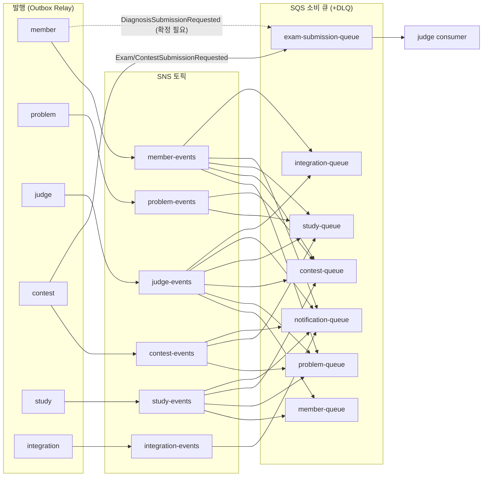

# 이벤트 계약서 v1.0

> 최종 수정일: 2026.10.07(수)
> 

---

## 1. 공통 규칙

모든 이벤트는 Outbox로 발행하고 `processed_events`로 멱등 소비하며, 순서는 보장하지 않으므로 소비자는 페이로드의 도메인 순서 값으로만 최신성을 판단한다.

### 1.1 공통 헤더

| 필드 | 타입 | 필수 | 설명 |
| --- | --- | --- | --- |
| `eventId` | string (UUID v4) | Y | Outbox 행 생성 시 발급. 재발행·재전달에서도 동일 값 유지. 소비자 멱등 키 |
| `eventType` | string | Y | 이벤트명 (PascalCase, 과거형). SNS 메시지 속성에도 복사해 구독 필터에 사용 |
| `schemaVersion` | string | Y | 메시지 형식 버전 `v1`. 도메인 순서 값과 무관 |
| `occurredAt` | string (date-time) | Y | 업무 트랜잭션 시각. `+09:00`, 마이크로초 6자리 |
| `aggregateId` | string | Y | 대상 애그리게이트 PK (접두어 없이 숫자 문자열. 예: `"55"`) |
| `correlationId` | string | Y | 원 요청의 `X-Correlation-Id`. 스케줄러 발행은 `sched-{작업명}-{UUID}` |
- 헤더와 페이로드는 한 JSON 객체에 평평하게 둔다(봉투 중첩 없음). 정책 §9.1 예시의 `aggregateId: "exam-55"`는 `"55"`로 정정한다(§8 역반영).
- `aggregate_type`은 Outbox 행에만 두고 메시지에는 싣지 않는다.

### 1.2 표기 규칙

| 항목 | 규칙 | 근거 |
| --- | --- | --- |
| 식별자 | 모든 ID·순번(`participantRevision`, `contextRevision`, `draftSeq`, `membershipId`)은 문자열 | API 0.2, 협의 공통-7 |
| 정수 | `judgeAttempt`, `profileVersion`·`sourceVersion`, `resultRevision`, 개수·시간·메모리는 정수 | API B.1 |
| 시각 | ISO-8601 `+09:00`, 마이크로초 6자리 (`2026-10-20T21:29:59.123456+09:00`) | 정책 §9.1 |
| 열거형 | 대문자 스네이크 (`AC`, `PRACTICE`, `LV2`). 언어만 소문자 `java` / `python3` / `cpp` | API 0.2 |
| 필드명 | camelCase. 회원 식별자는 judge 계열 `userId`, 그 외 `memberId` (기존 계약 유지) | API B.4·B.5 |
| 목록 | 배열, 비어 있으면 `[]` (null 금지) | 제안 |
| 기밀 | `sourceCode`는 채점 요청 이벤트에만. 토큰·이메일·코드 본문은 결과·알림 이벤트에 금지 | API B.1 |

### 1.3 발행 규칙

1. 업무 상태 변경과 `outbox_events` INSERT는 같은 트랜잭션이다. 트랜잭션 밖 직접 발행은 금지한다.
2. Outbox Relay가 1초 주기로 `status = 'PENDING'` 행을 `SELECT … FOR UPDATE SKIP LOCKED`(배치 100건)로 선점해 SNS Publish 또는 SQS SendMessage 후 `PUBLISHED`·`published_at`을 기록한다. Relay는 ShedLock을 쓰지 않는다.
3. 발행 실패는 `retry_count + 1`, 5회 초과 시 `FAILED`로 두고 운영 알림을 보낸다. `FAILED → PENDING` 재시도는 관리자 절차다.
4. 발행 성공 후 `PUBLISHED` 기록 전에 Relay가 죽으면 같은 `eventId`로 다시 발행된다. 이 중복은 소비자 멱등으로 흡수한다(최소 1회 전달).
5. 같은 애그리게이트 이벤트도 순서를 보장하지 않는다. SNS·SQS는 표준(Standard) 타입을 쓰고 FIFO는 쓰지 않는다.

### 1.4 소비 규칙

1. 수신 → 트랜잭션 시작 → `INSERT processed_events(event_id)` → 업무 반영 → 커밋 → SQS 메시지 삭제.
2. 유일 제약 위반(이미 처리)이면 롤백 후 메시지만 삭제한다. 삭제 실패로 재수신돼도 같은 경로로 흡수된다.
3. 업무 예외는 롤백하고 메시지를 삭제하지 않는다. Visibility Timeout 120초 후 재수신, 최대 수신 횟수를 넘으면 큐의 DLQ로 이동한다(§2.3).
4. 관심 없는 이벤트(필터 통과 후 문맥상 무시 대상)도 `processed_events`만 기록하고 성공 처리한다.
5. 외부 호출(LLM·GitHub·Judge0)은 소비 트랜잭션 안에서 하지 않는다. 작업 행을 만들고 커밋한 뒤 별도 워커가 처리한다.

### 1.5 순서 값 규칙

`eventId` 중복 제거 다음 단계로, 아래 값을 저장값과 비교해 지연·역전 이벤트를 버린다.

| 순서 값 | 이벤트 | 비교 단위 | 반영 조건 | 동일 값 처리 |
| --- | --- | --- | --- | --- |
| `judgeAttempt` | `SubmissionJudged`, `ExamSubmissionJudged`, `ContestSubmissionJudged`, `SubmissionFailed` | `submissionId` | 수신 > 저장 | 무시 (contest는 상충 시 격리) |
| `sourceVersion` | `MemberUpdated`, `MemberSuspended`, `MemberWithdrawn`, `ProblemStateChanged`, `StudyClosed` | 원천 애그리게이트 | 수신 > 저장 | 무시 |
| `profileVersion` | `LearningProfileUpdated` | `memberId` | 수신 > 저장 | 무시 |
| `contextRevision` / `examRevision` / `contestRevision` | 참가·설정·상태 이벤트 | `examId`·`contestId` | 수신 ≥ 저장 (종단 이벤트는 항상 우선) | 반영 (멱등) |
| `participantRevision` | `*ParticipantRegistered`·`*ParticipantCanceled` | `participantId` | 수신 > 저장, 같은 `participantId`면 취소 우선 | 무시 |
| `membershipId` | `StudyMemberJoined`·`StudyMemberLeft` | `(studyId, memberId)` | 수신 > 저장, 같은 값이면 `Left` 우선 | `Left` 수신 후 `Joined` 무시 |
| `resultRevision` | `ExamFinalized`·`ContestFinalized` | `examId`·`contestId` | 수신 > 저장 | 무시 |
- 종단 이벤트(`ExamClosed`·`ExamCanceled`·`ContestEnded`·`ContestCanceled`)는 수신 후 종단 표식을 남겨, 늦게 온 등록·수정 이벤트로 차단을 복원하지 않는다(API B.5 반영 규칙).
- 자연 순번이 없는 알림성 이벤트(`AssignmentPublished` 등)는 `eventId` 멱등만 적용한다.

### 1.6 스키마 변경

| 변경 | 허용 방식 |
| --- | --- |
| 선택 필드 추가 | `schemaVersion` 유지. 소비자는 모르는 필드를 무시해야 한다 (`FAIL_ON_UNKNOWN_PROPERTIES = false`) |
| 필드 삭제·이름 변경·의미·타입 변경 | `schemaVersion = v2` 신규 발행, 소비자 전환 후 `v1` 중단. 소비 서비스 담당자 승인 필수 |
| 이벤트 신설·폐지 | 이 문서 §3 갱신 + PR 리뷰에 발행·구독 담당자 전원 지정 |
- 이벤트 클래스는 공통 모듈(`common-event`)의 record로 정의하고, 계약 테스트(직렬화 JSON 스냅샷)로 이 문서와 구현의 일치를 검사한다(정책 §11 문서화 요구).

### 1.7 크기·보관

| 항목 | 값 |
| --- | --- |
| 메시지 최대 크기 | SQS 256KB. 코드 64KB 상한으로 채점 요청도 범위 안 |
| Outbox 보관 | `PUBLISHED` 후 7일, 일 1회 정리 배치 |
| `processed_events` 보관 | 14일 (SQS 최대 보관 14일과 동일) |
| DLQ 보관 | 14일 (`MessageRetentionPeriod` 최대) |

## 2. 채널 토폴로지

발행 서비스마다 SNS 토픽 1개, 소비 서비스마다 SQS 큐 1개(+DLQ)를 두고 `eventType` 필터 정책으로 필요한 이벤트만 구독한다. 채점 요청만 SNS를 거치지 않고 `exam-submission-queue`로 직접 보낸다(제안 — 이름·구성은 담당 A 확정).



### 2.1 SNS 토픽

| 토픽 (`resolve-{env}-` 접두) | 발행 | 메시지 속성 | 비고 |
| --- | --- | --- | --- |
| `member-events` | member | `eventType`, `schemaVersion` | 회원·프로필·레벨 |
| `problem-events` | problem | 동일 | `ProblemStateChanged` |
| `judge-events` | judge | 동일 + `context` | 채점 결과·실패. 시스템 구성도의 "문맥별 채점 결과" |
| `contest-events` | contest | 동일 | 참가·상태·확정 |
| `study-events` | study | 동일 | 스터디·문제집·힌트 |
| `integration-events` | integration | 동일 | `GitHubSyncFailed` |
- 구독은 Raw Message Delivery를 켜서 SQS 본문이 이벤트 JSON 그대로가 되게 한다.
- 로컬·CI는 LocalStack으로 같은 토픽·큐·구독을 Terraform(또는 init 스크립트)으로 생성한다(기획서 T1-02).

### 2.2 SQS 큐

| 큐 | 소비 서비스 | 구독 이벤트 수 | Visibility | 최대 수신 → DLQ |
| --- | --- | --- | --- | --- |
| `exam-submission-queue` | judge | 2 (+진단 1, 확정 필요) | 120초 | 3회 (정책 §3.4) |
| `member-queue` | member | 4 (확정 필요 2 포함) | 120초 | 5회 (제안) |
| `problem-queue` | problem | 7 | 120초 | 5회 |
| `contest-queue` | contest | 10 | 120초 | 5회 |
| `study-queue` | study | 16 | 120초 | 5회 |
| `notification-queue` | notification | 19 | 120초 | 5회 |
| `integration-queue` | integration | 2 | 120초 | 5회 |
- `exam-submission-queue`는 SSE-SQS(또는 KMS) 암호화와 judge 전용 수신 권한을 적용한다(코드 포함).
- 구독 이벤트 목록은 §5 매트릭스가 원본이다. 필터 정책은 매트릭스에서 생성한다.

### 2.3 DLQ

| DLQ | 원인 | 감지 | 재처리 |
| --- | --- | --- | --- |
| `{queue}-dlq` (SQS 소비 실패) | 소비 예외 반복 | CloudWatch `ApproximateNumberOfMessagesVisible ≥ 1` → 운영 알림 (정책 §11 "DLQ 1건 이상") | 원인 수정 후 관리자 redrive. `processed_events`로 중복 흡수 |
| `{topic}-delivery-dlq` (SNS 구독 전달 실패) | 큐 정책·권한 오류 | 동일 | 구독 수정 후 redrive |
- 두 DLQ 지표는 대시보드에서 구분한다(API B.1 실패 복구).

## 3. 이벤트 카탈로그

발행 6개 서비스의 이벤트 36종이다. 경로가 SQS인 3종은 채점 요청(명령성 메시지)이고 나머지 33종은 SNS 팬아웃 도메인 이벤트다.

| # | 이벤트 · 버전 | 발행 | 구독 | 경로 | 발행 시점 (트랜잭션) | 순서 값 | 상태 |
| --- | --- | --- | --- | --- | --- | --- | --- |
| M1 | `MemberUpdated` v1 | member | problem, contest, study | SNS | 가입·닉네임·이미지 변경 | `sourceVersion` | 확정 필요 (이름, E) |
| M2 | `MemberSuspended` v1 | member | problem, contest, study | SNS | 정지·해제 | `sourceVersion` | 확정 |
| M3 | `MemberWithdrawn` v1 | member | problem, contest, study, notification, integration | SNS | 탈퇴 | `sourceVersion` | 확정 |
| M4 | `LearningProfileUpdated` v1 | member | study | SNS | 프로필 입력·변경, 레벨 확정·변경 | `profileVersion` | 확정 |
| M5 | `TagLevelChanged` v1 | member | notification | SNS | 진단 결과·승급·하향·쿨타임 해제 | — | 확정 |
| M6 | `DiagnosisSubmissionRequested` v1 | member | judge | SQS `exam-submission-queue` | 진단 문항 제출·자동 제출 | — | 확정 필요 (B·E) |
| P1 | `ProblemStateChanged` v1 | problem | study, contest | SNS | 공개 상태 전환·공개 문제 새 회차 | `sourceVersion` | 확정 |
| J1 | `SubmissionJudged` v1 | judge | member, problem, study, notification, integration | SNS | `PRACTICE` 회차 정상 종결 | `judgeAttempt` | 확정 |
| J2 | `ExamSubmissionJudged` v1 | judge | contest | SNS | `EXAM` 회차 정상 종결 | `judgeAttempt` | 확정 |
| J3 | `ContestSubmissionJudged` v1 | judge | contest | SNS | `CONTEST` 회차 정상 종결 | `judgeAttempt` | 확정 |
| J4 | `SubmissionFailed` v1 | judge | notification, contest, member(진단) | SNS | 시도 상한 초과 `FAILED` | `judgeAttempt` | 확정 |
| J5 | `DiagnosisSubmissionJudged` v1 | judge | member | SNS | `DIAGNOSIS` 회차 정상 종결 | `judgeAttempt` | 확정 필요 (B·E) |
| C1 | `ExamSubmissionRequested` v1 | contest | judge | SQS `exam-submission-queue` | 시험 직접·자동 제출 접수 | — (`examSubmissionId` 멱등) | 확정 |
| C2 | `ContestSubmissionRequested` v1 | contest | judge | SQS `exam-submission-queue` | 대회 제출 접수 | — (`contestSubmissionId` 멱등) | 확정 |
| C3 | `ExamParticipantRegistered` v1 | contest | study, notification | SNS | 새 활성 참가 생성 | `participantRevision`, `contextRevision` | 확정 |
| C4 | `ContestParticipantRegistered` v1 | contest | study | SNS | 새 활성 참가 생성 | 동일 | 확정 |
| C5 | `ExamParticipantCanceled` v1 | contest | study, notification | SNS | 시작 전 참가 취소 | 동일 | 확정 |
| C6 | `ContestParticipantCanceled` v1 | contest | study | SNS | 시작 전 참가 취소 | 동일 | 확정 |
| C7 | `ExamUpdated` v1 | contest | study, notification | SNS | `SCHEDULED` 시험 설정 변경 | `examRevision` | 확정 |
| C8 | `ExamStarted` v1 | contest | study | SNS | `IN_PROGRESS` 전이 | `examRevision` | 확정 |
| C9 | `ExamClosed` v1 | contest | study | SNS | `CLOSED` 전이 | 종단 | 확정 |
| C10 | `ExamCanceled` v1 | contest | study, notification | SNS | `CANCELED` 전이 | 종단 | 확정 |
| C11 | `ExamFinalized` v1 | contest | notification (분석 P3) | SNS | 최초 확정·재확정 | `resultRevision` | 확정 |
| C12 | `ContestStarted` v1 | contest | notification | SNS | `RUNNING` 전이 | `contestRevision` | 확정 |
| C13 | `ContestEnded` v1 | contest | study, problem | SNS | `ENDED` 전이 | 종단 | 확정 |
| C14 | `ContestCanceled` v1 | contest | study, notification | SNS | `CANCELED` 전이 | 종단 | 확정 |
| C15 | `ContestFinalized` v1 | contest | notification (분석 P3) | SNS | 최초 확정·재확정 | `resultRevision` | 확정 |
| S1 | `StudyMemberJoined` v1 | study | contest, problem | SNS | 가입이 `APPROVED`가 되는 트랜잭션 | `membershipId` | 확정 |
| S2 | `StudyMemberLeft` v1 | study | contest, problem, notification | SNS | `LEFT`·`REMOVED`·회원 탈퇴 전파 | `membershipId` | 확정 |
| S3 | `StudyApplicationDecided` v1 | study | notification | SNS | 승인·거절·만료 | — | 확정 |
| S4 | `StudyClosed` v1 | study | contest | SNS | 스터디 종료 | `sourceVersion` | 확정 필요 (D·C) |
| S5 | `AssignmentPublished` v1 | study | notification | SNS | `SCHEDULED → OPEN` | — | 확정 |
| S6 | `AssignmentDeadlineApproaching` v1 | study | notification | SNS | 마감 24시간 이내 1회 | — | 확정 |
| S7 | `AssignmentIncompleteRepeated` v1 | study | notification | SNS | 연속 2회 `INCOMPLETE` 발견 | — | 확정 |
| S8 | `HintReady` v1 | study (AI 모듈) | notification, member(확정 필요) | SNS | 힌트 종결 (`READY`·`FALLBACK`·`BLOCKED`) | — | 확정 |
| I1 | `GitHubSyncFailed` v1 | integration | notification | SNS | Sync Job 최종 `FAILED` | — | 확정 |
- API B.2와 다른 행: `StudyMemberJoined` 구독에서 notification 제외(대응 알림 유형 없음, API 7.0), `ContestParticipantRegistered`·`Canceled` 구독에서 notification 제외(대회는 `ContestStarted`로 알림). `MemberUpdated`·`MemberSuspended`의 "전 서비스"는 `member_replicas` 보유 서비스(problem·contest·study, ERD §3)로 한정했다. 근거는 §8.1.

## 4. 이벤트 상세

각 이벤트는 공통 헤더(§1.1)에 아래 페이로드 필드를 더한 평평한 JSON이다. `aggregateId`는 표의 "aggregate" 값이다.

### 4.1 member (담당 E)

#### M1 `MemberUpdated` v1 — 확정 필요(이름)

- **발행:** 가입(1.1.2)·닉네임·이미지 변경(1.2.2) 트랜잭션. aggregate = `memberId`. `members.profile_version + 1`을 `sourceVersion`으로 싣는다.

| 필드 | 타입 | 필수 | 설명 |
| --- | --- | --- | --- |
| `memberId` | string | Y | 회원 ID |
| `sourceVersion` | integer | Y | `members.profile_version`. 상태 변경(정지·탈퇴)에도 증가시켜 M1~M3이 하나의 순서를 공유 |
| `status` | string | Y | `ACTIVE` / `SUSPENDED` / `WITHDRAWN` |
| `nickname` | string | Y | 표시 이름 |
| `profileImageUrl` | string | N | 미설정이면 null |

| 소비자 | 처리 |
| --- | --- |
| problem, contest, study | `member_replicas` upsert, `incoming.sourceVersion > stored`일 때만 |

#### M2 `MemberSuspended` v1

- **발행:** 관리자 정지·해제(1.6.2) 트랜잭션. aggregate = `memberId`. `MemberResumed`는 두지 않고 `suspended = false`로 통합한다.

| 필드 | 타입 | 필수 | 설명 |
| --- | --- | --- | --- |
| `memberId` | string | Y |  |
| `suspended` | boolean | Y | true = 정지, false = 해제 |
| `sourceVersion` | integer | Y | M1과 같은 계열 |
| `reason` | string | N | 감사용 요약. 사용자 노출 금지 |
| `changedAt` | string (date-time) | Y | 전이 시각 |

| 소비자 | 처리 |
| --- | --- |
| problem, study | `member_replicas.member_status` 갱신 → 쓰기 API `MEMBER_SUSPENDED`(403) 판정 |
| contest | 복제본 갱신. 이미 접수한 제출·자동 제출은 소급 취소하지 않음 (API 4.0, 협의 E-5 4주차) |
- judge·integration·notification은 복제본이 없으므로 쓰기 요청 시 member 내부 API 1.7.1로 확인한다(fail-closed).

#### M3 `MemberWithdrawn` v1

- **발행:** 탈퇴(1.2.3) 트랜잭션, 차단 조건(입장한 미확정 시험, 스터디장) 통과 후. aggregate = `memberId`.

| 필드 | 타입 | 필수 | 설명 |
| --- | --- | --- | --- |
| `memberId` | string | Y |  |
| `withdrawnAt` | string (date-time) | Y |  |
| `sourceVersion` | integer | Y | M1 계열 |

| 소비자 | 처리 (정책 §9.4) |
| --- | --- |
| study | 가입 `APPROVED → LEFT`(카운터 −1)·`PENDING → CANCELED`, 학습 프로필 복제본·추천 결과·힌트 차단 복제본 삭제, 가입마다 `StudyMemberLeft`(`MEMBER_WITHDRAWN`) 발행. `member_ac_replicas`·진행 기록은 유지 |
| problem | `member_replicas` 익명화("탈퇴한 사용자"), 공유 풀이 `CANCELED` |
| contest | 익명화, `MEMBER` 자원 가드 완료(도입 시). 참가 기록·결과는 유지 |
| notification | 해당 회원 알림 물리 삭제, SSE 연결 종료 |
| integration | 연동 `DISCONNECTED`(`WITHDRAWN`), 토큰·설치 정보 파기, 대기 Sync Job `CANCELED` |

```json
{
  "eventId": "5b0e2a7c-1d3f-4e8a-9b61-0c2f4a7d9e10",
  "eventType": "MemberWithdrawn",
  "schemaVersion": "v1",
  "occurredAt": "2026-10-21T10:00:00.000000+09:00",
  "aggregateId": "7",
  "correlationId": "req-3f81",
  "memberId": "7",
  "withdrawnAt": "2026-10-21T10:00:00.000000+09:00",
  "sourceVersion": 12
}
```

#### M4 `LearningProfileUpdated` v1

- **발행:** ① 프로필 최초 입력 ② 값이 바뀐 수정(1.3.2) ③ 진단 `SCORED`로 레벨 확정 ④ 승급·재채점 하향·태그 진입(1.4.2). 같은 값 재저장은 발행하지 않는다. aggregate = `memberId`. **전체 상태 스냅샷**이다.

| 필드 | 타입 | 필수 | 설명 |
| --- | --- | --- | --- |
| `memberId` | string | Y |  |
| `profileVersion` | integer | Y | `learning_profiles.profile_version`. 레벨 변경에도 증가 |
| `goal` | string | N | 프로필 미입력이면 null (레벨만 변경된 경우) |
| `preferredLanguages` | string[] | Y | `java` / `python3` / `cpp` |
| `activeTimeSlots` | string[] | Y | 값 체계 확정 필요 (정책 미결정, 2주차) |
| `tagLevels` | object[] | Y | `{tagId: string, level: "LV0"~"MASTER"}` 진입한 태그 전체 |

| 소비자 | 처리 |
| --- | --- |
| study | `member_learning_profile_replicas` 교체(`profileVersion` 비교) → 해당 회원 추천 즉시 재계산 |

```json
{
  "eventId": "a1c3…",
  "eventType": "LearningProfileUpdated",
  "schemaVersion": "v1",
  "occurredAt": "2026-09-28T10:00:00.000000+09:00",
  "aggregateId": "7",
  "correlationId": "req-77ab",
  "memberId": "7",
  "profileVersion": 4,
  "goal": "JOB",
  "preferredLanguages": ["java"],
  "activeTimeSlots": ["EVENING"],
  "tagLevels": [
    {"tagId": "3", "level": "LV2"},
    {"tagId": "5", "level": "LV1"}
  ]
}
```

#### M5 `TagLevelChanged` v1

- **발행:** 레벨 재계산 결과가 바뀐 트랜잭션, 진단 `SCORED`, 쿨타임 해제 스케줄러(스케줄러 §1.3). aggregate = `memberId`.

| 필드 | 타입 | 필수 | 설명 |
| --- | --- | --- | --- |
| `memberId` | string | Y |  |
| `tagId` | string | Y |  |
| `tagName` | string | Y | 알림 문구용 스냅샷 |
| `fromLevel` | string | N | 첫 진입(진단 결과)이면 `LV0` |
| `toLevel` | string | Y | `LV1`~`MASTER`. 쿨타임 해제는 현재 레벨 그대로 |
| `reasonType` | string | Y | `DIAGNOSIS` / `PROMOTION` / `REJUDGE` / `COOLDOWN_RELEASED` |
| `diagnosisId` | string | N | `DIAGNOSIS`·`COOLDOWN_RELEASED`만 |
| `basisSubmissionId` | string | N | `PROMOTION`·`REJUDGE`일 때 근거 제출 (추가 제안, 근거 조회 1.4.3 연결) |

| 소비자 | 처리 |
| --- | --- |
| notification | `LEVEL_CHANGED` 생성. 문구는 `reasonType`별(정책 §8.3 레벨 알림) |

#### M6 `DiagnosisSubmissionRequested` v1 — 확정 필요 (B·E)

- **발행:** 진단 문항 제출(1.5.5)·최종 제출/만료 자동 제출(1.5.6) 트랜잭션. `diagnosis_submissions`(`ACCEPTED`)와 함께 Outbox 기록 → Relay가 SQS로 전송 후 `REQUESTED`. aggregate = `diagnosisSubmissionId`.
- **경로 제안:** 시험·대회와 같은 `exam-submission-queue`를 공용으로 쓴다. judge 소비 로직(processed_events + submissions + judge_jobs 원자 저장)이 같고 큐를 늘리지 않는다. 큐 이름은 `judge-request-queue`로 바꾸는 안을 함께 검토한다.

| 필드 | 타입 | 필수 | 설명 |
| --- | --- | --- | --- |
| `diagnosisId` | string | Y | 진단 응시 ID (`context_id`) |
| `diagnosisSubmissionId` | string | Y | judge 멱등키 (`source_submission_id`) |
| `userId` | string | Y |  |
| `problemId` · `problemRevisionId` | string | Y | 출제 시 고정 회차 |
| `language` | string | Y |  |
| `sourceCode` | string | Y | 64KB 이하, 공백만인 코드 거절 |
| `draftSeq` | string | Y |  |
| `submissionType` | string | Y | `MANUAL` / `AUTO` |
| `receivedAt` | string (date-time) | Y | `<= ends_at`. judge `submitted_at` |

| 소비자 | 처리 |
| --- | --- |
| judge | `uk_submissions_context_source_submission(DIAGNOSIS, id)`로 멱등 생성, 레벨 접근 제한 미적용 |

### 4.2 problem (담당 B)

#### P1 `ProblemStateChanged` v1

- **발행:** 공개(2.3.7)·비공개 전환(2.3.8)·보관(2.3.9)·공개 문제의 새 회차 등록(2.3.4) 트랜잭션. aggregate = `problemId`. 대회 종료 공개(`ContestEnded` 소비)는 `scope`를 바꾸지 않으므로 발행하지 않는다.

| 필드 | 타입 | 필수 | 설명 |
| --- | --- | --- | --- |
| `problemId` | string | Y |  |
| `sourceVersion` | integer | Y | `problems.row_version` (협의 공통-4 결정 3) |
| `scope` | string | Y | `GENERAL` / `EXAM_ONLY` |
| `visibility` | string | Y | `PUBLIC` / `PRIVATE` / `ARCHIVED` |
| `problemRevisionId` | string | Y | 현재 공개 회차 |
| `revisionNumber` | integer | Y | 표시용 |
| `changeType` | string | Y | `VISIBILITY` / `REVISION` (추가 제안: 소비자가 분기 없이 판단) |
| `changedAt` | string (date-time) | Y |  |
| `operationId` | string | N | contest 자원 가드 도입 시만 |

| 소비자 | 처리 |
| --- | --- |
| study | `PRIVATE`·`ARCHIVED` → 포함된 `assignment_problems` `EXCLUDED`, 멤버별 과제 상태 재계산(분모 감소). `PUBLIC` → `ACTIVE` 복귀. 힌트 캐시는 키에 회차가 있어 별도 무효화 불필요 |
| contest | `PROBLEM` 가드 완료, 큰 `PUBLIC` 버전에만 해제. 시험·대회에 고정한 회차는 보존 |

### 4.3 judge (담당 B)

#### J1 `SubmissionJudged` v1 (`PRACTICE` 전용)

- **발행:** 실행기가 결과를 `submissions`에 반영하는 트랜잭션(`job.status = RUNNING AND lease_token = :token` 조건 성공 시). aggregate = `submissionId`. 판정과 무관하게 정상 종결이면 발행한다. 문맥 필드는 두지 않는다(이벤트명이 문맥).

| 필드 | 타입 | 필수 | 설명 |
| --- | --- | --- | --- |
| `submissionId` · `userId` · `problemId` · `problemRevisionId` | string | Y |  |
| `verdict` | string | Y | `AC` / `WA` / `TLE` / `MLE` / `RE` / `CE` |
| `judgeAttempt` | integer | Y | 1 이상 |
| `submittedAt` | string (date-time) | Y | 서버 접수 시각 (완료 유형·승급 판정 기준) |
| `judgedAt` | string (date-time) | Y | 종결 시각 (추가 제안: 반영 지연 지표 p95 ≤ 5초 측정용) |
| `passedCount` · `totalCount` | integer | Y |  |
| `maxTimeMs` · `maxMemoryKb` | integer | N | `CE`면 null |
| `language` | string | Y | GitHub 파일 확장자 결정용 (추가 제안) |
| `problemDifficulty` | integer | Y | 1~3, 회차 스냅샷 |
| `problemTags` | string[] | Y | 태그 이름 (기존 계약 유지) |
| `problemTagIds` | string[] | Y | 태그 ID (추가 제안 — member `practice_result_replica_tags.tag_id` 집계용, B·E 확정 필요) |
| `problemTitle` | string | Y | 알림 문구·GitHub 경로용 스냅샷 (추가 제안) |

| 소비자 | 처리 (모두 `judgeAttempt > 저장값`일 때만) |
| --- | --- |
| member | `practice_result_replicas` 교체 → (회원, 태그, 난이도) 성취도·레벨 재계산 → 바뀌면 M4·M5 Outbox |
| problem | `member_problem_statuses` 갱신(`is_solved`는 `false → true`만), 문제별 통계 |
| study | `member_ac_replicas` upsert(`is_accepted`), 대상 문제집 완료 기록 재계산 (다이어그램 §5.3) |
| integration | `AC`·`CONNECTED`·자동 커밋 켜짐 → `github_sync_jobs` 생성(`submission_id` 유일) |
| notification | `SUBMISSION_JUDGED` 생성 (끌 수 없음) |

```json
{
  "eventId": "8f2c4b1e-77a0-4c1d-9e1b-2d5a6f3c8e01",
  "eventType": "SubmissionJudged",
  "schemaVersion": "v1",
  "occurredAt": "2026-10-10T21:03:12.123456+09:00",
  "aggregateId": "91023",
  "correlationId": "c-7a1f",
  "submissionId": "91023",
  "userId": "7",
  "problemId": "1001",
  "problemRevisionId": "3",
  "verdict": "AC",
  "judgeAttempt": 1,
  "submittedAt": "2026-10-10T21:02:58.000000+09:00",
  "judgedAt": "2026-10-10T21:03:12.120001+09:00",
  "passedCount": 20,
  "totalCount": 20,
  "maxTimeMs": 312,
  "maxMemoryKb": 20480,
  "language": "java",
  "problemDifficulty": 2,
  "problemTags": ["해시"],
  "problemTagIds": ["3"],
  "problemTitle": "두 수의 합"
}
```

#### J2·J3 `ExamSubmissionJudged` / `ContestSubmissionJudged` v1

- **발행:** `EXAM`·`CONTEST` 제출의 회차 정상 종결 트랜잭션(재채점·재처리 새 회차 포함). aggregate = `submissionId`. 판정은 contest가 공개 시점을 정한다.

| 필드 | 타입 | 필수 | 설명 |
| --- | --- | --- | --- |
| `context` | string | Y | `EXAM` / `CONTEST` |
| `examId` · `examSubmissionId` | string | 조건 | `EXAM`에서만 (다른 문맥 ID 금지) |
| `contestId` · `contestSubmissionId` | string | 조건 | `CONTEST`에서만 |
| `submissionId` · `userId` · `problemId` · `problemRevisionId` | string | Y | 원래 접수와 대조 |
| `judgeAttempt` | integer | Y | 종결 회차 |
| `status` | string | Y | `COMPLETED` |
| `verdict` | string | Y | `AC` / `WA` / `TLE` / `MLE` / `RE` / `CE` |
| `passedCount` · `totalCount` · `maxTimeMs` · `maxMemoryKb` | integer | Y·Y·N·N | `CE`면 시간·메모리 null |
| `submittedAt` | string (date-time) | Y | contest `receivedAt`과 동일 |

| 소비자 | 처리 (API B.4 결과 소비 조건) |
| --- | --- |
| contest | 접수 연결 검증(사용자·문제·고정 회차·`submittedAt`) → 작은 회차·같은 회차 동일 결과 무시, 같은 회차 상충 격리, 최초 또는 허용 목표 회차만 반영 → 문제별 결과·참가자 합계·`resultRevision`·`processed_events` 한 트랜잭션 → Redis·SSE는 커밋 후 (실패해도 DB 유지). `FINALIZED` 이후 도착분은 반영하지 않고 재확정으로만 |

#### J4 `SubmissionFailed` v1

- **발행:** `try_count` 3 초과로 작업·제출이 `FAILED`가 되는 트랜잭션. aggregate = `submissionId`. 판정이 아니므로 사용자 판정으로 해석하지 않는다.

| 필드 | 타입 | 필수 | 설명 |
| --- | --- | --- | --- |
| `context` | string | Y | `PRACTICE` / `EXAM` / `CONTEST` / `DIAGNOSIS` |
| `contextId` · `receiptId` | string | N | 시험·대회·진단만 (`receiptId` = `source_submission_id`) |
| `submissionId` · `userId` · `problemId` · `problemRevisionId` | string | Y |  |
| `judgeAttempt` | integer | Y | 실패 종결 회차 |
| `status` | string | Y | `FAILED` |
| `submittedAt` | string (date-time) | Y |  |
| `errorCode` | string | Y | `JUDGE0_UNAVAILABLE` / `JUDGE0_TIMEOUT` / `LEASE_EXHAUSTED` / `DEADLINE_EXCEEDED` / `TEST_DATA_UNAVAILABLE` (제안) |

| 소비자 | 처리 |
| --- | --- |
| notification | `SUBMISSION_FAILED` "채점 실패, 재처리 예정" — 문맥 무관 (정책 §9.2) |
| contest | `EXAM`·`CONTEST` 접수 `FAILED` 전이 → 확정 보류, 관리자 운영 알림 |
| member | `DIAGNOSIS`만: 진단 제출 `FAILED`, 응시 `is_cooldown_exempt = true` (정책 §8.3 쿨타임 예외) |

#### J5 `DiagnosisSubmissionJudged` v1 — 확정 필요 (B·E)

- **제안:** `SubmissionJudged`는 `PRACTICE` 전용 계약이고 소비자 5곳이 진단을 걸러야 하므로, 진단 결과는 J2와 같은 형식의 별도 이벤트로 분리한다(정책 미결정 "DIAGNOSIS 결과 이벤트 분리", 2주차).
- 필드: J2에서 `context = DIAGNOSIS`, `diagnosisId`·`diagnosisSubmissionId`로 문맥 ID를 바꾼 형식. 소비자 member는 `diagnosis_submissions` 반영 → 응시 내 모든 제출 종결 시 `CLOSED → SCORED` 전이 + M4·M5 발행.

### 4.4 contest (담당 C)

#### C1·C2 `ExamSubmissionRequested` / `ContestSubmissionRequested` v1 (SQS)

- **발행:** 직접 제출(Draft 반영 + `exam_submissions` `ACCEPTED` + Outbox 한 트랜잭션), 자동 제출 스케줄러(AUTO), 대회 제출. Relay가 SQS 전송 성공 후 접수를 `ACCEPTED → REQUESTED`로 전이한다(먼저 도착한 `JUDGED`·`FAILED`는 보존). aggregate = `examSubmissionId` / `contestSubmissionId`.

| 필드 | 타입 | 필수 | 설명 |
| --- | --- | --- | --- |
| `examId` · `examSubmissionId` | string | C1 | `examSubmissionId` = judge 멱등키 |
| `contestId` · `contestSubmissionId` | string | C2 | `contestSubmissionId` = judge 멱등키 |
| `participantId` · `userId` | string | Y |  |
| `problemId` · `problemRevisionId` | string | Y | 고정 회차 (judge가 최신 회차로 치환 금지) |
| `language` | string | Y | `java` / `python3` / `cpp` |
| `sourceCode` | string | Y | UTF-8 64KB 이하 |
| `draftSeq` | string | C1 |  |
| `submissionType` | string | C1 | `MANUAL` / `AUTO` |
| `receivedAt` | string (date-time) | Y | 불변 접수 시각 (AUTO는 `personal_ends_at`) |

| 소비자 | 처리 |
| --- | --- |
| judge | `processed_events`·`submissions`(`QUEUED`, `submitted_at = receivedAt`)·`judge_jobs`(`PENDING`)를 한 트랜잭션 저장 후 메시지 삭제. `uk_submissions_context_source_submission` 위반 = 이미 접수 → 삭제만. judge 수신 시각으로 마감을 재판정하지 않는다 |

```json
{
  "eventId": "bc2dbf69-a397-4e45-9bcc-3a8206e0b066",
  "eventType": "ExamSubmissionRequested",
  "schemaVersion": "v1",
  "occurredAt": "2026-10-20T21:29:59.123456+09:00",
  "aggregateId": "4001",
  "correlationId": "request-901",
  "examId": "55",
  "examSubmissionId": "4001",
  "participantId": "411",
  "userId": "7",
  "problemId": "101",
  "problemRevisionId": "1001",
  "language": "java",
  "sourceCode": "class Solution { public int solution(int a, int b) { return a + b; } }",
  "draftSeq": "16",
  "submissionType": "MANUAL",
  "receivedAt": "2026-10-20T21:29:59.123456+09:00"
}
```

#### C3·C4 `ExamParticipantRegistered` / `ContestParticipantRegistered` v1

- **발행:** 새 활성 참가 생성 트랜잭션(재등록은 새 `participantId`). aggregate = `participantId`.

| 필드 | 타입 | 필수 | 설명 |
| --- | --- | --- | --- |
| `context` · `contextId` | string | Y | `EXAM`/`CONTEST`, 시험·대회 ID |
| `examId` 또는 `contestId` | string | Y | 문맥에 맞는 하나만 |
| `participantId` · `memberId` | string | Y |  |
| `participantRevision` | string | Y | 참가 행 버전 |
| `contextRevision` | string | Y | 등록 시점 시험·대회 설정 버전 |
| `problemIds` | string[] | Y | 포함 문제 전체 |
| `startsAt` · `endsAt` | string (date-time) | Y | 전체 시작·종료 (개인 종료 아님) |

| 소비자 | 처리 |
| --- | --- |
| study | `hint_block_replicas` 문제별 INSERT(유일 제약 무시). 해당 문맥에 종단 표식이 있으면 무시 |
| notification (C3만) | `startsAt − 5분` 예약 등록. 이미 임박이면 즉시 1회 (API 7.0) |

```json
{
  "eventId": "0e7d…",
  "eventType": "ExamParticipantRegistered",
  "schemaVersion": "v1",
  "occurredAt": "2026-10-19T12:00:00.000000+09:00",
  "aggregateId": "411",
  "correlationId": "req-55a",
  "context": "EXAM",
  "contextId": "55",
  "examId": "55",
  "participantId": "411",
  "memberId": "7",
  "participantRevision": "1",
  "contextRevision": "3",
  "problemIds": ["1001", "1002", "1003"],
  "startsAt": "2026-10-20T20:00:00.000000+09:00",
  "endsAt": "2026-10-20T21:30:00.000000+09:00"
}
```

#### C5·C6 `ExamParticipantCanceled` / `ContestParticipantCanceled` v1

- **발행:** 시작 전 참가 취소 트랜잭션. aggregate = `participantId`.

| 필드 | 타입 | 필수 | 설명 |
| --- | --- | --- | --- |
| `context` · `contextId` · `examId`/`contestId` | string | Y |  |
| `participantId` · `memberId` | string | Y |  |
| `participantRevision` · `contextRevision` | string | Y |  |
| `canceledAt` | string (date-time) | Y |  |

| 소비자 | 처리 |
| --- | --- |
| study | 해당 참가의 차단 행만 삭제. 같은 `participantId`의 늦은 등록 이벤트는 취소 표식으로 무시 (ERD `hint_block_replicas`에 `participant_id` 추가 필요, §8.1) |
| notification (C5만) | 시작 임박 예약 무효화 |

#### C7 `ExamUpdated` v1

- **발행:** `SCHEDULED` 시험의 문제·시간·배점 변경 트랜잭션. 참가자별이 아닌 단건, **전체 스냅샷**. aggregate = `examId`.

| 필드 | 타입 | 필수 | 설명 |
| --- | --- | --- | --- |
| `examId` · `studyId` | string | Y |  |
| `examRevision` | string | Y | 설정 버전 |
| `problems` | object[] | Y | `{problemId, problemRevisionId, score, displayOrder}` |
| `startsAt` · `endsAt` | string (date-time) | Y |  |
| `targetMemberIds` | string[] | Y | 활성 등록자 스냅샷 |

| 소비자 | 처리 |
| --- | --- |
| study | `context_revision < examRevision`인 해당 시험 차단 행을 문제·시각 기준으로 교체 |
| notification | `EXAM_UPDATED` 등록자 알림 + 시작 임박 예약 재설정 |

#### C8~C10 `ExamStarted` / `ExamClosed` / `ExamCanceled` v1

| 이벤트 | 발행 시점 | 필드 (aggregate = `examId`) | 소비자 처리 |
| --- | --- | --- | --- |
| `ExamStarted` | `ExamLifecycleScheduler` `IN_PROGRESS` 전이 | `examId`, `studyId`, `examRevision`, `startsAt`, `endsAt` | study: 차단 행 존재 확인(진단 지표). 차단은 시각 판정이라 필수 아님 |
| `ExamClosed` | `CLOSED` 전이 (전체 마감 초과) | `examId`, `studyId`, `examRevision`, `closedAt` | study: 해당 시험 차단 행 삭제 + 종단 표식. 알림 없음 |
| `ExamCanceled` | 시작 전 취소 API, 스터디 종료 준비 | `examId`, `studyId`, `examRevision`, `canceledAt`, `reason`, `targetMemberIds` | study: 차단 삭제 + 종단. notification: `EXAM_CANCELED`, 예약 무효화 |

#### C11·C15 `ExamFinalized` / `ContestFinalized` v1

- **발행:** 결과 확정 스케줄러(최초)·관리자 재확정 API 트랜잭션. 결과·스냅샷과 원자 저장. aggregate = `examId`/`contestId`.

| 필드 | 타입 | 필수 | 설명 |
| --- | --- | --- | --- |
| `context` · `contextId` · `examId`/`contestId` | string | Y |  |
| `resultRevision` | integer | Y | 결과 버전 |
| `finalizedAt` | string (date-time) | Y |  |
| `isRefinalized` | boolean | Y | 재확정이면 true |
| `targetMemberIds` | string[] | Y | 미제출 활성 등록자 포함 |

| 소비자 | 처리 |
| --- | --- |
| notification | `EXAM_FINALIZED`·`CONTEST_FINALIZED` (재확정도 알림, 문구 구분). `resultRevision`이 저장값 이하면 무시 |
| 분석 (P3) | 확정 스냅샷 조회 API(4.7.9) 호출 |

#### C12~C14 대회 상태 이벤트

| 이벤트 | 발행 시점 | 필드 (aggregate = `contestId`) | 소비자 처리 |
| --- | --- | --- | --- |
| `ContestStarted` | `RUNNING` 전이 | `contestId`, `contestRevision`, `startsAt`, `endsAt`, `targetMemberIds` | notification: `CONTEST_STARTED` |
| `ContestEnded` | `ENDED` 전이 | `contestId`, `contestRevision`, `endedAt`, `isProblemsPublicAfterEnd`, `problemIds` (추가 제안) | study: 차단 삭제 + 종단. problem: `EXAM_ONLY` 문제 종료 공개 플래그(`scope` 유지). 알림 없음 |
| `ContestCanceled` | 시작 전 취소 | `contestId`, `contestRevision`, `canceledAt`, `reason`, `targetMemberIds` | study: 차단 삭제 + 종단. notification: `CONTEST_CANCELED` |
- 대회 설정 변경 이벤트(`ContestUpdated`)는 정의하지 않는다. 대회는 관리자만 만들고 시작 전 변경 시 참가자 알림 요구가 없어서다. 변경이 차단 시각에 영향을 주면 study는 4.7.7 hint-blocks로 재구성한다(§8.1 협의).

### 4.5 study·AI (담당 D)

#### S1 `StudyMemberJoined` v1

- **발행:** 가입이 `APPROVED`가 되는 트랜잭션(즉시 가입·승인·스터디 생성 시 `LEADER`). aggregate = `membershipId`. 문제집 편입은 가입 트랜잭션이 직접 하므로 study 자신은 소비하지 않는다(정책 §7.1).

| 필드 | 타입 | 필수 | 설명 |
| --- | --- | --- | --- |
| `studyId` · `membershipId` · `memberId` | string | Y | `membershipId`는 재가입마다 증가 |
| `role` | string | Y | `LEADER` / `MANAGER` / `MEMBER` |
| `joinedAt` | string (date-time) | Y |  |

| 소비자 | 처리 |
| --- | --- |
| contest | `study_membership_replicas` `(studyId, memberId)` upsert. 저장 `membershipId`보다 작으면 무시, 같은 `membershipId`의 `Left` 수신 후면 무시 → 시험 참가 자격 |
| problem | 같은 규칙 → 풀이 공유 조회 권한 |

```json
{
  "eventId": "d4f1…",
  "eventType": "StudyMemberJoined",
  "schemaVersion": "v1",
  "occurredAt": "2026-10-12T09:00:00.000000+09:00",
  "aggregateId": "812",
  "correlationId": "req-12bc",
  "studyId": "12",
  "membershipId": "812",
  "memberId": "7",
  "role": "MEMBER",
  "joinedAt": "2026-10-12T09:00:00.000000+09:00"
}
```

#### S2 `StudyMemberLeft` v1

- **발행:** 본인 탈퇴(`LEFT`)·강제 탈퇴(`REMOVED`)·`MemberWithdrawn` 소비 트랜잭션. 스터디 종료(`CLOSED`)는 가입을 `APPROVED`로 두므로 발행하지 않는다. aggregate = `membershipId`.

| 필드 | 타입 | 필수 | 설명 |
| --- | --- | --- | --- |
| `studyId` · `membershipId` · `memberId` | string | Y |  |
| `reason` | string | Y | `LEFT` / `REMOVED` / `MEMBER_WITHDRAWN` |
| `leftAt` | string (date-time) | Y |  |
| `studyName` | string | Y | 알림 문구용 스냅샷 (추가 제안) |

| 소비자 | 처리 |
| --- | --- |
| contest | 같은 `membershipId`면 복제본 비활성, 작으면 무시. 이미 등록한 참가는 유지 |
| problem | 같은 규칙. 공유 풀이 조회는 조회 시점 재검증이라 별도 삭제 없음 |
| notification | `reason = REMOVED`일 때만 `STUDY_MEMBER_REMOVED` |

#### S3 `StudyApplicationDecided` v1

| 항목 | 내용 |
| --- | --- |
| 발행 | 승인·거절 API, `StudyApplicationExpiryScheduler`(만료). 신청 취소는 본인 행위라 발행하지 않음 |
| aggregate | `membershipId` |
| 필드 | `studyId`, `studyName`(추가 제안), `membershipId`, `memberId`, `result`(`APPROVED` / `REJECTED` / `EXPIRED`), `decidedAt` |
| 소비자 | notification: 신청자에게 `STUDY_APPLICATION_DECIDED` |

#### S4 `StudyClosed` v1 — 확정 필요 (D·C)

| 항목 | 내용 |
| --- | --- |
| 발행 | 스터디 종료 API(5.3.4)·관리자 강제 종료(5.6.1) 트랜잭션 |
| aggregate | `studyId` |
| 필드 | `studyId`, `sourceVersion`(`studies.version`), `closedAt`, `operationId`(가드 도입 시) |
| 소비자 | contest: `STUDY` 가드 완료·신규 시험 생성 차단. `CLOSED` 시험의 채점·확정은 계속 |

#### S5~S7 문제집 이벤트

| 이벤트 | 발행 시점 | 필드 (aggregate = `assignmentId`) | 소비자 처리 |
| --- | --- | --- | --- |
| `AssignmentPublished` | `AssignmentLifecycleScheduler` `SCHEDULED → OPEN` | `studyId`, `assignmentId`, `title`, `startsAt`, `deadlineAt`(null 가능), `targetMemberIds` | notification: `ASSIGNMENT_PUBLISHED` |
| `AssignmentDeadlineApproaching` | `AssignmentDeadlineReminderScheduler`, 문제집당 1회 | `studyId`, `assignmentId`, `title`, `deadlineAt`, `incompleteMemberIds` | notification: `ASSIGNMENT_DEADLINE_APPROACHING` (미완료자만) |
| `AssignmentIncompleteRepeated` | CLOSE 전이 중 연속 2회 `INCOMPLETE` 발견 | `studyId`, `assignmentId`, `memberIds`, `recipientMemberIds`(`LEADER`·`MANAGER`) | notification: `ASSIGNMENT_INCOMPLETE_REPEATED` (운영진만, 자동 강퇴 없음) |
- 미완료자가 0명이면 `AssignmentDeadlineApproaching`·`AssignmentIncompleteRepeated`를 발행하지 않는다.

#### S8 `HintReady` v1

- **발행:** 힌트 요청 종결 트랜잭션 — 캐시 적중 즉시 `READY`, 생성 `READY`·`FALLBACK`, 전달 직전 `BLOCKED`, 회수 스케줄러. aggregate = `hintRequestId`.

| 필드 | 타입 | 필수 | 설명 |
| --- | --- | --- | --- |
| `hintRequestId` · `memberId` · `problemId` | string | Y |  |
| `problemRevisionId` | string | Y | 캐시 키 회차 (추가 제안) |
| `level` | integer | Y | 1~3 |
| `result` | string | Y | `READY` / `FALLBACK` / `BLOCKED` |
| `isCached` | boolean | Y |  |
| `completedAt` | string (date-time) | Y | member `hint_usage_replicas.first_used_at` 원천 (추가 제안) |

| 소비자 | 처리 |
| --- | --- |
| notification | `HINT_READY`, `result`별 문구. 힌트 본문은 싣지 않고 6.1.3으로 조회 |
| member (확정 필요) | `READY`·`FALLBACK`이면 `hint_usage_replicas` `(memberId, problemId)` INSERT IGNORE(최초 시각 유지) → 해당 문제 AC 점수 1/2로 성취도 재계산 |
- 순서 주의: 힌트 사용이 AC보다 늦게 와도 결과가 같도록 member는 성취도를 매번 재계산한다. 힌트 사용 시각과 AC 접수 시각의 선후로 1/2점 여부를 가를지는 E·D 확정 필요(§8.2).

### 4.6 integration (담당 A)

#### I1 `GitHubSyncFailed` v1

| 항목 | 내용 |
| --- | --- |
| 발행 | Sync Job이 `retry_count` 5 초과로 `FAILED`가 되는 워커 트랜잭션. 권한 만료(401)로 인한 `DISCONNECTED` 전이도 같은 이벤트(`errorCode = AUTH_EXPIRED`) |
| aggregate | `syncJobId` |
| 필드 | `syncJobId`, `memberId`, `submissionId`, `problemId`, `problemTitle`(추가 제안), `errorCode`(`RATE_LIMIT_EXHAUSTED` / `GITHUB_5XX` / `AUTH_EXPIRED` / `REPOSITORY_NOT_FOUND` / `CODE_UNAVAILABLE`), `failedAt` |
| 소비자 | notification: `GITHUB_SYNC_FAILED`, `AUTH_EXPIRED`면 재인가 안내 링크 |

## 5. 서비스별 구독 매트릭스

이 표가 SNS 구독 필터 정책의 원본이다. ● = 구독, ○ = 구독(확정 필요), 빈칸 = 구독 안 함.

| 이벤트 | judge | member | problem | contest | study | notification | integration |
| --- | --- | --- | --- | --- | --- | --- | --- |
| `MemberUpdated` |  |  | ● | ● | ● |  |  |
| `MemberSuspended` |  |  | ● | ● | ● |  |  |
| `MemberWithdrawn` |  |  | ● | ● | ● | ● | ● |
| `LearningProfileUpdated` |  |  |  |  | ● |  |  |
| `TagLevelChanged` |  |  |  |  |  | ● |  |
| `DiagnosisSubmissionRequested` | ○ |  |  |  |  |  |  |
| `ProblemStateChanged` |  |  |  | ● | ● |  |  |
| `SubmissionJudged` |  | ● | ● |  | ● | ● | ● |
| `ExamSubmissionJudged` |  |  |  | ● |  |  |  |
| `ContestSubmissionJudged` |  |  |  | ● |  |  |  |
| `SubmissionFailed` |  | ● (진단) |  | ● |  | ● |  |
| `DiagnosisSubmissionJudged` |  | ○ |  |  |  |  |  |
| `ExamSubmissionRequested` | ● |  |  |  |  |  |  |
| `ContestSubmissionRequested` | ● |  |  |  |  |  |  |
| `ExamParticipantRegistered` |  |  |  |  | ● | ● |  |
| `ContestParticipantRegistered` |  |  |  |  | ● |  |  |
| `ExamParticipantCanceled` |  |  |  |  | ● | ● |  |
| `ContestParticipantCanceled` |  |  |  |  | ● |  |  |
| `ExamUpdated` |  |  |  |  | ● | ● |  |
| `ExamStarted` |  |  |  |  | ● |  |  |
| `ExamClosed` |  |  |  |  | ● |  |  |
| `ExamCanceled` |  |  |  |  | ● | ● |  |
| `ExamFinalized` |  |  |  |  |  | ● |  |
| `ContestStarted` |  |  |  |  |  | ● |  |
| `ContestEnded` |  |  | ● |  | ● |  |  |
| `ContestCanceled` |  |  |  |  | ● | ● |  |
| `ContestFinalized` |  |  |  |  |  | ● |  |
| `StudyMemberJoined` |  |  | ● | ● |  |  |  |
| `StudyMemberLeft` |  |  | ● | ● |  | ● |  |
| `StudyApplicationDecided` |  |  |  |  |  | ● |  |
| `StudyClosed` |  |  |  | ○ |  |  |  |
| `AssignmentPublished` |  |  |  |  |  | ● |  |
| `AssignmentDeadlineApproaching` |  |  |  |  |  | ● |  |
| `AssignmentIncompleteRepeated` |  |  |  |  |  | ● |  |
| `HintReady` |  | ○ |  |  |  | ● |  |
| `GitHubSyncFailed` |  |  |  |  |  | ● |  |
| **합계** | 2 (+1) | 2 (+2) | 7 | 9 (+1) | 16 | 19 | 2 |

### 5.1 소비자 구현 체크리스트

- `@SqsListener` 메서드는 이벤트 타입별 핸들러로 디스패치하고, 모르는 `eventType`은 `processed_events`만 기록 후 성공
- 핸들러는 `@Transactional` 안에서 `processed_events` INSERT를 첫 문장으로 실행
- 순서 값 비교는 조건부 UPDATE(`WHERE judge_attempt < :incoming`)로 구현해 동시 소비에서도 역전 없음
- 외부 호출·Redis·SSE는 커밋 후(`@TransactionalEventListener(AFTER_COMMIT)` 또는 워커) 실행
- 로그에 `eventId`·`eventType`·`correlationId` MDC 기록, 코드 본문·토큰 미기록

## 6. 이벤트 → 알림 매핑

notification은 이벤트를 받아 수신자·문구·이동 경로를 직접 정한다. 도메인 서비스는 알림 문구를 이벤트에 싣지 않는다(정책 §9.2 생성 책임).

| 원천 이벤트 | 조건 | 알림 `type` | 수신자 | 수신 설정 컬럼 | `linkUrl` (제안) |
| --- | --- | --- | --- | --- | --- |
| `SubmissionJudged` | 항상 | `SUBMISSION_JUDGED` | `userId` | 끌 수 없음 | `/submissions/{submissionId}` |
| `SubmissionFailed` | 항상 (문맥 무관) | `SUBMISSION_FAILED` | `userId` | 끌 수 없음 | 문맥별 제출·시험 화면 |
| `ExamParticipantRegistered` | 예약 → `startsAt − 5분` 발화 | `EXAM_STARTING_SOON` | `memberId` | `is_exam_contest_enabled` | `/exams/{examId}` |
| `ExamUpdated` | 등록자 + 예약 재설정 | `EXAM_UPDATED` | `targetMemberIds` | 동일 | `/exams/{examId}` |
| `ExamCanceled` | 항상 | `EXAM_CANCELED` | `targetMemberIds` | 동일 | `/studies/{studyId}` |
| `ExamFinalized` | 최초·재확정 | `EXAM_FINALIZED` | `targetMemberIds` | 동일 | `/exams/{examId}/result` |
| `ContestStarted` | 항상 | `CONTEST_STARTED` | `targetMemberIds` | 동일 | `/contests/{contestId}` |
| `ContestCanceled` | 항상 | `CONTEST_CANCELED` | `targetMemberIds` | 동일 | `/contests` |
| `ContestFinalized` | 최초·재확정 | `CONTEST_FINALIZED` | `targetMemberIds` | 동일 | `/contests/{contestId}/standings` |
| `StudyApplicationDecided` | 항상 | `STUDY_APPLICATION_DECIDED` | `memberId` | `is_study_application_enabled` | `/studies/{studyId}` |
| `StudyMemberLeft` | `reason = REMOVED` | `STUDY_MEMBER_REMOVED` | `memberId` | 동일 | 없음 |
| `AssignmentPublished` | 항상 | `ASSIGNMENT_PUBLISHED` | `targetMemberIds` | `is_assignment_enabled` | `/studies/{studyId}/assignments/{assignmentId}` |
| `AssignmentDeadlineApproaching` | 항상 | `ASSIGNMENT_DEADLINE_APPROACHING` | `incompleteMemberIds` | 동일 | 동일 |
| `AssignmentIncompleteRepeated` | 항상 | `ASSIGNMENT_INCOMPLETE_REPEATED` | `recipientMemberIds` | 동일 | `/studies/{studyId}/manage` |
| `TagLevelChanged` | 항상 | `LEVEL_CHANGED` | `memberId` | `is_level_changed_enabled` | `/me/tag-levels/{tagId}` |
| `HintReady` | 항상 | `HINT_READY` | `memberId` | `is_hint_ready_enabled` | `/problems/{problemId}?hint={hintRequestId}` |
| `GitHubSyncFailed` | 항상 | `GITHUB_SYNC_FAILED` | `memberId` | `is_github_sync_enabled` | `/settings/github` |
- 알림을 만들지 않는 이벤트: `ExamClosed`·`ContestEnded`(종료 알림 없음), `ExamSubmissionJudged`·`ContestSubmissionJudged`(건별 채점 알림 없음), `ExamStarted`(임박 알림으로 대체), `StudyMemberJoined`(승인은 `StudyApplicationDecided`).
- 멱등: `uk_notifications_source_member_type(source_event_id, member_id, type)`. 예약 알림의 `source_event_id`는 원천 이벤트(`ExamParticipantRegistered` 또는 마지막 `ExamUpdated`)의 `eventId`다.
- 수신 설정이 꺼져 있으면 알림 행을 만들지 않고 `processed_events`만 기록한다.
- 탈퇴 회원(`MemberWithdrawn` 수신 이후)에게 가는 알림은 수신자 목록에서 제외한다(알림 서비스의 탈퇴 회원 집합 기준).

## 7. 실패·복구·재동기화

이벤트 유실은 "원천 DB가 맞다"는 전제로 대사·재동기화로 복구한다. 복제본을 원천으로 삼아 원천을 고치는 경로는 없다.

### 7.1 실패 유형별 처리

| 실패 | 증상 | 자동 처리 | 사람 개입 |
| --- | --- | --- | --- |
| Outbox 발행 실패 | `outbox_events.status = PENDING` 적체 | Relay 재시도(5회), 이후 `FAILED` | 운영 알림 → 원인 해결 후 `FAILED → PENDING` |
| 시험 접수 미발행 | `exam_submissions.ACCEPTED` 1분 초과 | `ContestSubmissionReconciliationScheduler`가 같은 `eventId` 재전달 | 10분 초과 시 운영 알림 |
| 소비 예외 | 재수신 반복 | Visibility 120초 후 재시도 → DLQ | DLQ 알림 → 원인 수정 → redrive |
| 소비 성공·삭제 실패 | 같은 메시지 재수신 | `processed_events` 유일 위반 → 삭제만 | 없음 |
| 순서 역전 | 작은 순서 값 도착 | 무시 (§1.5) | 없음 |
| 같은 회차 상충 결과 (contest) | 같은 `judgeAttempt`·다른 판정 | 격리 기록, 반영 안 함 | 운영 오류 확인 |
| 종료·취소 이벤트 유실 (study 힌트 차단) | 차단 행 잔존 | `ends_at + 10분` 이후 판정 제외, 1일 후 정리 | 필요 시 4.7.7 hint-blocks로 재구성 |
| 채점 결과 이벤트 유실 (contest) | 접수가 `REQUESTED`로 정체 | 5분 대사(3.3.5 by-receipt) | 확정 보류가 길면 관리자 확인 |

### 7.2 복제본 재동기화 경로

| 복제본 (소유) | 원천 | 재동기화 API | 실행 |
| --- | --- | --- | --- |
| `member_ac_replicas` (study) | judge | `GET /internal/v1/submissions/accepted?context=PRACTICE&userId=` (3.3.4) | 관리자 5.6.2 |
| `practice_result_replicas` (member) | judge | 동일 API에 판정 무관 조회 필요 → 확장 확정 필요 (B·E) | 관리자 절차 |
| `hint_block_replicas` (study) | contest | `GET /internal/v1/hint-blocks` (4.7.7) | 관리자·장애 후 |
| `study_membership_replicas` (contest·problem) | study | 내부 조회 API 미정 → `GET /internal/v1/studies/{studyId}/members`(5.7.1) 재사용 제안 | 관리자 절차 |
| `member_replicas` (problem·contest·study) | member | `GET /internal/v1/members/{memberId}/status` (1.7.1) | 복제본 없을 때 즉시 보정 |
| `member_learning_profile_replicas` (study) | member | 내부 API 없음 → 다음 `LearningProfileUpdated`까지 대기, 필요 시 추가 (E) | — |

### 7.3 DLQ 재처리 절차

1. 대시보드에서 DLQ 메시지의 `eventType`·`eventId`·`correlationId`로 원인 로그를 찾는다.
2. 원인(코드 버그·데이터 불일치)을 수정해 배포한다.
3. SQS redrive로 원래 큐에 되돌린다. 이미 반영된 메시지는 `processed_events`로 흡수된다.
4. `processed_events` 보관(14일)을 넘긴 메시지는 재처리 전 해당 순서 값을 확인해 중복 반영이 없음을 검증한다.
5. 재처리 사실을 `audit_logs`(judge: DLQ 재처리)에 남긴다.

---

## 8. 미결정 사항

| # | 항목 | 현재 초안 |
| --- | --- | --- |
| 1 | `MemberUpdated` 이벤트명·필드 | M1 표 |
| 2 | 진단 채점 요청 경로·이벤트명 | M6: `exam-submission-queue` 공용 |
| 3 | 진단 결과 이벤트 분리 | J5 `DiagnosisSubmissionJudged` |
| 4 | `SubmissionJudged`에 `problemTagIds`·`language`·`problemTitle`·`judgedAt` 추가 | J1 표 (하위 호환 추가) |
| 5 | `StudyClosed` 신설 | S4 |
| 6 | `HintReady` member 구독, `completedAt` 추가, 힌트 사용 1/2점 판정 기준(AC보다 먼저 쓴 힌트만?) | S8 |
| 7 | `hint_block_replicas.participant_id` 컬럼 추가 (참가 취소 우선 규칙 구현) | C5 처리 |
| 8 | 진단 중 힌트 차단 판정 경로 | 후보: member `DiagnosisStarted`/`DiagnosisClosed` 이벤트로 study 복제본, 또는 study → member 내부 조회 |
| 9 | SNS 토픽·큐 이름, 최대 수신 횟수(5회) | §2 |
| 10 | `study_membership_replicas` 재동기화 API | §7.2 |
| 11 | `practice_result_replicas` 재동기화용 판정 무관 조회 | §7.2 |
| 12 | 대회 설정 변경 시 힌트 차단 반영 (`ContestUpdated` 신설 여부) | 미정의 |

---

end.
