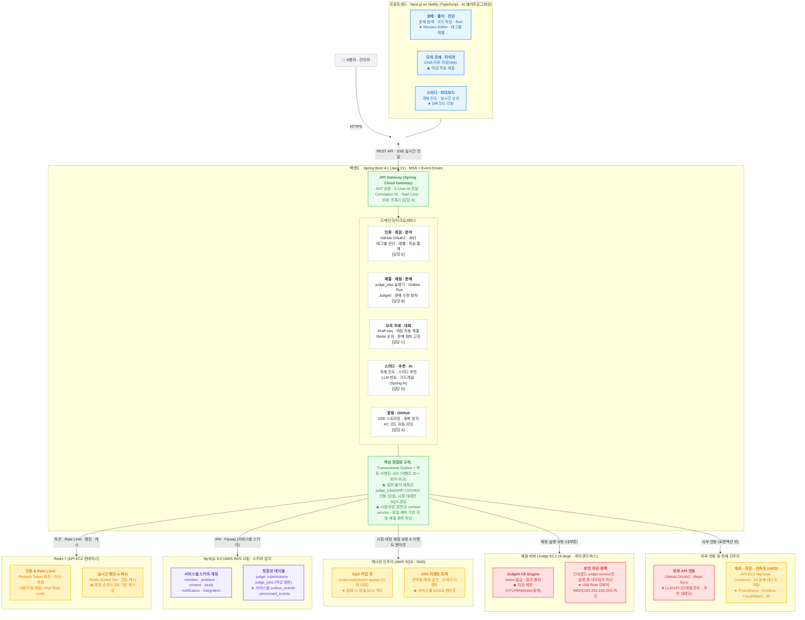

# 시스템 구성도

> 최종 수정일: 2026.10.02(금)
> 

---

```mermaid
flowchart TD
    %% 스타일 클래스 정의
    classDef clientBox fill:#F1F3F5,stroke:#CED4DA,stroke-width:2px,color:#212529;
    classDef feBox fill:#E7F5FF,stroke:#339AF0,stroke-width:2px,color:#1864AB;
    classDef beBox fill:#EBFBEE,stroke:#51CF66,stroke-width:2px,color:#2B8A3E;
    classDef infraBox fill:#FFF3BF,stroke:#FCC419,stroke-width:2px,color:#E67700;
    classDef dbBox fill:#F3F0FF,stroke:#845EF7,stroke-width:2px,color:#5F3DC4;
    classDef extBox fill:#FFE3E3,stroke:#FA5252,stroke-width:2px,color:#C92A2A;
    classDef subCard fill:#FFFFFF,stroke:#ADB5BD,stroke-width:1px,color:#212529;

    %% 1. 사용자 영역
    USER["👤 사용자 · 관리자"]:::clientBox

    USER -->|"HTTPS"| FE_MAIN

    %% 2. 프론트엔드 영역
    subgraph FE_AREA ["프론트엔드 · Next.js on Netlify (TypeScript · AI 페어프로그래밍)"]
        direction LR
        FE_1["<b>문제 · 풀이 · 진단</b><br>문제 탐색 · 코드 작성 · Run<br>★ Monaco Editor · 태그별 레벨"]:::feBox
        FE_2["<b>모의 코테 · 타이머</b><br>Draft 자동 저장(seq)<br>★ 마감 자동 제출"]:::feBox
        FE_3["<b>스터디 · 리더보드</b><br>과제 진도 · 실시간 순위<br>★ Diff 코드 리뷰"]:::feBox
    end
    FE_MAIN[" "]
    style FE_MAIN fill:none,stroke:none;
    FE_AREA --- FE_MAIN

    FE_MAIN <-->|"REST API · SSE 실시간 전달"| GW

    %% 3. 백엔드 및 서비스 계층
    subgraph BE_AREA ["백엔드 · Spring Boot 4.1 (Java 21) · MSA + Event-Driven"]
        direction TB
        GW["<b>API Gateway (Spring Cloud Gateway)</b><br>JWT 검증 · X-User-Id 전달 · Correlation ID · Rate Limit · SSE 프록시 [담당 A]"]:::beBox

        subgraph SERVICES ["도메인 마이크로서비스"]
            direction LR
            MS_AUTH["<b>인증 · 회원 · 분석</b><br>GitHub OAuth2 · JWT<br>태그별 진단 · 레벨 · 학습 통계<br>[담당 E]"]:::subCard
            MS_PROB["<b>제출 · 채점 · 문제</b><br>judge_jobs 실행기 · Outbox · Run<br>Judge0 · 문제 수정 회차<br>[담당 B]"]:::subCard
            MS_EXAM["<b>모의 코테 · 대회</b><br>Draft seq · 마감 자동 제출<br>Redis 순위 · 문제 회차 고정<br>[담당 C]"]:::subCard
            MS_STUDY["<b>스터디 · 추천 · AI</b><br>과제 진도 · 스터디 추천<br>LLM 힌트 · 가드레일 (Spring AI)<br>[담당 D]"]:::subCard
            MS_NOTI["<b>알림 · GitHub</b><br>SSE 스트리밍 · 중복 방지<br>AC 코드 자동 커밋<br>[담당 A]"]:::subCard
        end

        BE_NOTE["<b>핵심 정합성 규칙</b>: Transactional Outbox + 멱등 이벤트 소비 (이벤트 ID + 회차 비교)<br>★ 일반 풀이 채점은 judge_jobs(SKIP LOCKED 선점·임대), 시험·대회만 SQS 경유<br>★ 시험 마감 원천은 contest-service · 유일 제약 기반 자동 제출 중복 차단"]:::beBox
    end

    GW --> SERVICES
    SERVICES --- BE_NOTE

    %% 4. 인프라 하단 계층
    BE_NOTE -->|"토큰 · Rate Limit · 랭킹 · 캐시"| REDIS_AREA
    BE_NOTE -->|"JPA · Flyway (서비스별 스키마)"| RDS_AREA
    BE_NOTE -->|"시험·대회 채점 요청 & 이벤트 팬아웃"| MSG_AREA
    BE_NOTE -->|"채점 실행 요청 (내부망)"| JUDGE_AREA
    BE_NOTE -->|"외부 연동 (트랜잭션 밖)"| EXT_AREA

    subgraph REDIS_AREA ["Redis 7 (API EC2 컨테이너)"]
        direction TB
        RD_1["<b>인증 & Rate Limit</b><br>Refresh Token 회전 · 차단 목록<br>사용자별 제출 · Run Rate Limit"]:::infraBox
        RD_2["<b>실시간 랭킹 & 캐시</b><br>Redis Sorted Set · 힌트 캐시<br>★ 확정 순위는 DB 기준 재구성"]:::infraBox
    end

    subgraph RDS_AREA ["MySQL 8.0 (AWS RDS 1대) · 스키마 분리"]
        direction TB
        DB_1["<b>서비스별 스키마·계정</b><br>member · problem · contest · study<br>notification · integration"]:::dbBox
        DB_2["<b>정합성 테이블</b><br>judge: submissions · judge_jobs (작업 원천)<br>★ 서비스별 outbox_events · processed_events"]:::dbBox
    end

    subgraph MSG_AREA ["메시징 인프라 (AWS SQS · SNS)"]
        direction TB
        MQ_1["<b>SQS 작업 큐</b><br>exam-submission-queue (시험·대회)<br>★ 실패 시 큐별 DLQ 격리"]:::infraBox
        MQ_2["<b>SNS 이벤트 토픽</b><br>문맥별 채점 결과 · 도메인 이벤트<br>★ 서비스별 SQS로 팬아웃"]:::infraBox
    end

    subgraph JUDGE_AREA ["채점 서버 (Judge EC2 c5.large · 격리 샌드박스)"]
        direction TB
        JD_1["<b>Judge0 CE Engine</b><br>token 발급 · 결과 폴링<br>★ 자원 제한 (CPU/RAM/pids/출력)"]:::extBox
        JD_2["<b>보안 차단 정책</b><br>인바운드 judge-service만 · 실행 중 네트워크 차단<br>★ IAM Role 미부여 · IMDS(169.254.169.254) 차단"]:::extBox
    end

    subgraph EXT_AREA ["외부 연동 및 전체 인프라"]
        direction TB
        EX_1["<b>외부 API 연동</b><br>GitHub OAuth2 · Repo Sync<br>★ LLM API (단계별 힌트 · 추천 임베딩)"]:::extBox
        EX_2["<b>배포 · 저장 · 관측성 (AWS)</b><br>API EC2 t4g.large Compose · S3 문제·테스트 파일<br>★ Prometheus · Grafana · CloudWatch · k6"]:::infraBox
    end
```